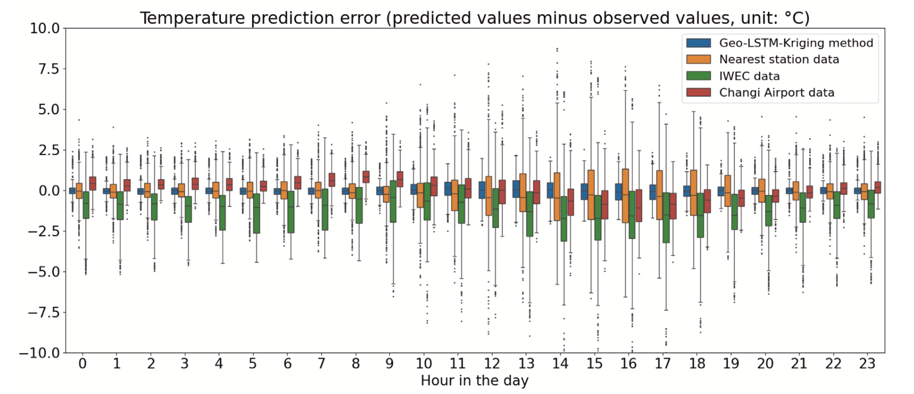
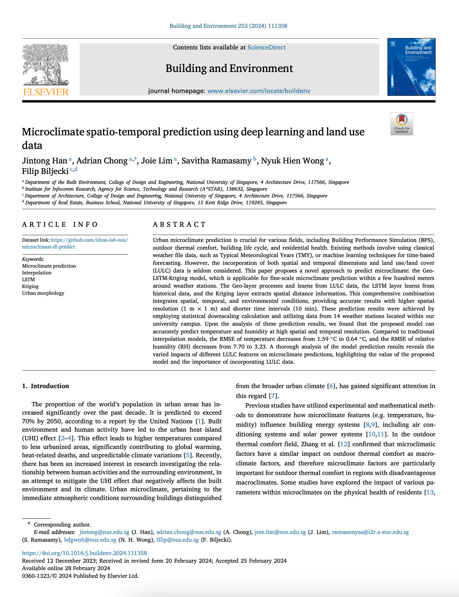

We are glad to share a new collaborative paper:

> Han J, Chong A, Lim J, Ramasamy S, Wong NH, Biljecki F (2024): Microclimate spatio-temporal prediction using deep learning and land use data. _Building and Environment_ 253: 111358. [<i class="ai ai-doi-square ai"></i> 10.1016/j.buildenv.2024.111358](https://doi.org/10.1016/j.buildenv.2024.111358) [<i class="far fa-file-pdf"></i> PDF](/publication/2024-bae-microclimate-prediction/2024-bae-microclimate-prediction.pdf)</i>

This research was led by {}, who has been working on her PhD with [Prof Adrian Chong](https://scholar.google.com.sg/citations?hl=en&user=Xm3qR2QAAAAJ) from our sister group [IDEAS Lab](https://ideaslab.io), and with whom we have been collaborating in the recent years.
Congratulations on this important journal publication! :raised_hands: :clap:

The developed code has been released openly and it can be accessed [here](https://github.com/ideas-lab-nus/microclimate-dl-predict).



The paper is [available freely](https://authors.elsevier.com/c/1igmX1HudNFeZI) until 2024-04-19.

### Highlights

+ Microclimates could exhibit noticeable variations within small spatial and temporal scales.
+ Combining spatial and temporal knowledge contributes to the microclimate prediction accuracy.
+ Integrating LULC data enhances the stability of prediction errors.
+ Different LULC features have varying temporal effects on microclimate predictions.


### Abstract

> Urban microclimate prediction is crucial for various fields, including Building Performance Simulation (BPS), outdoor thermal comfort, building life cycle, and residential health. Existing methods involve using classical weather file data, such as Typical Meteorological Years (TMY), or machine learning techniques for time-based forecasting. However, the incorporation of both spatial and temporal dimensions and land use/land cover (LULC) data is seldom considered. This paper proposes a novel approach to predict microclimate: the Geo-LSTM-Kriging model, which is applicable for fine-scale microclimate prediction within a few hundred meters around weather stations. The Geo-layer processes and learns from LULC data, the LSTM layer learns from historical data, and the Kriging layer extracts spatial distance information. This comprehensive combination integrates spatial, temporal, and environmental conditions, providing accurate results with higher spatial resolution (1 m x 1 m) and shorter time intervals (10 min). These prediction results were achieved by employing statistical downscaling calculation and utilizing data from 14 weather stations located within our university campus. Upon the analysis of these prediction results, we found that the proposed model can accurately predict temperature and humidity at high spatial and temporal resolution. Compared to traditional interpolation models, the RMSE of temperature decreases from 1.59 °C to 0.64 °C, and the RMSE of relative humidity (RH) decreases from 7.70 to 3.23. A thorough analysis of the model prediction results reveals the varied impacts of different LULC features on microclimate predictions, highlighting the value of the proposed model and the importance of incorporating LULC data.

### Paper 

For more information, please see the [paper](/publication/2024-bae-microclimate-prediction/).

[](/publication/2024-bae-microclimate-prediction/)

BibTeX citation:
```bibtex
@article{2024_bae_microclimate_prediction,
  author = {Han, Jintong and Chong, Adrian and Lim, Joie and Ramasamy, Savitha and Wong, Nyuk Hien and Biljecki, Filip},
  doi = {10.1016/j.buildenv.2024.111358},
  journal = {Building and Environment},
  pages = {111358},
  title = {Microclimate spatio-temporal prediction using deep learning and land use data},
  volume = {253},
  year = {2024}
}
```
