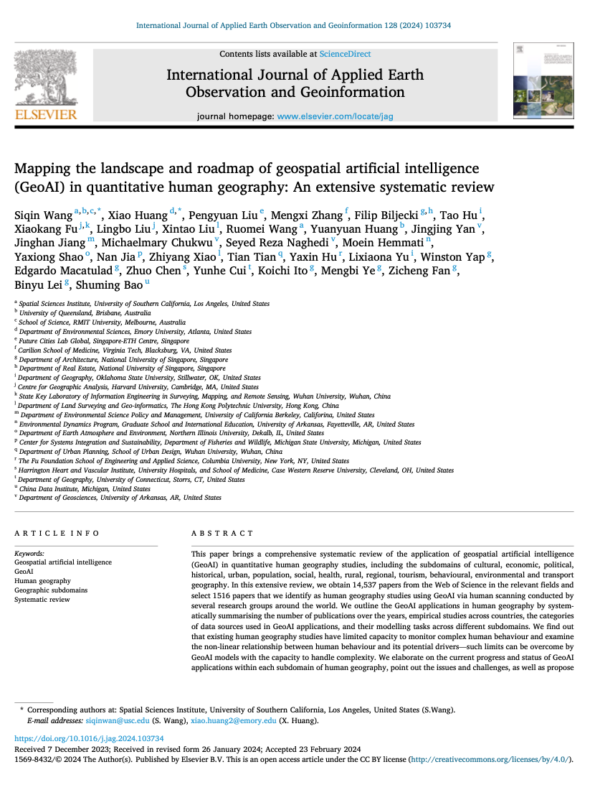

We are glad to share a new collaborative paper:

> Wang S, Huang X, Liu P, Zhang M, Biljecki F, Hu T, Fu X, Liu L, Liu X, Wang R, Huang Y, Yan J, Jiang J, Chukwu M, Reza Naghedi S, Hemmati M, Shao Y, Jia N, Xiao Z, Tian T, Hu Y, Yu L, Yap W, Macatulad E, Chen Z, Cui Y, Ito K, Ye M, Fan Z, Lei B, Bao S (2024): Mapping the landscape and roadmap of geospatial artificial intelligence (GeoAI) in quantitative human geography: An extensive systematic review. _International Journal of Applied Earth Observation and Geoinformation_ 128: 103734. [<i class="ai ai-doi-square ai"></i> 10.1016/j.jag.2024.103734](https://doi.org/10.1016/j.jag.2024.103734) [<i class="far fa-file-pdf"></i> PDF](/publication/2024-jag-geoai-hg/2024-jag-geoai-hg.pdf)</i> <i class="ai ai-open-access-square ai"></i>

It is a massive review on GeoAI in quantitative human geography. In this paper, 8 of our lab members have been involved in. Starting from an extensive corpus of 14,537 papers, 1516 of them were reviewed to outline the applications of GeoAI in this domain, together with issues and challenges, and postulating an outlook on directions and research opportunities.

The review was led by Siqin (Sisi) Wang from the University of Southern California and Xiao Huang from Emory University, and it included 31 authors from 22 institutes in five countries and regions (🇺🇸🇦🇺🇨🇳🇭🇰🇸🇬).


### Highlights

+ It reviewed 1516 papers using GeoAI in human geography related studies.
+ This review covers 14 subdomains of human geography.
+ It elaborates on the current progress and status of GeoAI applications within each subdomain.
+ It points out the issues and challenges for using GeoAI in future human geography studies.
+ It proposes the directions and research opportunities for future studies.


### Abstract

> This paper brings a comprehensive systematic review of the application of geospatial artificial intelligence (GeoAI) in quantitative human geography studies, including the subdomains of cultural, economic, political, historical, urban, population, social, health, rural, regional, tourism, behavioural, environmental and transport geography. In this extensive review, we obtain 14,537 papers from the Web of Science in the relevant fields and select 1516 papers that we identify as human geography studies using GeoAI via human scanning conducted by several research groups around the world. We outline the GeoAI applications in human geography by systematically summarising the number of publications over the years, empirical studies across countries, the categories of data sources used in GeoAI applications, and their modelling tasks across different subdomains. We find out that existing human geography studies have limited capacity to monitor complex human behaviour and examine the non-linear relationship between human behaviour and its potential drivers—such limits can be overcome by GeoAI models with the capacity to handle complexity. We elaborate on the current progress and status of GeoAI applications within each subdomain of human geography, point out the issues and challenges, as well as propose the directions and research opportunities for using GeoAI in future human geography studies in the context of sustainable and open science, generative AI, and quantum revolution.

### Paper 

For more information, please see the [paper](/publication/2024-jag-geoai-hg/) (open access <i class="ai ai-open-access-square ai"></i>).

[](/publication/2024-jag-geoai-hg/)

BibTeX citation:
```bibtex
@article{2024_jag_geoai_hg,
  author = {Wang, Siqin and Huang, Xiao and Liu, Pengyuan and Zhang, Mengxi and Biljecki, Filip and Hu, Tao and Fu, Xiaokang and Liu, Lingbo and Liu, Xintao and Wang, Ruomei and Huang, Yuanyuan and Yan, Jingjing and Jiang, Jinghan and Chukwu, Michaelmary and Reza Naghedi, Seyed and Hemmati, Moein and Shao, Yaxiong and Jia, Nan and Xiao, Zhiyang and Tian, Tian and Hu, Yaxin and Yu, Lixiaona and Yap, Winston and Macatulad, Edgardo and Chen, Zhuo and Cui, Yunhe and Ito, Koichi and Ye, Mengbi and Fan, Zicheng and Lei, Binyu and Bao, Shuming},
  doi = {10.1016/j.jag.2024.103734},
  issn = {1569-8432},
  journal = {International Journal of Applied Earth Observation and Geoinformation},
  pages = {103734},
  title = {Mapping the landscape and roadmap of geospatial artificial intelligence (GeoAI) in quantitative human geography: An extensive systematic review},
  volume = {128},
  year = {2024}
}
```
