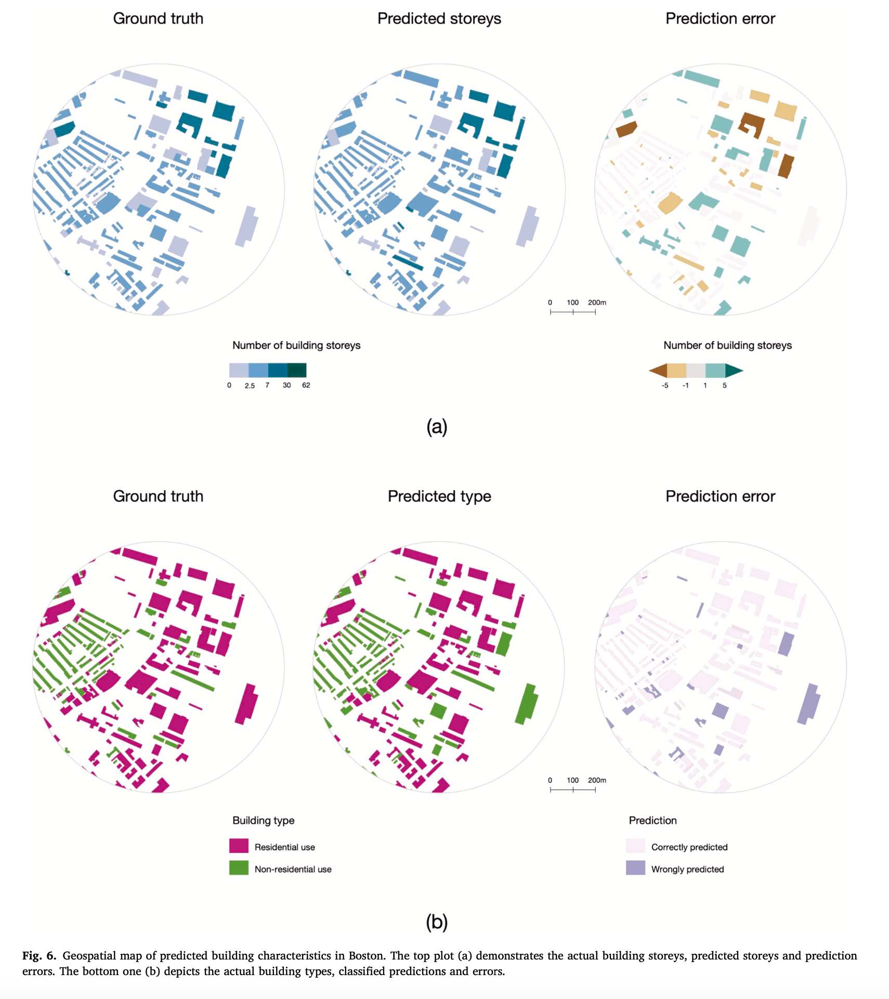

We are glad to share our new paper:

> Lei B, Liu P, Milojevic-Dupont N, Biljecki F (2024): Predicting building characteristics at urban scale using graph neural networks and street-level context. Computers, Environment and Urban Systems, 111: 102129. [<i class="ai ai-doi-square ai"></i> 10.1016/j.compenvurbsys.2024.102129](https://doi.org/10.1016/j.compenvurbsys.2024.102129) [<i class="far fa-file-pdf"></i> PDF](/publication/2024-ceus-gnn-building/2024-ceus-gnn-building.pdf)</i>

This research was led by {}.
Congratulations on this important journal publication! :raised_hands: :clap:


The paper is [available freely](https://authors.elsevier.com/a/1j6Z3jFQh0YjD) until 2024-07-07.

### Highlights

+ A graph-based spatially explicit GeoAI framework to complete building semantics.
+ Novel graph representation of urban objects for predicting building characteristics.
+ Cross-validation on the usability of framework across different cities.
+ Robust predictive capabilities despite insufficient data available.
+ Potential use case for estimating building volume and generating a 3D city model.


### Abstract

The abstract follows.

> Building characteristics, such as number of storeys and type, play a key role across many domains: interpreting urban form, simulating urban microclimate or modelling building energy. However, geospatial data on the building stock is often fragmented and incomplete. Here, we propose a novel and easily adaptable method to predict building characteristics in diverse cities, which attempts to mitigate such data gaps. Our method exploits the geospatial connectivity between street-level urban objects and building characteristics by employing graph neural networks, as they can model spatial relationships and leverage them for predictions. We apply this approach in three representative cities (Boston, Melbourne, and Helsinki) that offer a variety of building features as prediction targets (storeys, types, construction period and materials) and diverse urban environments as predictors. Overall, the magnitude of errors is acceptable for a series of use cases. In the prediction of building storeys, an average of 81.83% buildings in three cities have less than one-storey prediction error. We also find that the prediction of building type achieves an average of 88.33% accuracy across three cities. Meanwhile, an average of 70.5% of buildings are correctly classified by construction period in Melbourne and Helsinki, and the building material prediction accuracy is 68% in Helsinki. The results confirm that our approach is adaptable across different urban environments because comparable performance is achieved in the other two cities. Further, we assess the impact of varying local data availability on model performance. Our findings underscore the feasibility of the method in scenarios with sparse building data (10%, 30% and 50% availability). Our graph-based approach advances research on filling in incomplete building semantics from existing datasets, and showcases the potential to enable 3D city modelling. Given the broad applicability of the approach to predicting many building characteristics, diverse downstream applications exist, such as enhancing contemporary urban studies (e.g. exploring streetscapes) and facilitating the development of 3D GIS (e.g. maintaining and updating 3D building settings).




### Paper 

For more information, please see the [paper](/publication/2024-ceus-gnn-building/).

[](/publication/2024-ceus-gnn-building/)

BibTeX citation:
```bibtex
@article{2024_ceus_gnn_building,
  author = {Lei, Binyu and Liu, Pengyuan and Milojevic-Dupont, Nikola and Biljecki, Filip},
  doi = {10.1016/j.compenvurbsys.2024.102129},
  journal = {Computers, Environment and Urban Systems},
  pages = {102129},
  title = {Predicting building characteristics at urban scale using graph neural networks and street-level context},
  volume = {111},
  year = {2024}
}
```
