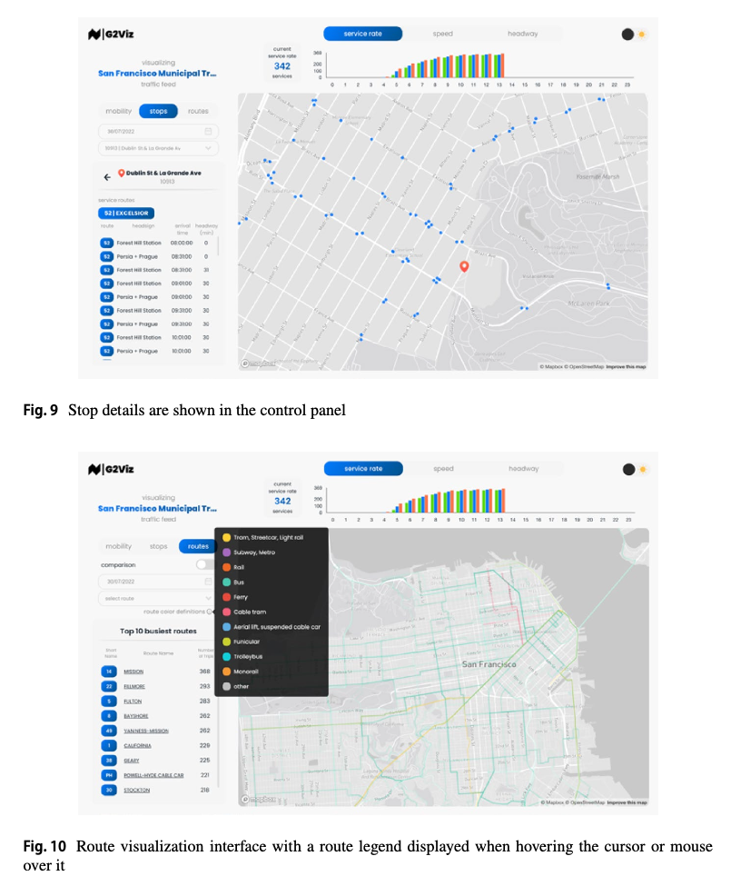
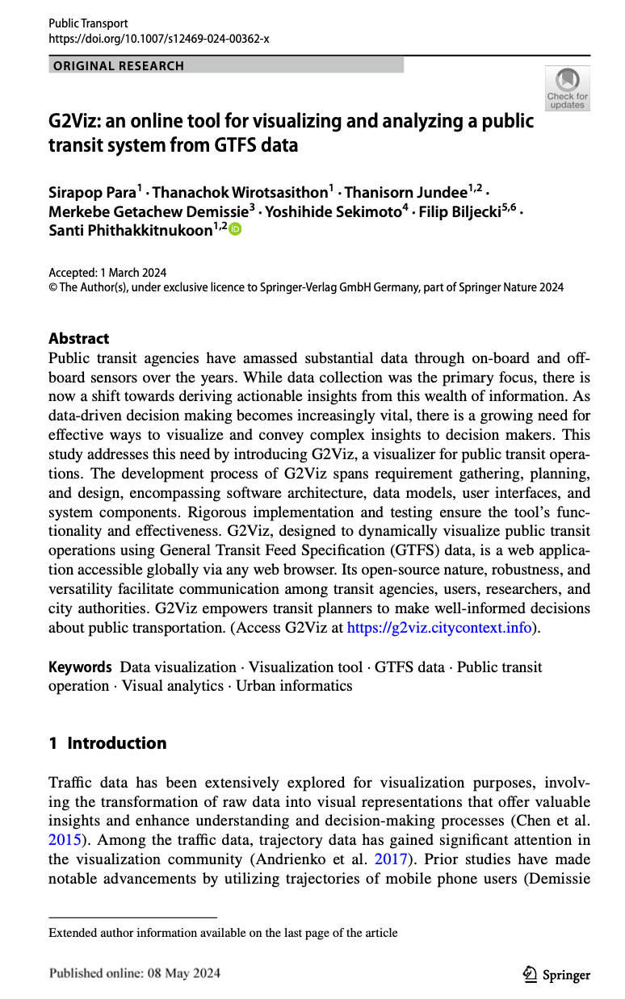

We are glad to share a new collaborative paper:

> Para S, Wirotsasithon T, Jundee T, Demissie MG, Sekimoto Y, Biljecki F, Phithakkitnukoon S (2024): G2Viz: an online tool for visualizing and analyzing a public transit system from GTFS data. _Public Transport_. [<i class="ai ai-doi-square ai"></i> 10.1007/s12469-024-00362-x](https://doi.org/10.1007/s12469-024-00362-x) [<i class="far fa-file-pdf"></i> PDF](/publication/2024-pt-g-2-viz/2024-pt-g-2-viz.pdf)</i>

This research was led by the group of [Santi Phithakkitnukoon](https://cpemis.eng.cmu.ac.th/~santi/) from Chiang Mai University.

The paper is [available freely](https://rdcu.be/dHocM).

G2Viz can be accessed [here](https://g2viz.citycontext.info).



### Abstract

> Public transit agencies have amassed substantial data through on-board and off-board sensors over the years. While data collection was the primary focus, there is now a shift towards deriving actionable insights from this wealth of information. As data-driven decision making becomes increasingly vital, there is a growing need for effective ways to visualize and convey complex insights to decision makers. This study addresses this need by introducing G2Viz, a visualizer for public transit operations. The development process of G2Viz spans requirement gathering, planning, and design, encompassing software architecture, data models, user interfaces, and system components. Rigorous implementation and testing ensure the tool’s functionality and effectiveness. G2Viz, designed to dynamically visualize public transit operations using General Transit Feed Specification (GTFS) data, is a web application accessible globally via any web browser. Its open-source nature, robustness, and versatility facilitate communication among transit agencies, users, researchers, and city authorities. G2Viz empowers transit planners to make well-informed decisions about public transportation. (Access G2Viz at https://g2viz.citycontext.info).

### Paper 

For more information, please see the [paper](/publication/2024-pt-g-2-viz/).

[](/publication/2024-pt-g-2-viz/)

BibTeX citation:
```bibtex
@article{2024_pt_g2viz,
  author = {Para, Sirapop and Wirotsasithon, Thanachok and Jundee, Thanisorn and Demissie, Merkebe Getachew and Sekimoto, Yoshihide and Biljecki, Filip and Phithakkitnukoon, Santi},
  doi = {10.1007/s12469-024-00362-x},
  journal = {Public Transport},
  title = {G2Viz: an online tool for visualizing and analyzing a public transit system from GTFS data},
  year = {2024}
}
```
