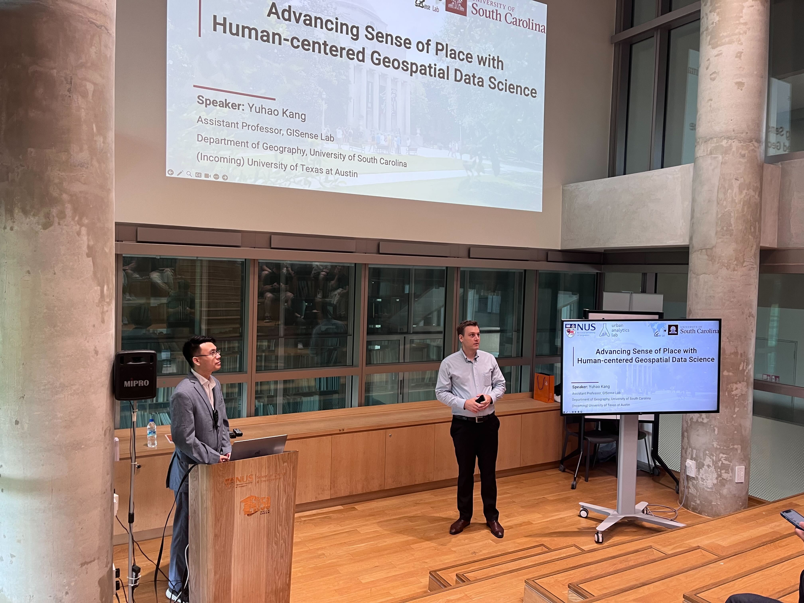
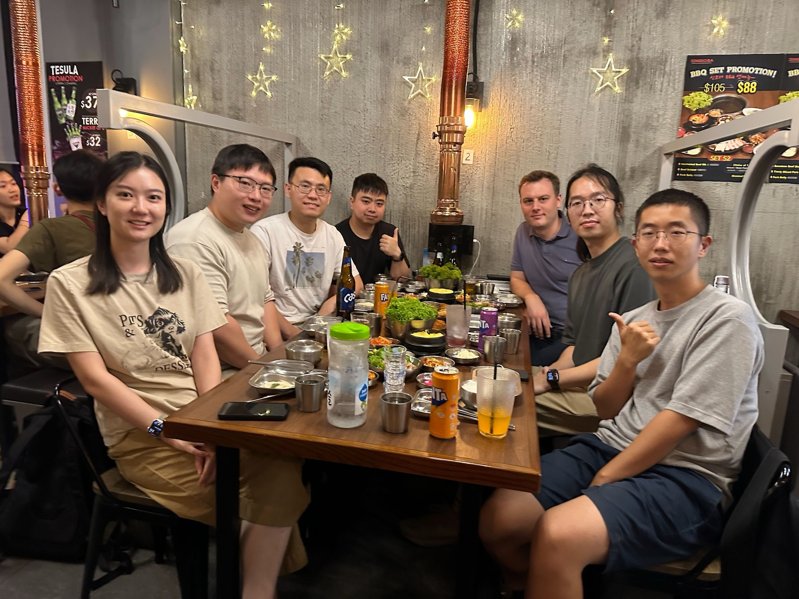

Our Lab hosted Dr [Yuhao Kang](http://www.kkyyhh96.site/), Assistant Professor at the University of South Carolina and University of Texas at Austin. 🇺🇸

Dr. Yuhao Kang is leading the GISense Lab. He was a postdoctoral researcher at MIT and received his Ph.D. from the University of Wisconsin-Madison. He had working experience at Google X and MoBike. Dr. Kang’s research mainly focuses on Human-centered Geospatial Data Science, including understanding human subjective experience at place and develop ethical and responsible geospatial artificial intelligence (GeoAI) approaches. By leveraging human-centered geospatial data science, Dr. Kang’s work has benefited various applications in public health, real estate, crime, and urban planning. His papers have been published on Landscape and Urban Planning, IJGIS, Cities, PNAS, etc. He was the recipient for several fellowships and awards, including the Young Researcher Award by the Austrian Academy of Sciences, CaGIS Rising Award, CaGIS scholarship, ICA scholarship, etc. He actively contributed to the GIScience community. He founded the non-profit global education project GISphere with over 20,000 members, served as the associate editor of Computational Urban Science, and board members for the AAG GISS/CyberGIS/Cartography groups and CPGIS.

During his stay, besides several collaborative exchanges such as discussion sessions and meetings, Yuhao delivered the lecture _Advancing Sense of Place with Human-centered Geospatial Data Science_ (poster and abstract below).

Thanks, and looking forward to future collaborations!

### Abstract of the lecture

> Human sense of place refers to how we perceive, experience, and interact with a particular location and environment. The emergence of Geospatial Data Science – the use of geographic knowledge and AI approaches to extract meaningful insights from large-scale geographic data – has achieved remarkable success not only in modeling physical geographic phenomena but also in advancing human subjective experiences at place. In this talk, Dr. Kang will present a series of works that utilize geospatial data science to understand human experience and sense of place. First, utilizing eye-tracking systems, his work delved into human subjective safety perceptions (e.g., whether a neighborhood is perceived as a safe place) to identify physical objects that attract human attention from street view images. Second, utilizing large language models (LLMs), his work proposed a Soundscape-to-Image Diffusion model to visualize and translate human auditory perceptions into visual representations of place. His work demonstrated how human multi-sensory experiences can be linked to comprehensively understand human sense of place using Generative AI. Finally, he will share his multifaceted experiences in GISphere that aim to promote global GIScience education.

