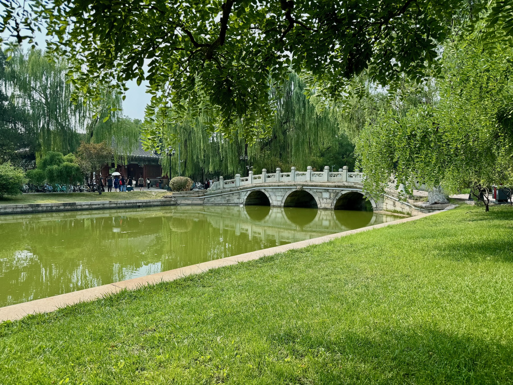
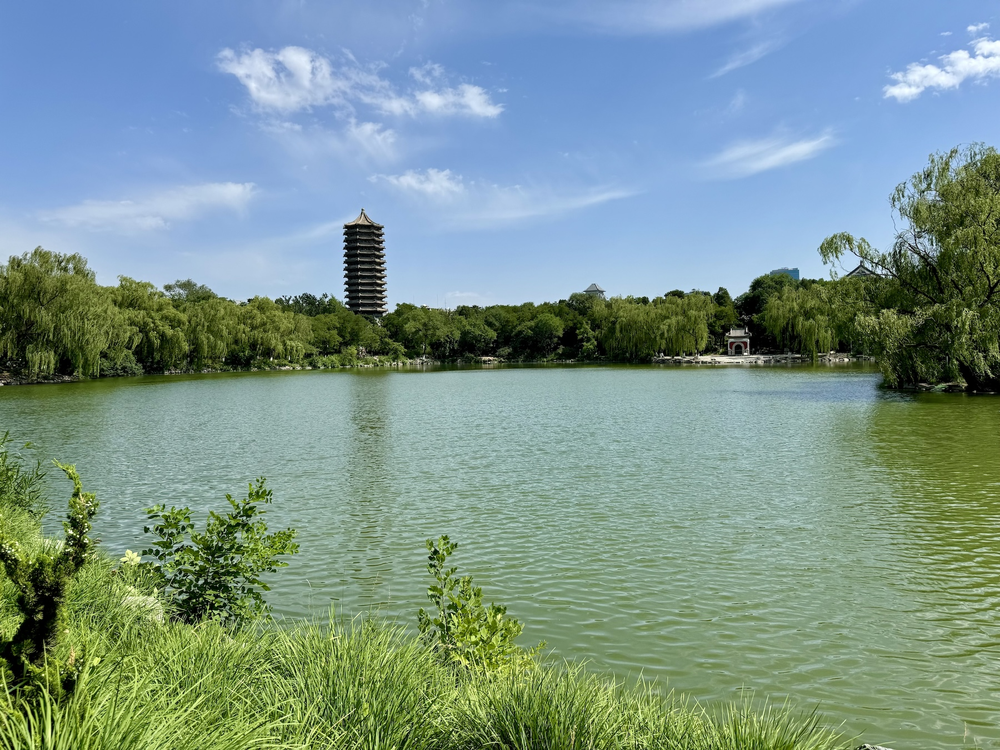
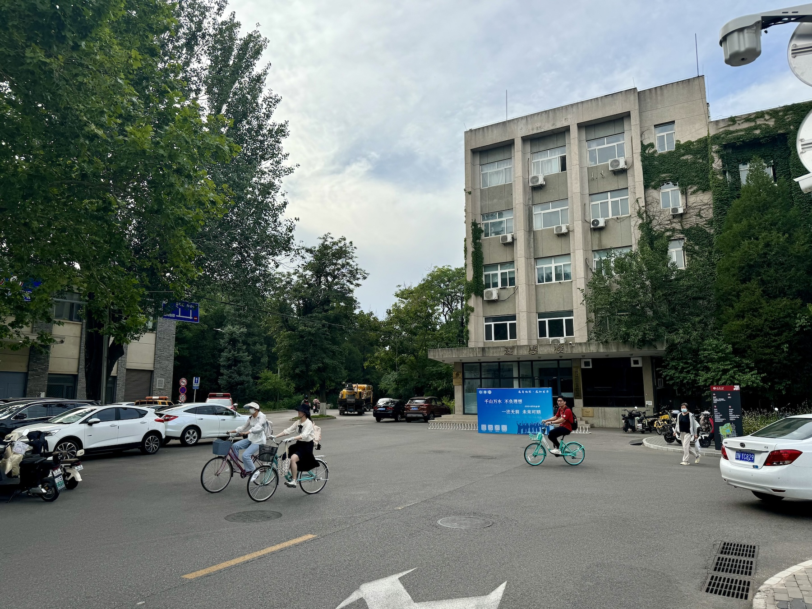
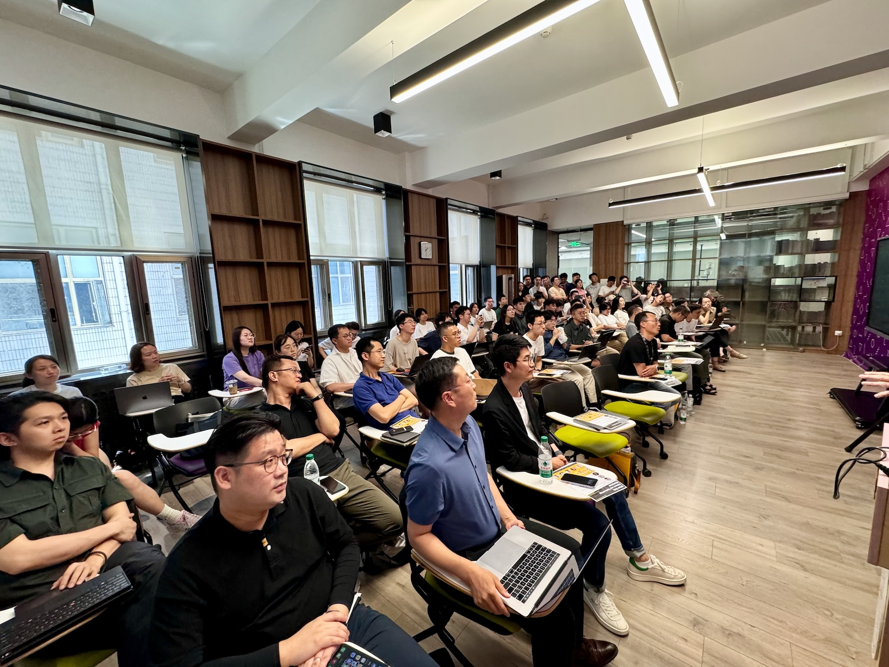
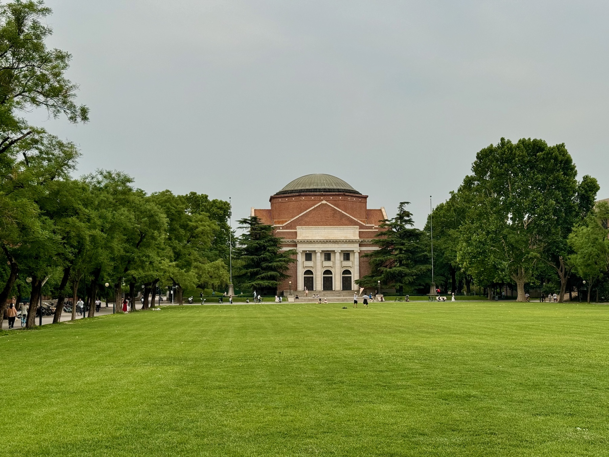
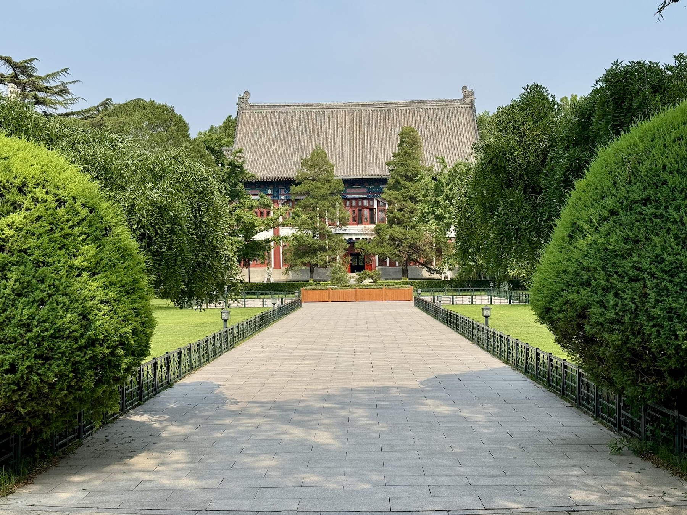

The PI of the Urban Analytics Lab, {} and PhD researcher {}, have visited and presented research at Peking University and Tsinghua University in Beijing, China 🇨🇳.

The guest lectures were hosted by [Fan Zhang](https://irsgis.pku.edu.cn/english/facultystaff/gis/zhangfan/index.htm) at the [PKU Institute of Remote Sensing and GIS](https://irsgis.pku.edu.cn/english/index.htm) and [Ying Long](http://www.arch.tsinghua.edu.cn/info/FUrban%20Planning%20and%20Design/1760) at [Tsinghua's School of Architecture](http://www.arch.tsinghua.edu.cn/column/Home) and [Beijing City Lab](https://www.beijingcitylab.com/), renowned institutions in their respective fields.

It was a pleasure to be in the company of exceptional scholars and learn more about their work.

Many thanks to collaborators and hosts, and everyone else for the organisation and great hospitality.
We look forward to continue collaborating with these wonderful research groups.

