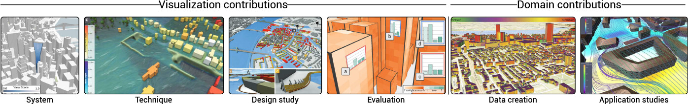
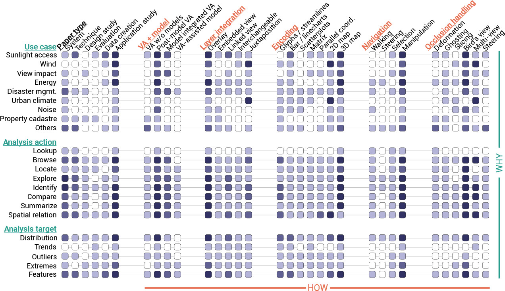
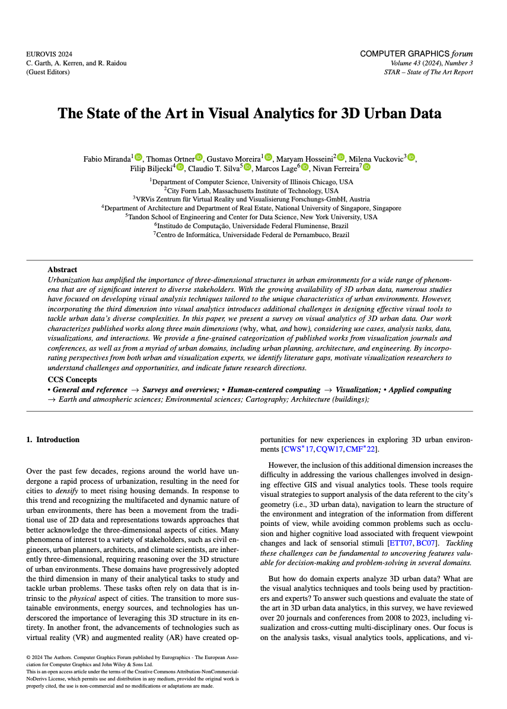

We are glad to share a new collaborative paper:

> Miranda F, Ortner T, Moreira G, Hosseini M, Vuckovic M, Biljecki F, Silva CT, Lage M, Ferreira N (2024): The State of the Art in Visual Analytics for 3D Urban Data. _Computer Graphics Forum_ 43(3): e15112. [<i class="ai ai-doi-square ai"></i> 10.1111/cgf.15112](https://doi.org/10.1111/cgf.15112) [<i class="far fa-file-pdf"></i> PDF](/publication/2024-cgf-star-3-dviz/2024-cgf-star-3-dviz.pdf)</i> <i class="ai ai-open-access-square ai"></i>

This research was led by [Fabio Miranda](https://fmiranda.me) from the Department of Computer Science at the University of Illinois Chicago.
It was conducted in collaboration with academics from other institutions in the USA, Austria, and Brazil: MIT, VRVis, NYU, UFF, and UFPE.

The paper is [available open access](https://doi.org/10.1111/cgf.15112).



### Abstract

> Urbanization has amplified the importance of three-dimensional structures in urban environments for a wide range of phenomena that are of significant interest to diverse stakeholders. With the growing availability of 3D urban data, numerous studies have focused on developing visual analysis techniques tailored to the unique characteristics of urban environments. However, incorporating the third dimension into visual analytics introduces additional challenges in designing effective visual tools to tackle urban data's diverse complexities. In this paper, we present a survey on visual analytics of 3D urban data. Our work characterizes published works along three main dimensions (why, what, and how), considering use cases, analysis tasks, data, visualizations, and interactions. We provide a fine-grained categorization of published works from visualization journals and conferences, as well as from a myriad of urban domains, including urban planning, architecture, and engineering. By incorporating perspectives from both urban and visualization experts, we identify literature gaps, motivate visualization researchers to understand challenges and opportunities, and indicate future research directions.




### Paper 

For more information, please see the [paper](/publication/2024-cgf-star-3-dviz/) (open access <i class="ai ai-open-access-square ai"></i>).

[](/publication/2024-cgf-star-3-dviz/)

BibTeX citation:
```bibtex
@article{2024_cgf_star_3dviz,
  author = {Miranda, Fabio and Ortner, Thomas and Moreira, Gustavo and Hosseini, Maryam and Vuckovic, Milena and Biljecki, Filip and Silva, Claudio T. and Lage, Marcos and Ferreira, Nivan},
  doi = {10.1111/cgf.15112},
  journal = {Computer Graphics Forum},
  number = {3},
  title = {The State of the Art in Visual Analytics for 3D Urban Data},
  volume = {43},
  year = {2024}
}
```
