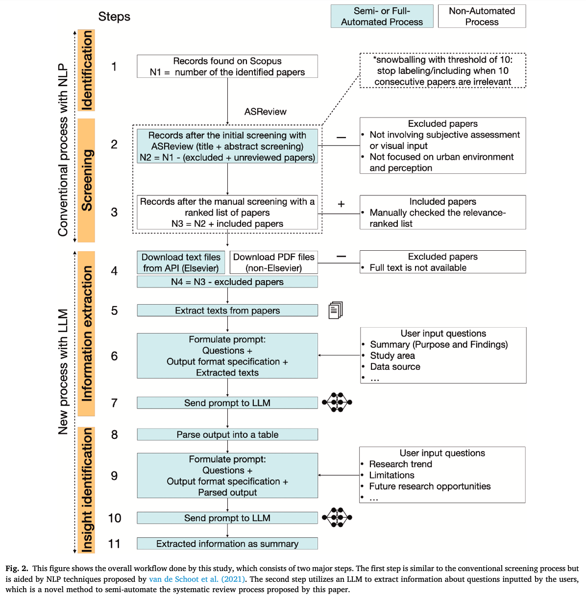
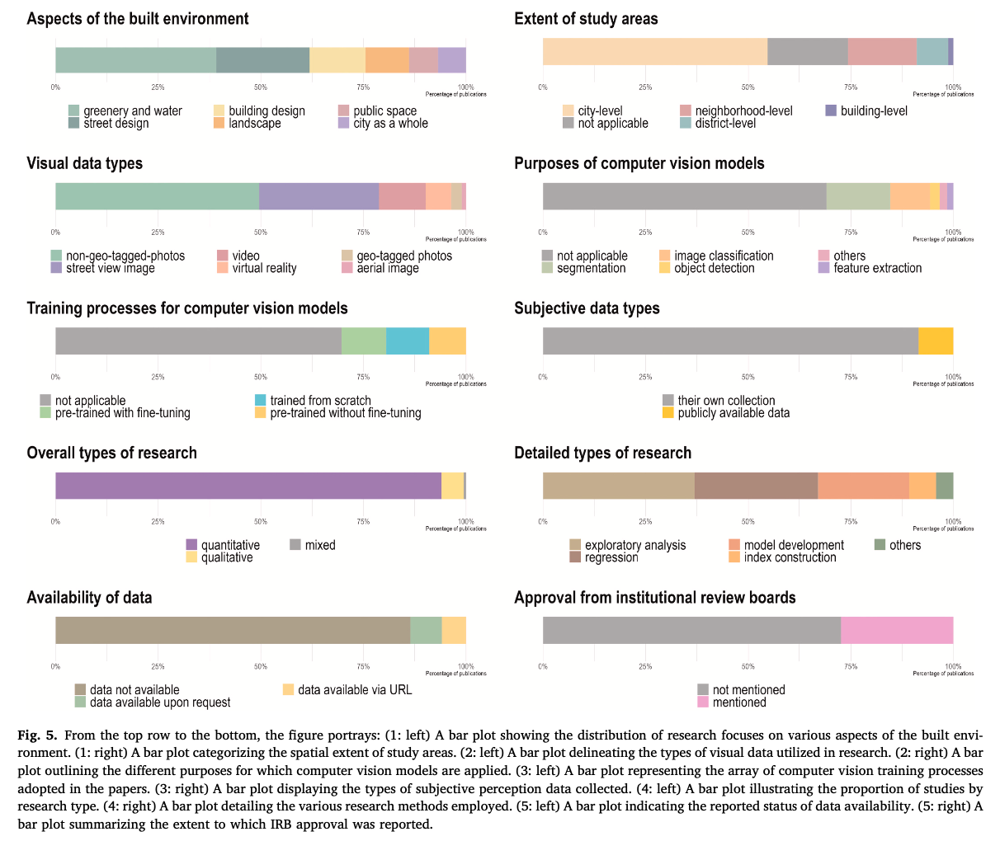
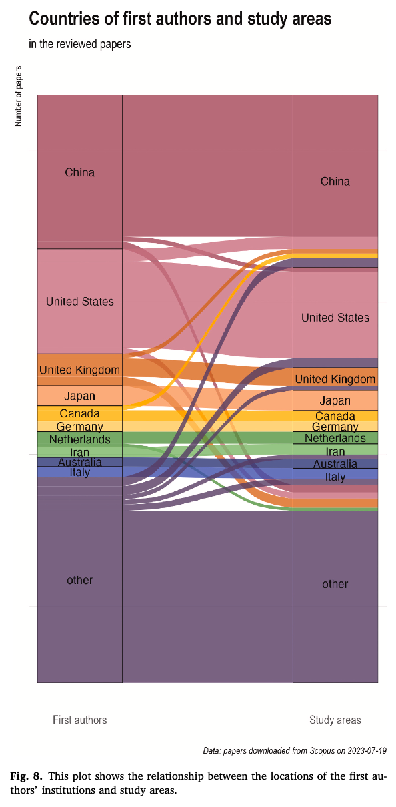
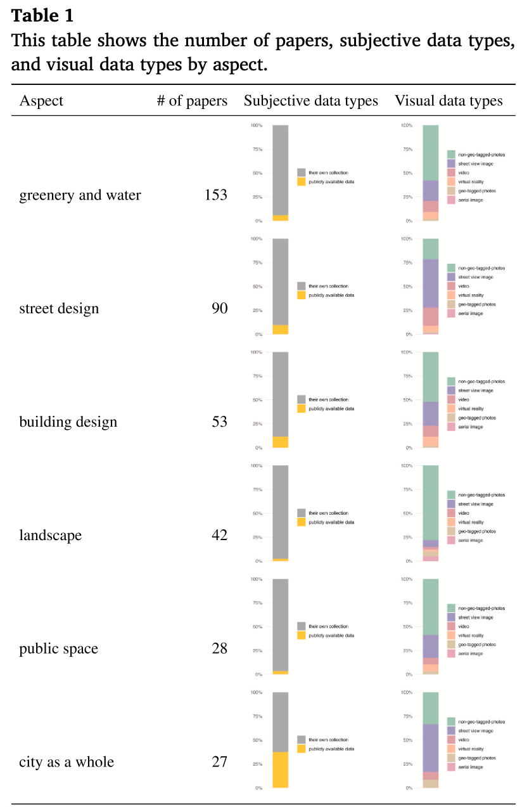
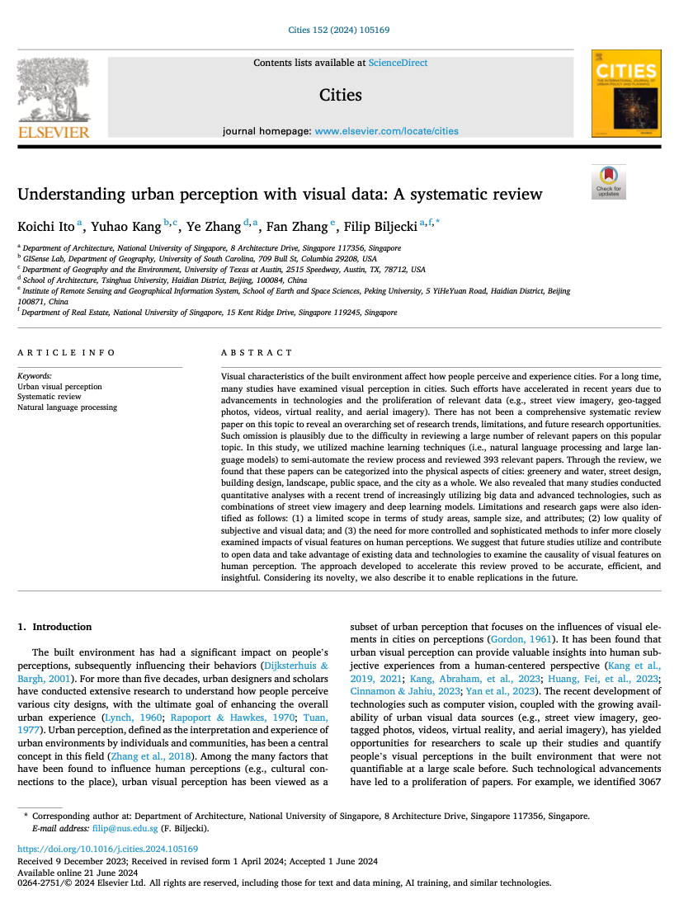

We are glad to share our new paper:

> Ito K, Kang Y, Zhang Y, Zhang F, Biljecki F (2024): Understanding Urban Perception with Visual Data: A Systematic Review. Cities, 152: 105169. [<i class="ai ai-doi-square ai"></i> 10.1016/j.cities.2024.105169](https://doi.org/10.1016/j.cities.2024.105169) [<i class="far fa-file-pdf"></i> PDF](/publication/2024-cities-perception-rev/2024-cities-perception-rev.pdf)</i>

This research was led by {}.
Congratulations on this important journal publication! :raised_hands: :clap:



The paper is [available freely](https://authors.elsevier.com/a/1jIcAy5jOuwFw) until 2024-08-10.

### Highlights

+ Comprehensive and overarching review on 393 urban visual perception studies
+ Novel approach to semi-automate the systematic review with NLP and LLM models
+ Identified six dominant categories (e.g., greenery and water and street design)




### Abstract

The abstract follows.

> Visual characteristics of the built environment affect how people perceive and experience cities. For a long time, many studies have examined visual perception in cities. Such efforts have accelerated in recent years due to advancements in technologies and the proliferation of relevant data (e.g., street view imagery, geo-tagged photos, videos, virtual reality, and aerial imagery). There has not been a comprehensive systematic review paper on this topic to reveal an overarching set of research trends, limitations, and future research opportunities. Such omission is plausibly due to the difficulty in reviewing a large number of relevant papers on this popular topic. In this study, we utilized machine learning techniques (i.e., natural language processing and large language models) to semi-automate the review process and reviewed 393 relevant papers. Through the review, we found that these papers can be categorized into the physical aspects of cities: greenery and water, street design, building design, landscape, public space, and the city as a whole. We also revealed that many studies conducted quantitative analyses with a recent trend of increasingly utilizing big data and advanced technologies, such as combinations of street view imagery and deep learning models. Limitations and research gaps were also identified as follows: (1) a limited scope in terms of study areas, sample size, and attributes; (2) low quality of subjective and visual data; and (3) the need for more controlled and sophisticated methods to infer more closely examined impacts of visual features on human perceptions. We suggest that future studies utilize and contribute to open data and take advantage of existing data and technologies to examine the causality of visual features on human perception. The approach developed to accelerate this review proved to be accurate, efficient, and insightful. Considering its novelty, we also describe it to enable replications in the future.





### Paper 

For more information, please see the [paper](/publication/2024-cities-perception-rev/).

[](/publication/2024-cities-perception-rev/)

BibTeX citation:
```bibtex
@article{2024_cities_perception_rev,
  author = {Ito, Koichi and Kang, Yuhao and Zhang, Ye and Zhang, Fan and Biljecki, Filip},
  doi = {10.1016/j.cities.2024.105169},
  journal = {Cities},
  pages = {105169},
  title = {Understanding urban perception with visual data: A systematic review},
  volume = {152},
  year = {2024}
}
```
