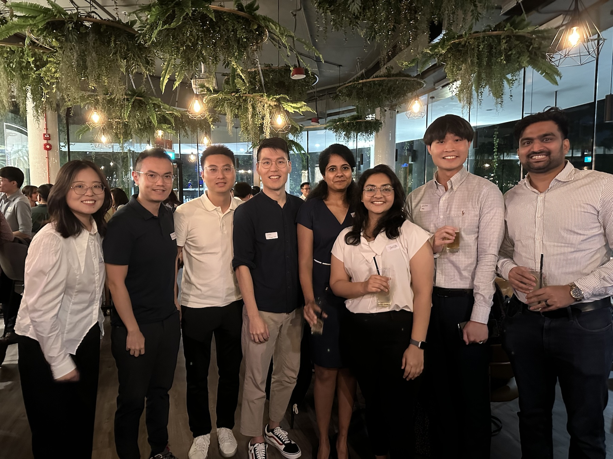
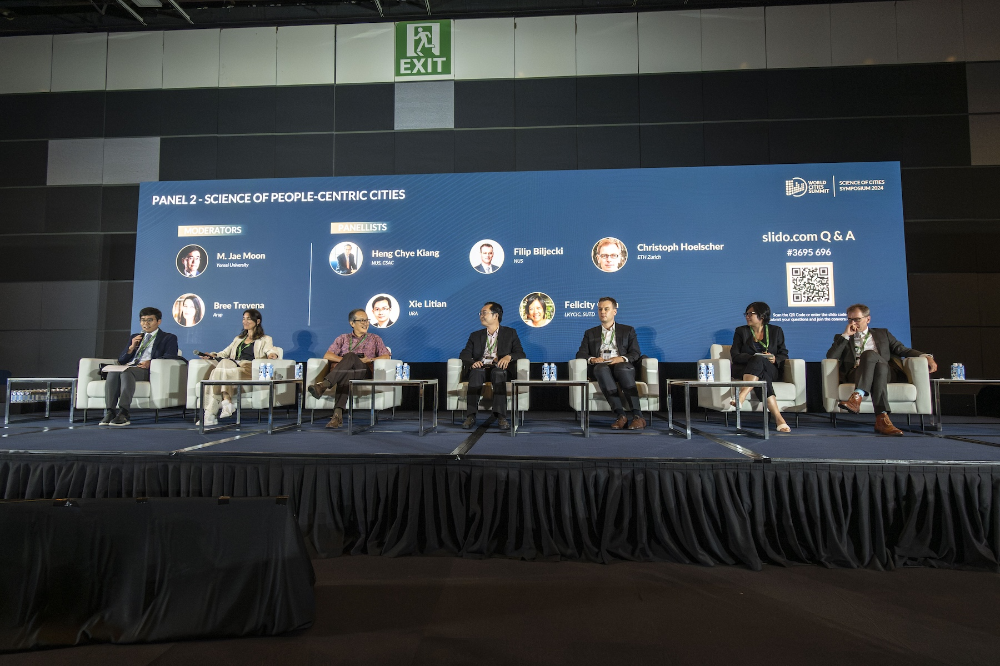
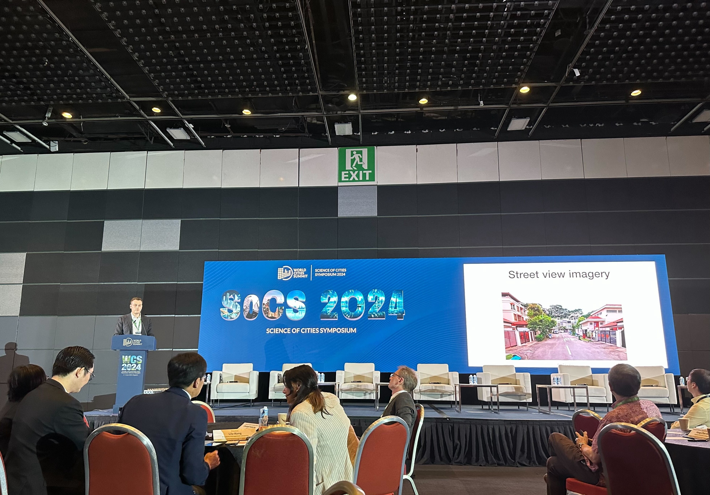
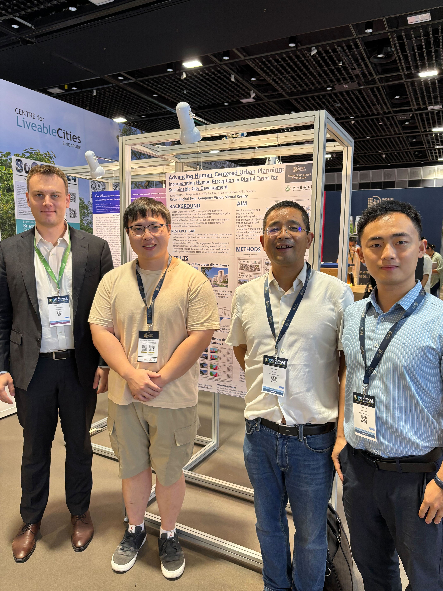
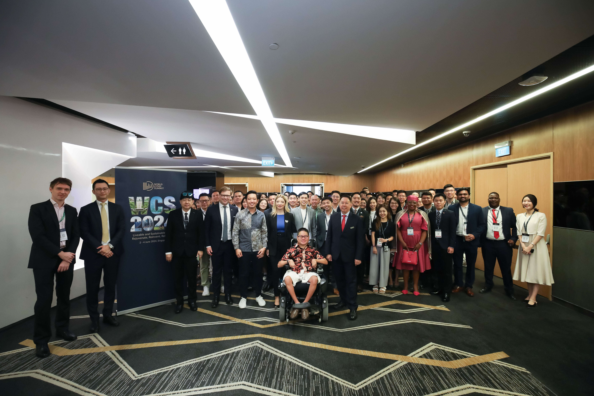
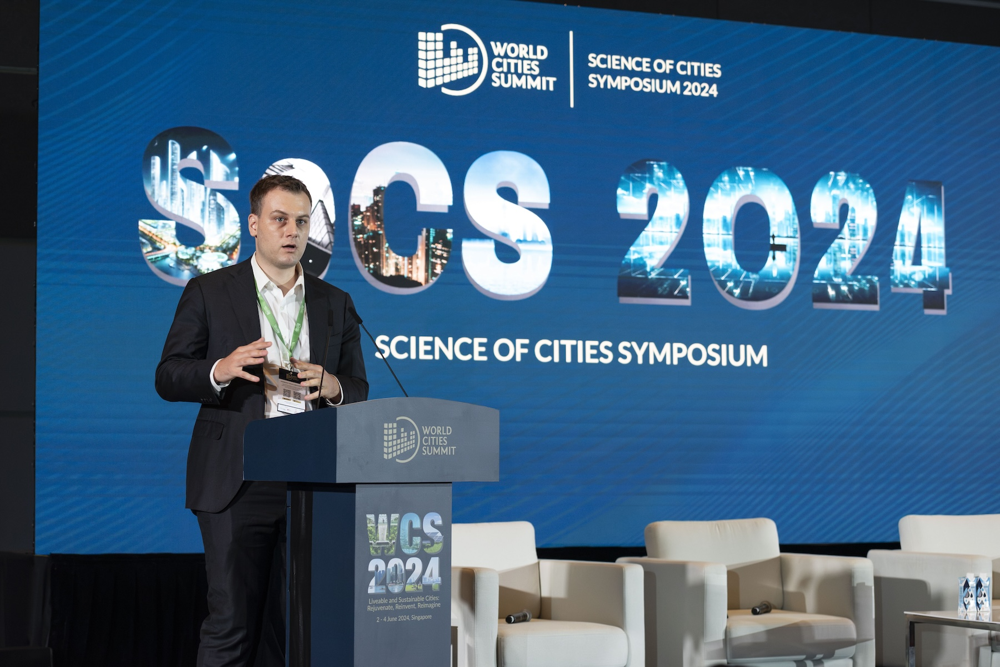

A number of our members, alumni, and associated researchers -- {}, {}, {}, {}, {} and {} -- have participated in this year's [World Cities Summit](https://www.worldcitiessummit.com.sg) in Singapore.

The [World Cities Summit (WCS)](https://www.worldcitiessummit.com.sg) is a biennial event for government leaders and industry experts to address liveable and sustainable city challenges, share integrated urban solutions and forge new partnerships.
It is jointly organised by Singapore's [Centre for Liveable Cities (CLC)](https://www.clc.gov.sg) and the [Urban Redevelopment Authority (URA)](https://www.ura.gov.sg)

We presented our work and participated in lots of activities.

At the [Young Leaders Symposium](https://www.worldcitiessummit.com.sg/programme/wcs-young-leaders), our PhD candidate {} connected with fellow emerging urban innovators.
This event offered a distinct platform for networking and engaging with a diverse panel of experts from government, academia, and private sectors, fostering valuable interdisciplinary interactions.
The current Young Leaders network and alumni stand at 550+ strong across continents, with members from both public and private sectors such as Mikko Kiesiläinen, Chief Economist for the City of Helsinki, Finland, Sean Tan, Co-Founder, Insect Feed Technologies, Estibaliz Luengo Celaya, Director, International Department, Bilbao City Council, and Brice Richard, Strategic Advisory and Smart Cities Lead, Arup.

Our principal investigator {} presented one of our latest projects at the [Science of Cities Symposium](https://www.worldcitiessummit.com.sg/programme/wcs-science-of-cities-symposium) and served as panelist in the panel on Science of People-Centric Cities. 
The Symposium was attended by more than 200 attendees from government agencies, researchers, industry, both locally and internationally.
The programme, together with abstracts and posters, can be found [here](https://www.worldcitiessummit.com.sg/programme/wcs-science-of-cities-symposium).

Below are some photos, courtesy of CLC/URA and our researchers and lab friends.
Many thanks to everyone at CLC and URA for making this event a success and for having us --- it was perfectly organised. 👏

