The [19th International 3D GeoInfo Conference](https://3dgeoinfoeg-ice.webs.uvigo.es) took place in Vigo, Galicia, Spain on 1-3 July 2024.
It was hosted by [Lucía Díaz Vilariño](https://cintecx.uvigo.es/es/teacher/lucia-diaz-vilarino/) and colleagues at the [University of Vigo](https://www.uvigo.gal/en).

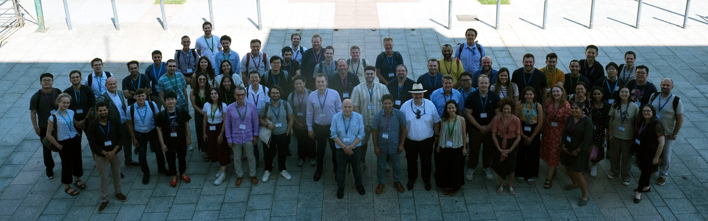

From the [website](https://3dgeoinfoeg-ice.webs.uvigo.es):
> The 3D GeoInfo Conference aims to bring together international researchers, practitioners, and professionals from academia, industry, and government to discuss the latest advances in 3D geoinformation science and technology. This annual event offers a multidisciplinary and inter-sectorial forum in the fields of 3D/4D data collection, management, data quality, analysis, advanced modelling, and visualization, with a strong focus on cutting-edge research, standardisation, technical, implementation and application issues across different disciplines.

This year, the conference was collocated with the [31st EG-ICE International Workshop on Intelligent Computing in Engineering](https://3dgeoinfoeg-ice.webs.uvigo.es/eg-ice) , forming the Joint 3D GeoInfo conference and EG-ICE workshop 2024.

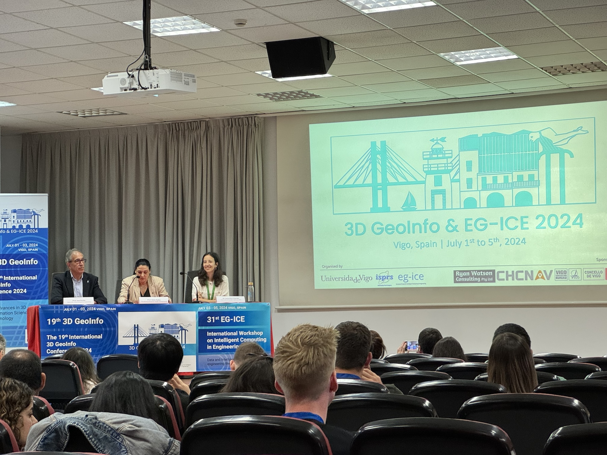

3D GeoInfo is the leading conference in this domain, and it started in 2006 in Kuala Lumpur, Malaysia under the auspices of Professor Alias Abdul Rahman and his research group.
We organised its [2019 instance in Singapore](), together with the Singapore Land Authority.

The conference had many interesting talks on the most recent developments in 3D GIS and urban digital twins.

Our research group was represented by  and , and also our colleague [Rudi Stouffs](https://cde.nus.edu.sg/arch/staffs/rudi-stouffs-dr/) from the [NUS Department of Architecture](https://cde.nus.edu.sg/arch/) was there.

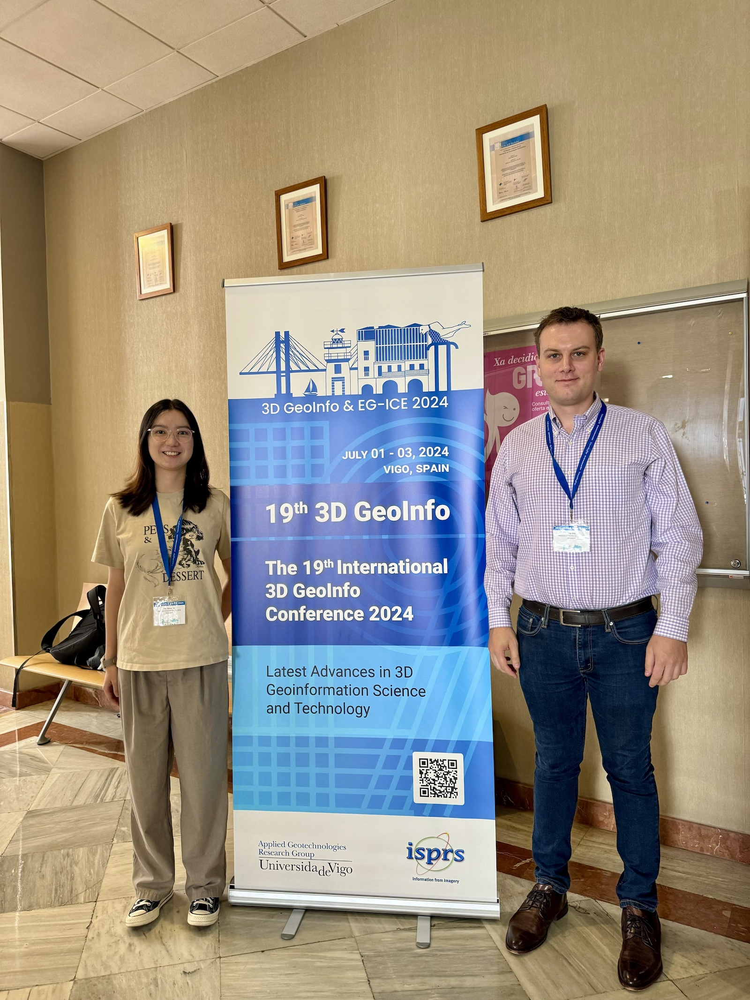

Three papers of ours were published and presented at the conference, and they include our lab members , , and .

The conference papers have been published in two volumes in [ISPRS Annals](https://isprs-annals.copernicus.org/articles/X-4-W5-2024/) and [ISPRS Archives](https://isprs-archives.copernicus.org/articles/XLVIII-4-W11-2024/), edited by Lucía Díaz-Vilariño and Jesús Balado. 
Here is the list of our papers with links to access them:

> Lei B, Liang X, Biljecki F (2024): Integrating human perception in 3D city models and urban digital twins. ISPRS Annals of the Photogrammetry, Remote Sensing and Spatial Information Sciences, X-4/W5-2024: 211-218. [<i class="ai ai-doi-square ai"></i> 10.5194/isprs-annals-x-4-w5-2024-211-2024](https://doi.org/10.5194/isprs-annals-x-4-w5-2024-211-2024) [<i class="far fa-file-pdf"></i> PDF](/publication/2024-3-dgeoinfo-perception-dt/2024-3-dgeoinfo-perception-dt.pdf)</i> <i class="ai ai-open-access-square ai"></i>

> Ignatius M, Lim J, Gottkehaskamp B, Fujiwara K, Miller C, Biljecki F (2024): Digital Twin and Wearables Unveiling Pedestrian Comfort Dynamics and Walkability in Cities. ISPRS Annals of the Photogrammetry, Remote Sensing and Spatial Information Sciences, X-4/W5-2024: 195-202. [<i class="ai ai-doi-square ai"></i> 10.5194/isprs-annals-x-4-w5-2024-195-2024](https://doi.org/10.5194/isprs-annals-x-4-w5-2024-195-2024) [<i class="far fa-file-pdf"></i> PDF](/publication/2024-3-dgeoinfo-thermal-walk/2024-3-dgeoinfo-thermal-walk.pdf)</i> <i class="ai ai-open-access-square ai"></i>

> Lim J, Biljecki F, Stouffs R (2024): Integration of Movement Data into 3D GIS. ISPRS Annals of the Photogrammetry, Remote Sensing and Spatial Information Sciences, X-4/W5-2024: 219-227. [<i class="ai ai-doi-square ai"></i> 10.5194/isprs-annals-x-4-w5-2024-219-2024](https://doi.org/10.5194/isprs-annals-x-4-w5-2024-219-2024) [<i class="far fa-file-pdf"></i> PDF](/publication/2024-3-dgeoinfo-movementdata/2024-3-dgeoinfo-movementdata.pdf)</i> <i class="ai ai-open-access-square ai"></i>


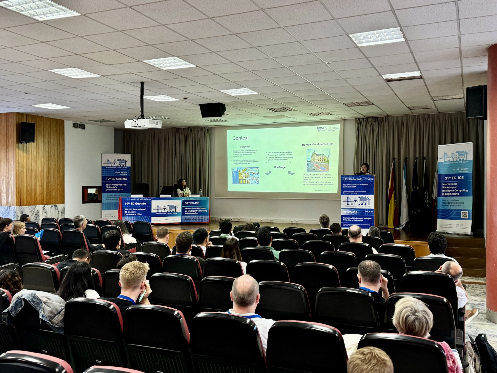

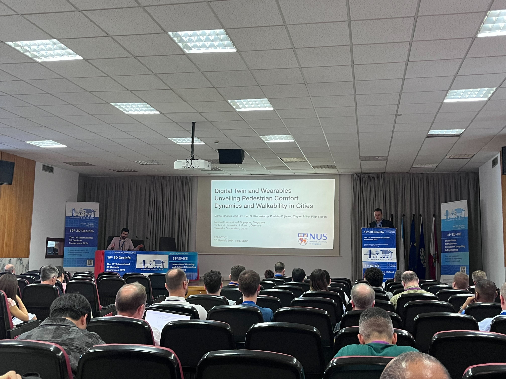

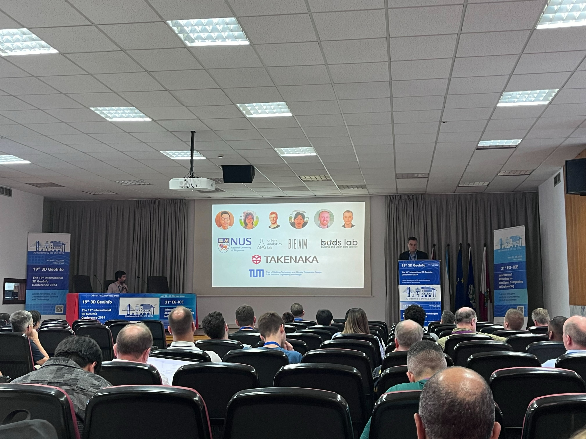

And here are some images that depict the research.

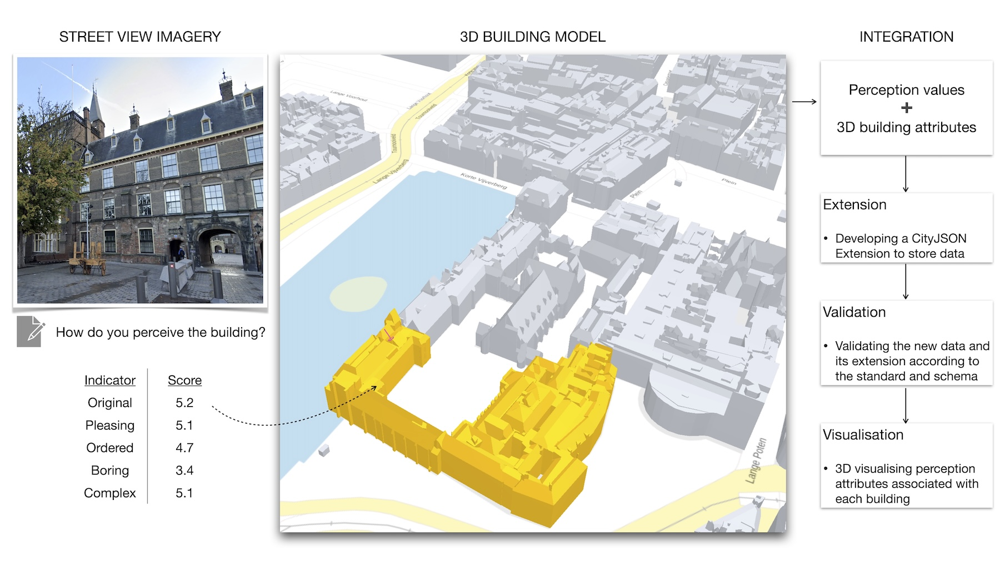

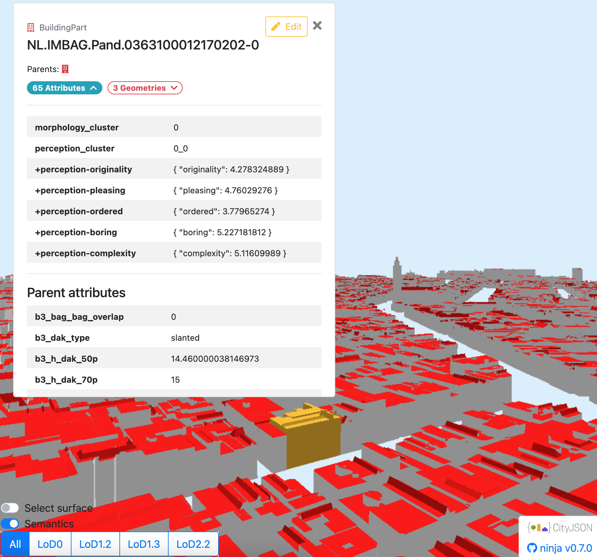

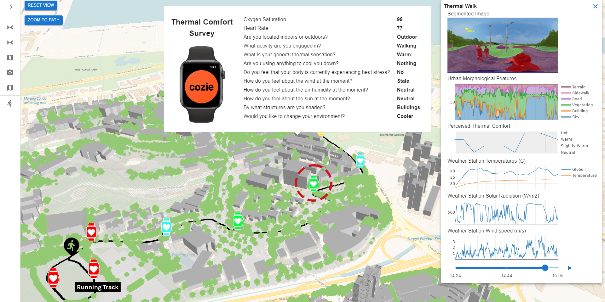

The best paper award went to [Weixiao Gao](https://3d.bk.tudelft.nl/weixiao/), [Ravi Peters](https://scholar.google.nl/citations?user=DQyb2G8AAAAJ&hl=nl), [Hugo Ledoux](http://3d.bk.tudelft.nl/hledoux), and [Jantien Stoter](http://3d.bk.tudelft.nl/jstoter) from [3D Geoinformation at TU Delft](https://3d.bk.tudelft.nl) for their article _[Filling holes in LoD2 building models](https://doi.org/10.5194/isprs-annals-X-4-W5-2024-171-2024)_.
Congratulations! 👏🎉


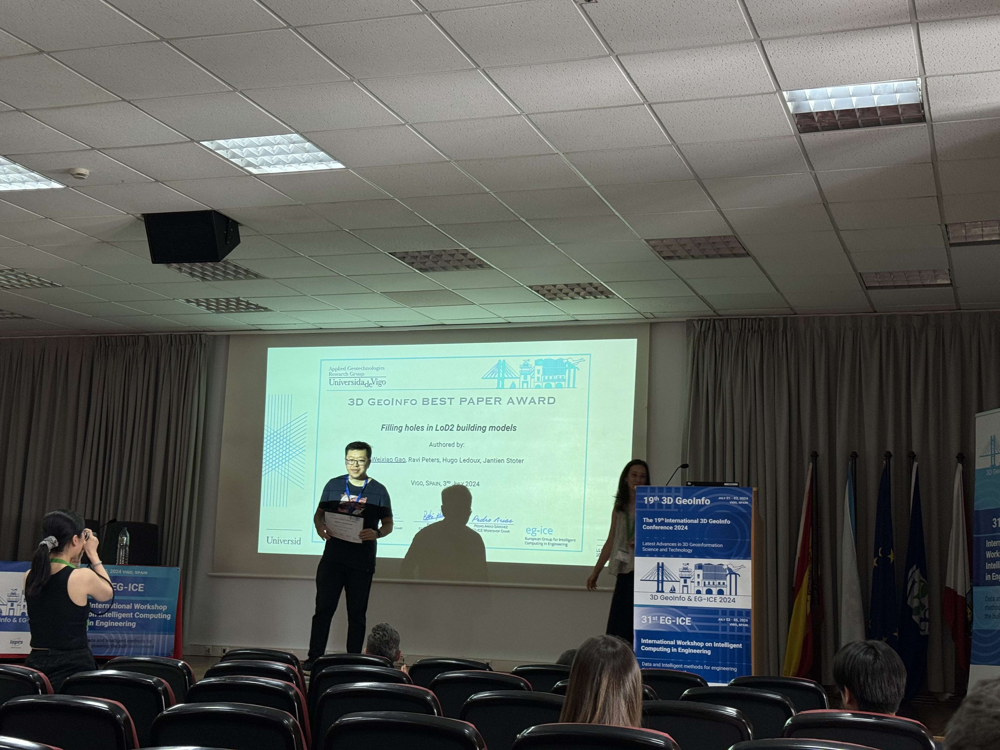


It was a great conference.
We highly appreciate the organisation by Lucía and others at UVigo. 

The next instance of the conference, in 2025, will be in Japan.
It will be collocated with the Smart Data and Smart Cities (SDSC) conference in the first week of September 2025, at the University of Tokyo -- Kashiwa campus, in co-organisation with the [PLATEAU team](https://www.mlit.go.jp/plateau/) at the Ministry of Land, Infrastructure, Transport and Tourism (MLIT).

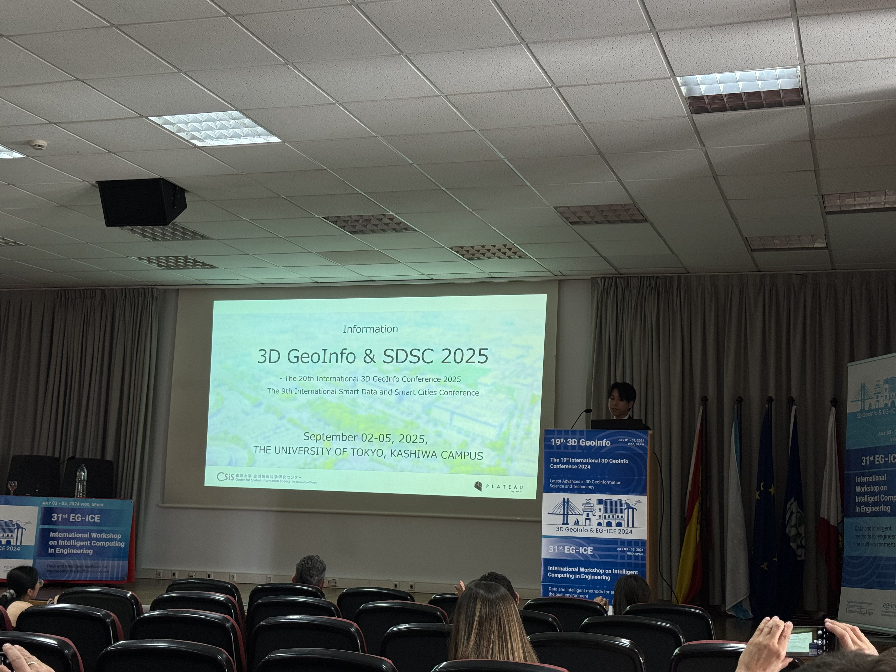

Our Lab remains committed to contributing to this vibrant community, and we very much look forward to the next instance of the conference.

See you at 3D GeoInfo 2025 at UTokyo Kashiwa! :jp:

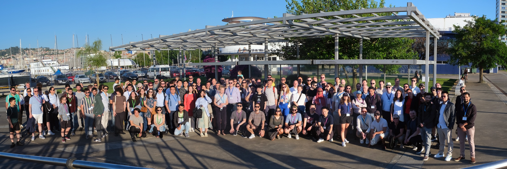

---

BibTeX citations of our three papers:
```bibtex
@article{2024_3dgeoinfo_perception_dt,
  author = {Lei, Binyu and Liang, Xiucheng and Biljecki, Filip},
  doi = {10.5194/isprs-annals-x-4-w5-2024-211-2024},
  journal = {ISPRS Annals of the Photogrammetry, Remote Sensing and Spatial Information Sciences},
  pages = {211-218},
  title = {Integrating human perception in 3D city models and urban digital twins},
  volume = {X-4/W5-2024},
  year = {2024}
}
```

```bibtex
@article{2024_3dgeoinfo_thermal_walk,
  author = {Ignatius, Marcel and Lim, Joie and Gottkehaskamp, Ben and Fujiwara, Kunihiko and Miller, Clayton and Biljecki, Filip},
  doi = {10.5194/isprs-annals-x-4-w5-2024-195-2024},
  journal = {ISPRS Annals of the Photogrammetry, Remote Sensing and Spatial Information Sciences},
  pages = {195-202},
  title = {Digital Twin and Wearables Unveiling Pedestrian Comfort Dynamics and Walkability in Cities},
  volume = {X-4/W5-2024},
  year = {2024}
}
```

```bibtex
@article{2024_3dgeoinfo_movementdata,
  author = {Lim, Joie and Biljecki, Filip and Stouffs, Rudi},
  doi = {10.5194/isprs-annals-x-4-w5-2024-219-2024},
  journal = {ISPRS Annals of the Photogrammetry, Remote Sensing and Spatial Information Sciences},
  pages = {219-227},
  title = {Integration of Movement Data into 3D GIS},
  volume = {X-4/W5-2024},
  year = {2024}
}
```

