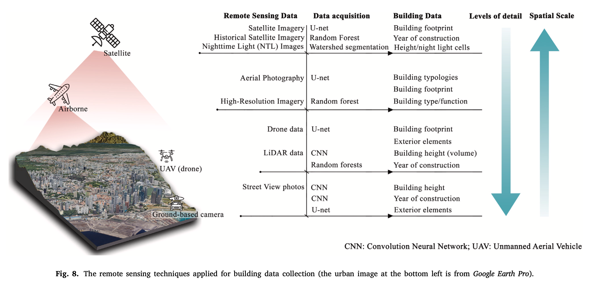
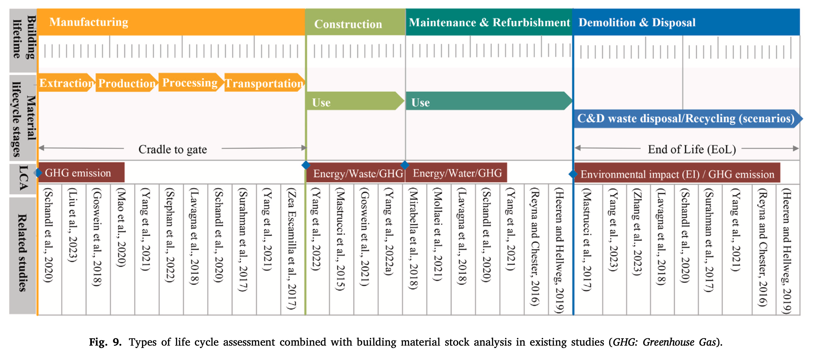
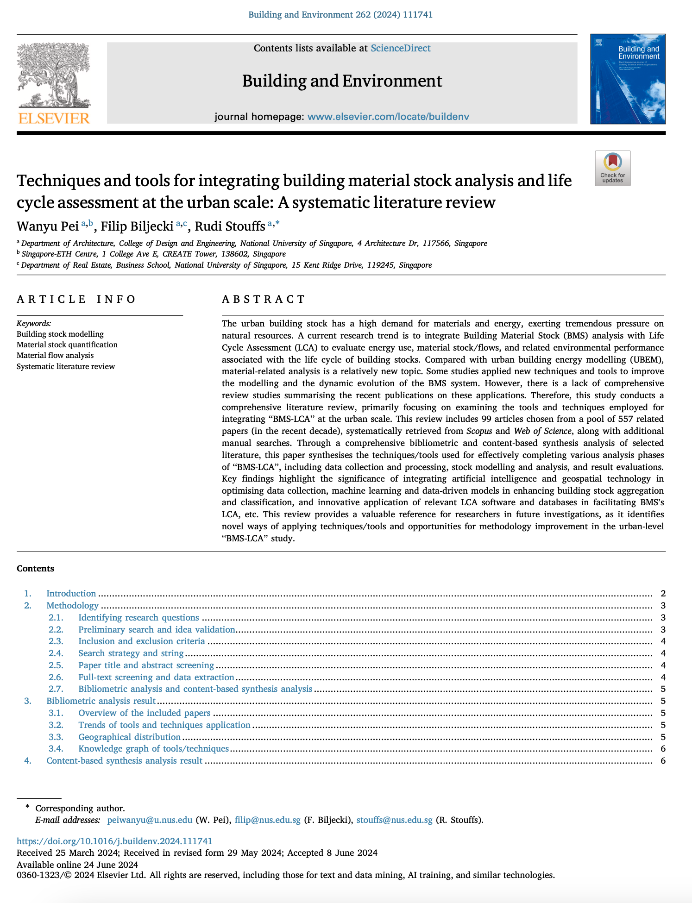

We are glad to share a new collaborative paper:

> Pei W, Biljecki F, Stouffs R (2024): Techniques and tools for integrating building material stock analysis and life cycle assessment at the urban scale: A systematic literature review. _Building and Environment_ 262: 111741. [<i class="ai ai-doi-square ai"></i> 10.1016/j.buildenv.2024.111741](https://doi.org/10.1016/j.buildenv.2024.111741) [<i class="far fa-file-pdf"></i> PDF](/publication/2024-bae-stock-review/2024-bae-stock-review.pdf)</i>

This research was led by [Wanyu Pei](https://www.researchgate.net/profile/Wanyu-Pei-2).
Congratulations on the publication! :raised_hands: :clap:

The paper is [available freely](https://authors.elsevier.com/c/1jMg51HudNFfV9) until 2024-08-22.


### Abstract

> The urban building stock has a high demand for materials and energy, exerting tremendous pressure on natural resources. A current research trend is to integrate Building Material Stock (BMS) analysis with Life Cycle Assessment (LCA) to evaluate energy use, material stock/flows, and related environmental performance associated with the life cycle of building stocks. Compared with urban building energy modelling (UBEM), material-related analysis is a relatively new topic. Some studies applied new techniques and tools to improve the modelling and the dynamic evolution of the BMS system. However, there is a lack of comprehensive review studies summarising the recent publications on these applications. Therefore, this study conducts a comprehensive literature review, primarily focusing on examining the tools and techniques employed for integrating “BMS-LCA” at the urban scale. This review includes 99 articles chosen from a pool of 557 related papers (in the recent decade), systematically retrieved from Scopus and Web of Science, along with additional manual searches. Through a comprehensive bibliometric and content-based synthesis analysis of selected literature, this paper synthesises the techniques/tools used for effectively completing various analysis phases of “BMS-LCA”, including data collection and processing, stock modelling and analysis, and result evaluations. Key findings highlight the significance of integrating artificial intelligence and geospatial technology in optimising data collection, machine learning and data-driven models in enhancing building stock aggregation and classification, and innovative application of relevant LCA software and databases in facilitating BMS’s LCA, etc. This review provides a valuable reference for researchers in future investigations, as it identifies novel ways of applying techniques/tools and opportunities for methodology improvement in the urban-level “BMS-LCA” study.





### Paper 

For more information, please see the [paper](/publication/2024-bae-stock-review/).

[](/publication/2024-bae-stock-review/)

BibTeX citation:
```bibtex
@article{2024_bae_stock_review,
  author = {Pei, Wanyu and Biljecki, Filip and Stouffs, Rudi},
  doi = {10.1016/j.buildenv.2024.111741},
  journal = {Building and Environment},
  pages = {111741},
  title = {Techniques and tools for integrating building material stock analysis and life cycle assessment at the urban scale: A systematic literature review},
  volume = {262},
  year = {2024}
}
```
