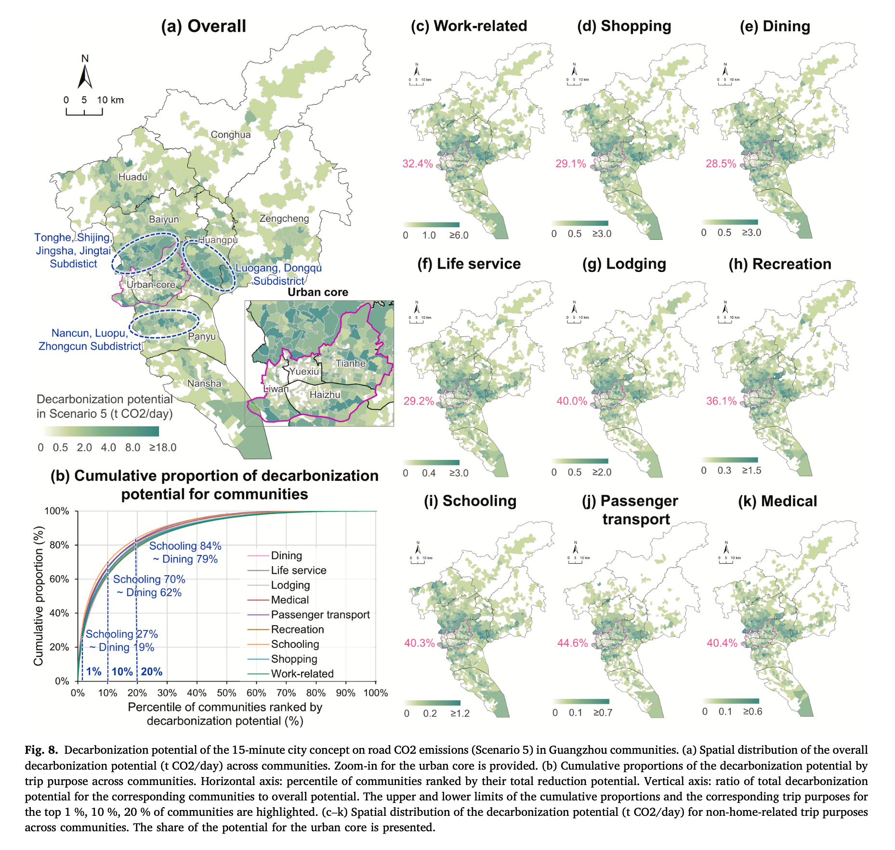
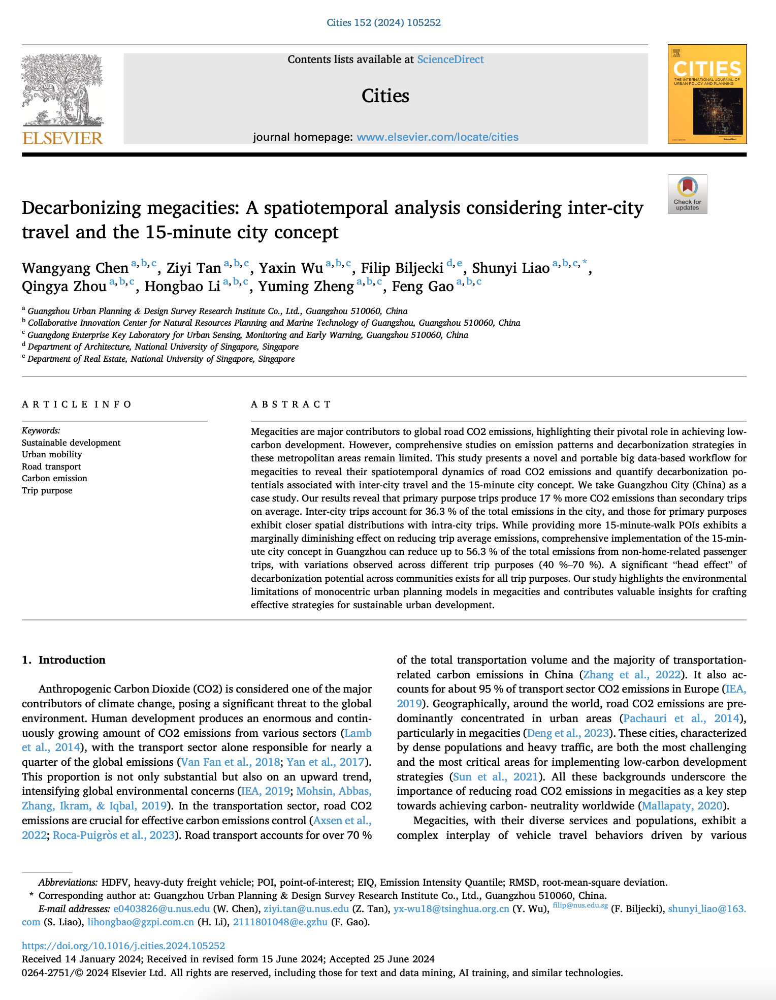

We are glad to share a new collaborative paper:

> Chen W, Tan Z, Wu Y, Biljecki F, Liao S, Zhou Q, Li H, Zheng Y, Gao F (2024): Decarbonizing megacities: A spatiotemporal analysis considering inter-city travel and the 15-minute city concept. _Cities_ 262: 111741. [<i class="ai ai-doi-square ai"></i> 10.1016/j.cities.2024.105252](https://doi.org/10.1016/j.cities.2024.105252) [<i class="far fa-file-pdf"></i> PDF](/publication/2024-cities-decarbonizing/2024-cities-decarbonizing.pdf)</i>

This research was led by {}.
Congratulations on the publication! :raised_hands: :clap:

The paper is [available freely](https://authors.elsevier.com/c/1jMpvy5jOuwSz) until 2024-08-22.



### Highlights


+ Diversified spatiotemporal patterns of road CO2 emissions in Guangzhou were revealed.
+ Novel methods were proposed to compare emission disparities between intra-city and inter-city trips.
+ Decarbonization potential of the 15-minute city concept was quantified in a megacity context.
+ Efficient paradigms for promoting low-carbon 15-minute city in megacities were proposed.

### Abstract

> Megacities are major contributors to global road CO2 emissions, highlighting their pivotal role in achieving low-carbon development. However, comprehensive studies on emission patterns and decarbonization strategies in these metropolitan areas remain limited. This study presents a novel and portable big data-based workflow for megacities to reveal their spatiotemporal dynamics of road CO2 emissions and quantify decarbonization potentials associated with inter-city travel and the 15-minute city concept. We take Guangzhou City (China) as a case study. Our results reveal that primary purpose trips produce 17% more CO2 emissions than secondary trips on average. Inter-city trips account for 36.3% of the total emissions in the city, and those for primary purposes exhibit closer spatial distributions with intra-city trips. While providing more 15-minute-walk POIs exhibits a marginally diminishing effect on reducing trip average emissions, comprehensive implementation of the 15-minute city concept in Guangzhou can reduce up to 56.3% of the total emissions from non-home-related passenger trips, with variations observed across different trip purposes (40%–70%). A significant “head effect” of decarbonization potential across communities exists for all trip purposes. Our study highlights the environmental limitations of monocentric urban planning models in megacities and contributes valuable insights for crafting effective strategies for sustainable urban development.

### Paper 

For more information, please see the [paper](/publication/2024-cities-decarbonizing/).

[](/publication/2024-cities-decarbonizing/)

BibTeX citation:
```bibtex
@article{2024_cities_decarbonizing,
  author = {Chen, Wangyang and Tan, Ziyi and Wu, Yaxin and Biljecki, Filip and Liao, Shunyi and Zhou, Qingya and Li, Hongbao and Zheng, Yuming and Gao, Feng},
  doi = {10.1016/j.cities.2024.105252},
  journal = {Cities},
  pages = {105252},
  title = {Decarbonizing megacities: A spatiotemporal analysis considering inter-city travel and the 15-minute city concept},
  volume = {152},
  year = {2024}
}
```
