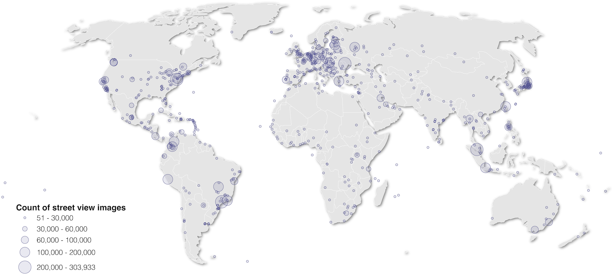
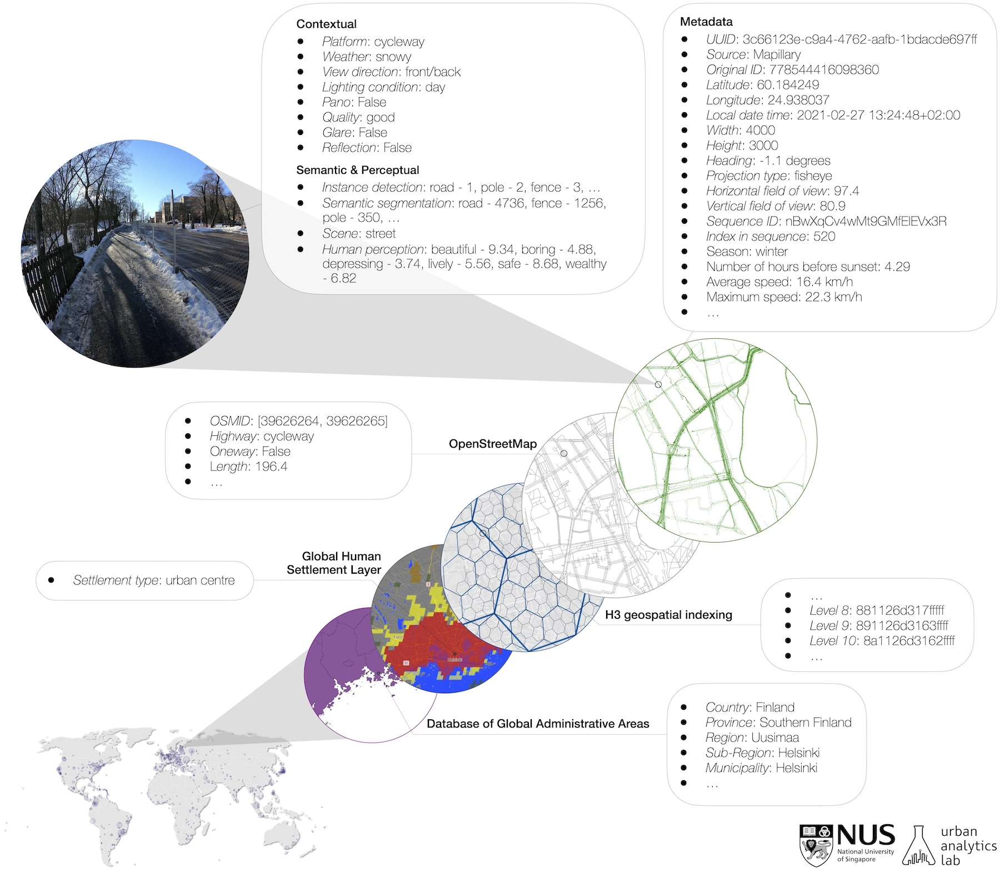
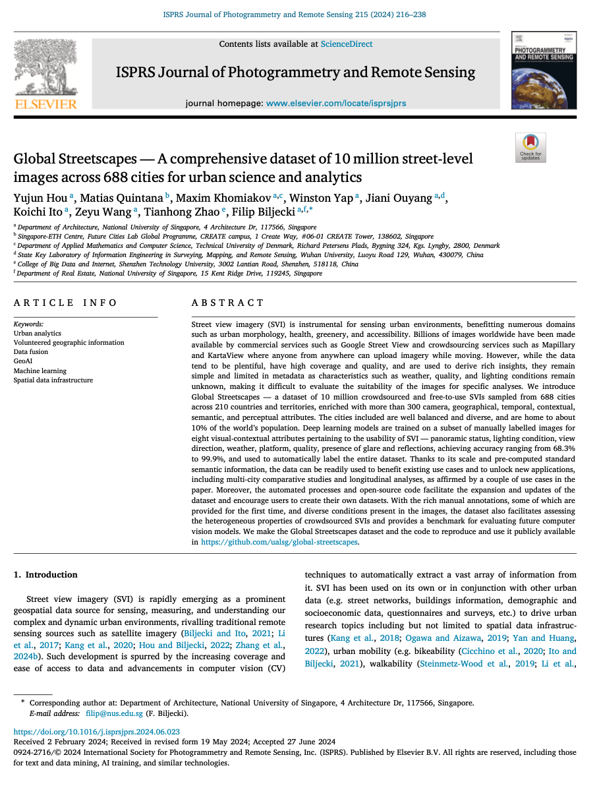

We are excited to announce our project [_Global Streetscapes_](/project/global-streetscapes/)!

It is a big open large-scale labelled street-level imagery dataset addressing various challenges on using street view imagery in urban sciences.
A comprehensive paper about the project is published as a namesake [article](https://doi.org/10.1016/j.isprsjprs.2024.06.023) in the _ISPRS Journal of Photogrammetry and Remote Sensing_:

> Hou Y, Quintana M, Khomiakov M, Yap W, Ouyang J, Ito K, Wang Z, Zhao T, Biljecki F (2024): Global Streetscapes -- A comprehensive dataset of 10 million street-level images across 688 cities for urban science and analytics. _ISPRS Journal of Photogrammetry and Remote Sensing_ 215: 216-238.
> [<i class="ai ai-doi-square ai"></i>10.1016/j.isprsjprs.2024.06.023](https://doi.org/10.1016/j.isprsjprs.2024.06.023) [<i class="far fa-file-pdf"></i> PDF](/publication/2024-global-streetscapes/2024-global-streetscapes.pdf)</i>

The project was led by {}, and it was carried out in a large collaboration within our research group.

Global Streetscapes is a worldwide dataset of 10 million crowdsourced SVIs sampled from Mapillary and KartaView, covering 688 cities around the world, which account for about 10\% of the world's population, enriched with more than 300 attributes and has wide geographical, environmental, and temporal diversity.
In addition, the project is supported with open-source code and documentation.





Check the [website of the project](/project/global-streetscapes/) for more information and links to the dataset, code, and other products, while the [paper](https://doi.org/10.1016/j.isprsjprs.2024.06.023) details the motivation, methodology, examples of results, and provides use cases.

The paper is [available freely](https://authors.elsevier.com/a/1jRHE3I9x1qnmq) until 2024-09-04.

## Highlights

+ Largest labelled dataset, with 346 attributes that characterise street photos.
+ Baseline models and ground truth labels for benchmarking computer vision models.
+ Reproducible framework to sample and enrich SVIs from cities all around the world.
+ In-depth discussion of how the dataset could drive novel research questions.
+ Taking forward the work of Mapillary and KartaView, and their contributors.

## Abstract

> Street view imagery (SVI) is instrumental for sensing urban environments, benefitting numerous domains such as urban morphology, health, greenery, and accessibility. Billions of images worldwide have been made available by commercial services such as Google Street View and crowdsourcing services such as Mapillary and KartaView where anyone from anywhere can upload imagery while moving. However, while the data tend to be plentiful, have high coverage and quality, and are used to derive rich insights, they remain simple and limited in metadata as characteristics such as weather, quality, and lighting conditions remain unknown, making it difficult to evaluate the suitability of the images for specific analyses. We introduce Global Streetscapes — a dataset of 10 million crowdsourced and free-to-use SVIs sampled from 688 cities across 210 countries and territories, enriched with more than 300 camera, geographical, temporal, contextual, semantic, and perceptual attributes. The cities included are well balanced and diverse, and are home to about 10% of the world’s population. Deep learning models are trained on a subset of manually labelled images for eight visual-contextual attributes pertaining to the usability of SVI — panoramic status, lighting condition, view direction, weather, platform, quality, presence of glare and reflections, achieving accuracy ranging from 68.3% to 99.9%, and used to automatically label the entire dataset. Thanks to its scale and pre-computed standard semantic information, the data can be readily used to benefit existing use cases and to unlock new applications, including multi-city comparative studies and longitudinal analyses, as affirmed by a couple of use cases in the paper. Moreover, the automated processes and open-source code facilitate the expansion and updates of the dataset and encourage users to create their own datasets. With the rich manual annotations, some of which are provided for the first time, and diverse conditions present in the images, the dataset also facilitates assessing the heterogeneous properties of crowdsourced SVIs and provides a benchmark for evaluating future computer vision models. We make the Global Streetscapes dataset and the code to reproduce and use it publicly available in [https://github.com/ualsg/global-streetscapes](https://github.com/ualsg/global-streetscapes).

### Paper 

For more information, please see the [paper](/publication/2024-global-streetscapes/).

[](/publication/2024-global-streetscapes/)

BibTeX citation:
```bibtex
@article{2024_global_streetscapes,
 author = {Hou, Yujun and Quintana, Matias and Khomiakov, Maxim and Yap, Winston and Ouyang, Jiani and Ito, Koichi and Wang, Zeyu and Zhao, Tianhong and Biljecki, Filip},
 doi = {10.1016/j.isprsjprs.2024.06.023},
 journal = {ISPRS Journal of Photogrammetry and Remote Sensing},
 pages = {216-238},
 title = {Global Streetscapes -- A comprehensive dataset of 10 million street-level images across 688 cities for urban science and analytics},
 volume = {215},
 year = {2024}
}
```


