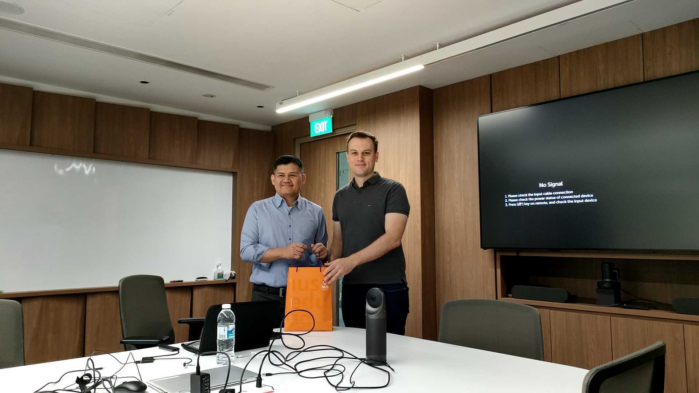
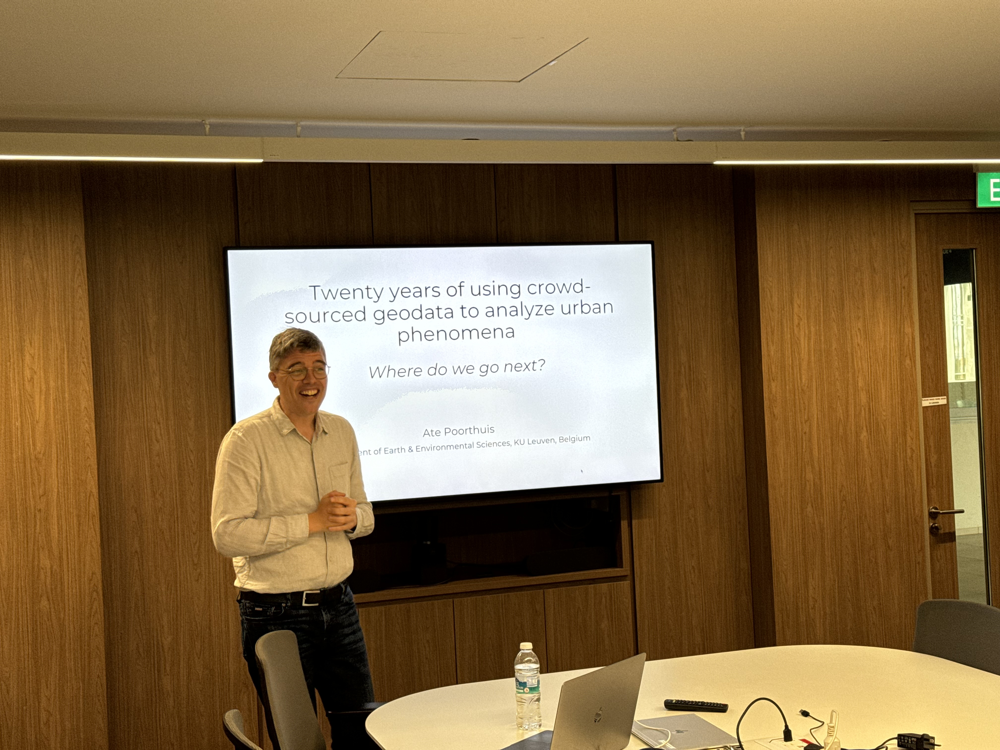
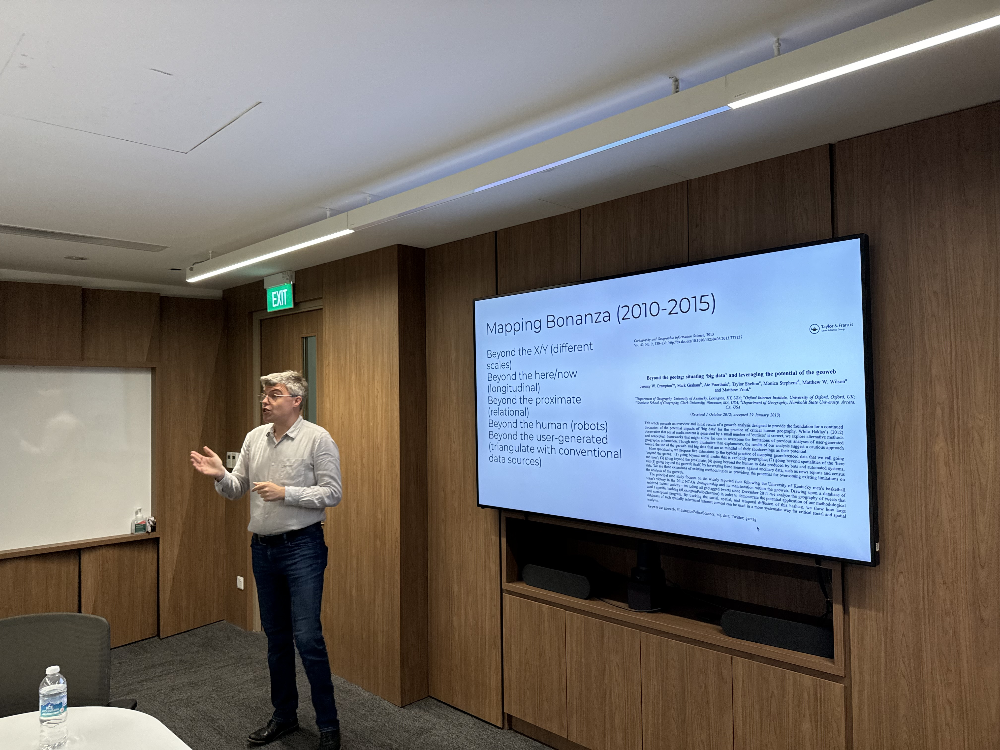
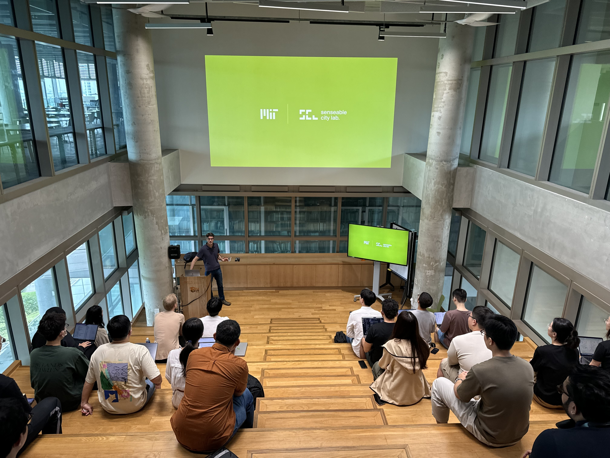
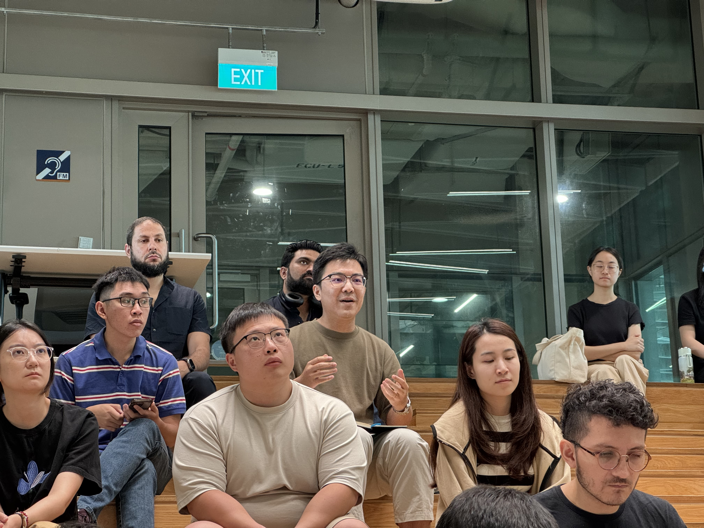
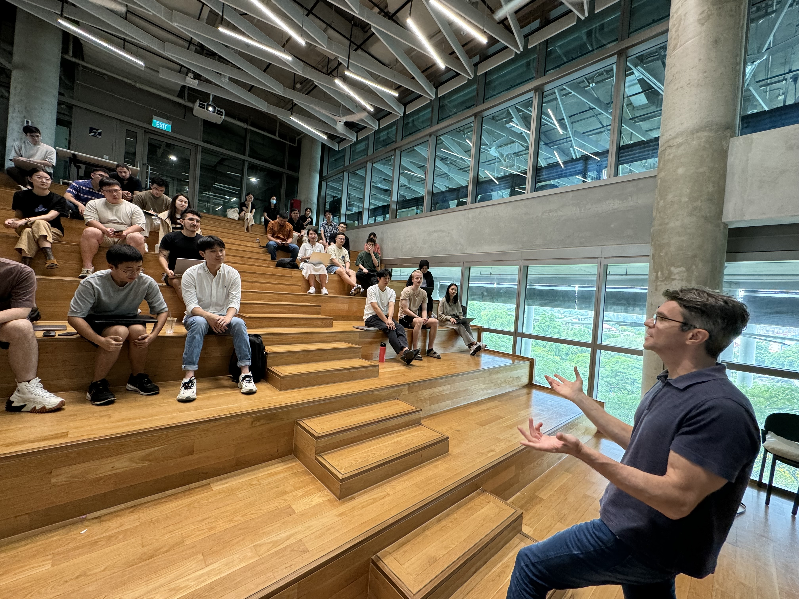
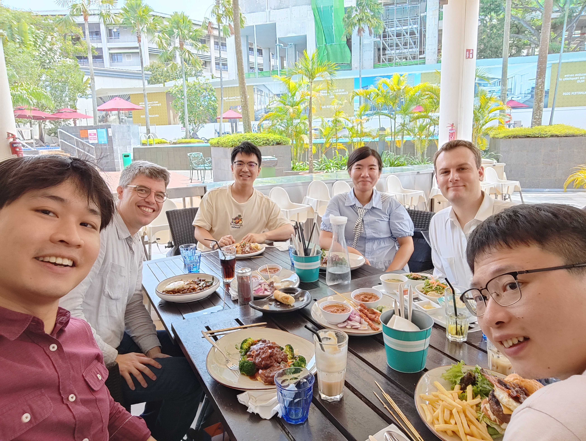

We are having an exciting, vibrant, and busy July!

This month, we hosted four faculty from overseas for insightful department lectures and group discussion sessions:

+ [Adiwan Aritenang](https://www.itb.ac.id/staf/profil/adiwan-fahlan-aritenang), Bandung Institute of Technology 🇮🇩
+ [Vonu Thakuriah](https://sites.rutgers.edu/thakuriah/), Rutgers University-New Brunswick 🇺🇸
+ [Ate Poorthuis](https://www.atepoorthuis.com), KU Leuven 🇧🇪
+ [Fábio Duarte](https://dusp.mit.edu/people/fabio-duarte), Massachusetts Institute of Technology 🇺🇸

The topics of the lectures are listed below, while the abstracts and more information are available on [our seminars website](/seminars).

+ User-Generated Data: Alternative Data Source for Urban Planning in Indonesia
+ Ethics and Responsible Innovation in Data-Intensive Smart Cities and Urban Mobility Management
+ Twenty years of using crowd-sourced geodata to analyze urban phenomena – where do we go next?
+ What happens with big data approaches to urban science when data don't exist?

Big thanks to our guests for the wonderful talks and their time! 

Read more about our seminars on its [website](/seminars).

