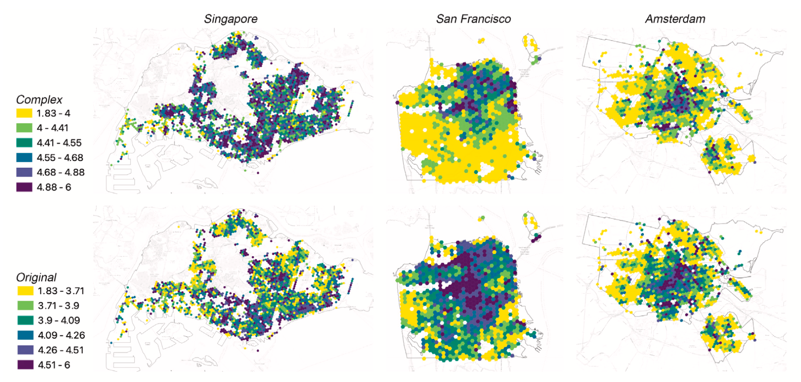
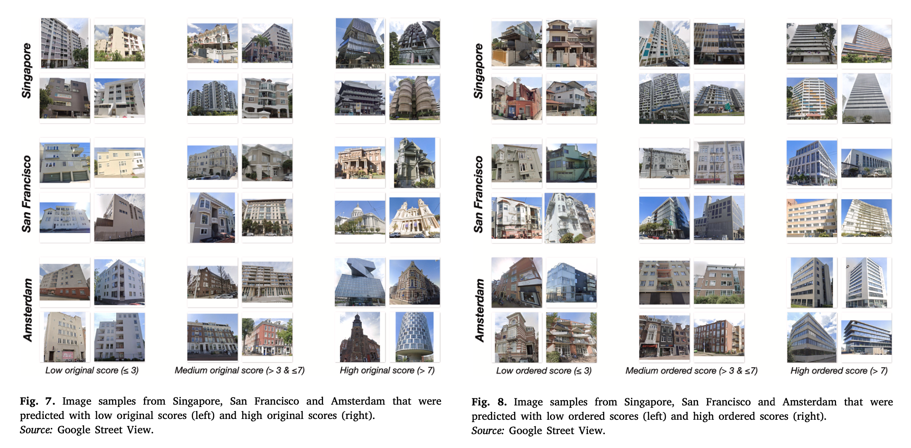
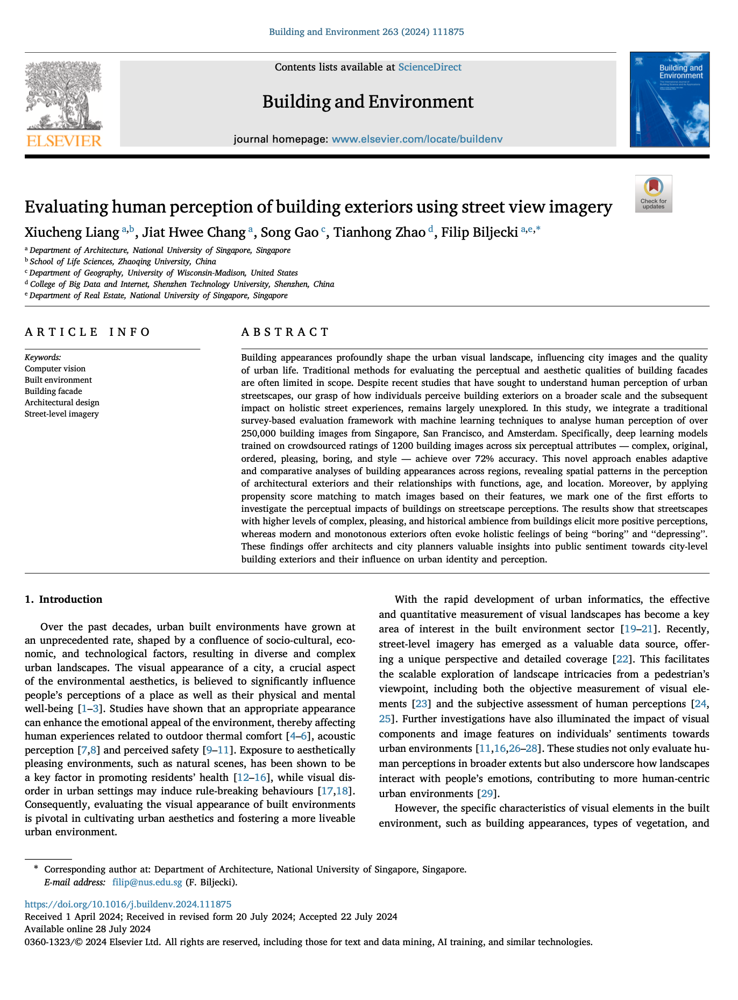

We are glad to share our new paper:

> Liang X, Chang JH, Gao S, Zhao T, Biljecki F (2024): Evaluating human perception of building exteriors using street view imagery. Building and Environment, 263: 111875. [<i class="ai ai-doi-square ai"></i> 10.1016/j.buildenv.2024.111875](https://doi.org/10.1016/j.buildenv.2024.111875) [<i class="far fa-file-pdf"></i> PDF](/publication/2024-bae-building/2024-bae-building.pdf)</i>

This research was led by {}.
Congratulations on this important journal publication! :raised_hands: :clap:



The paper is [available freely](https://authors.elsevier.com/a/1jXKy1HudNFfq2) until 2024-09-21.

### Highlights

+ A deep learning approach is developed to evaluate building exteriors in three cities.
+ Spatial patterns of architectural design are identified from street view imagery.
+ Building characteristics in cities are analysed using objective building attributes.
+ The influence of building perceptions on overall streetscape perceptions is quantified.
+ The historical and complex ambience of buildings enhance streetscape perception quality.




### Abstract

> Building appearances profoundly shape the urban visual landscape, influencing city images and the quality of urban life. Traditional methods for evaluating the perceptual and aesthetic qualities of building facades are often limited in scope. Despite recent studies that have sought to understand human perception of urban streetscapes, our grasp of how individuals perceive building exteriors on a broader scale and the subsequent impact on holistic street experiences, remains largely unexplored. In this study, we integrate a traditional survey-based evaluation framework with machine learning techniques to analyse human perception of over 250,000 building images from Singapore, San Francisco, and Amsterdam. Specifically, deep learning models trained on crowdsourced ratings of 1,200 building images across six perceptual attributes — complex, original, ordered, pleasing, boring, and style — achieve over 72% accuracy. This novel approach enables adaptive and comparative analyses of building appearances across regions, revealing spatial patterns in the perception of architectural exteriors and their relationships with functions, age, and location. Moreover, by applying propensity score matching to match images based on their features, we mark one of the first efforts to investigate the perceptual impacts of buildings on streetscape perceptions. The results show that streetscapes with higher levels of complex, pleasing, and historical ambience from buildings elicit more positive perceptions, whereas modern and monotonous exteriors often evoke holistic feelings of being “boring” and “depressing”. These findings offer architects and city planners valuable insights into public sentiment towards city-level building exteriors and their influence on urban identity and perception.

### Paper 

For more information, please see the [paper](/publication/2024-bae-building/).

[](/publication/2024-bae-building/)

BibTeX citation:
```bibtex
@article{2024_bae_building,
  author = {Liang, Xiucheng and Chang, Jiat Hwee and Gao, Song and Zhao, Tianhong and Biljecki, Filip},
  doi = {10.1016/j.buildenv.2024.111875},
  journal = {Building and Environment},
  pages = {111875},
  title = {Evaluating human perception of building exteriors using street view imagery},
  volume = {263},
  year = {2024}
}
```
