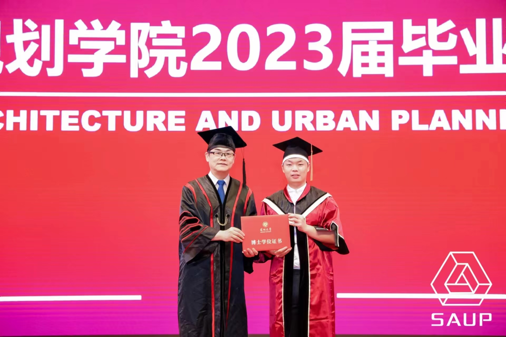
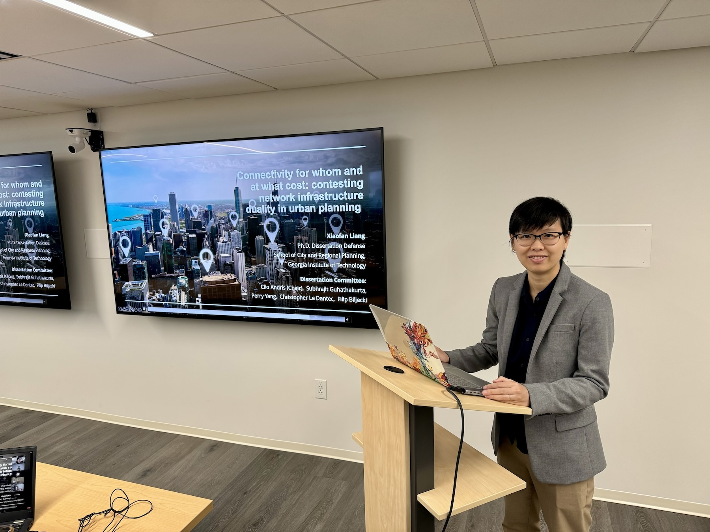
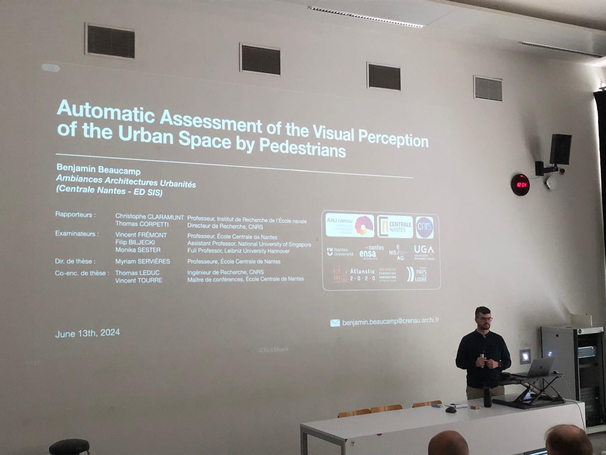
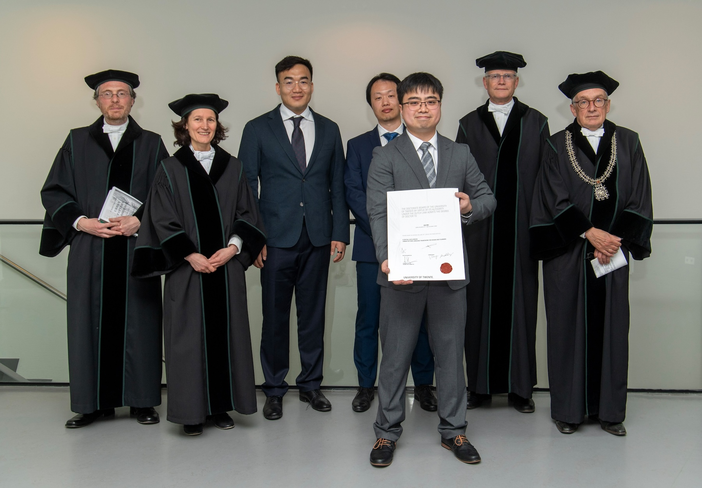
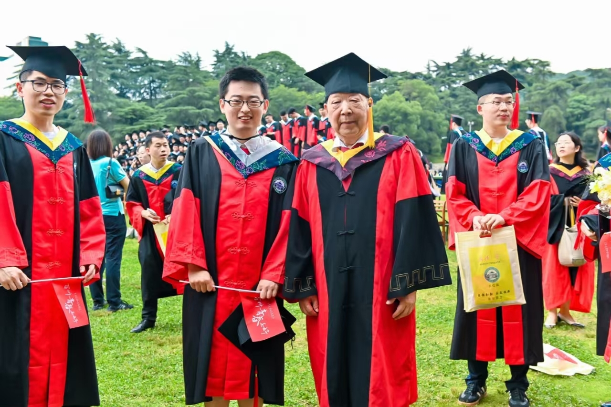
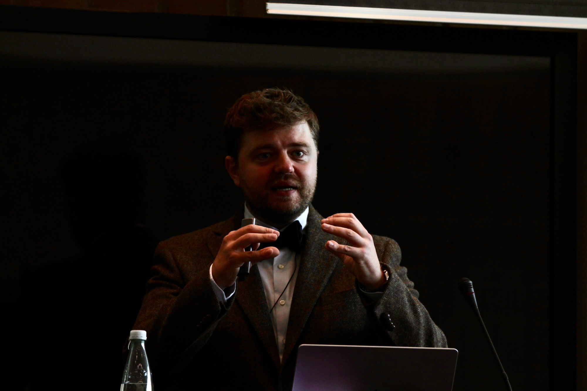
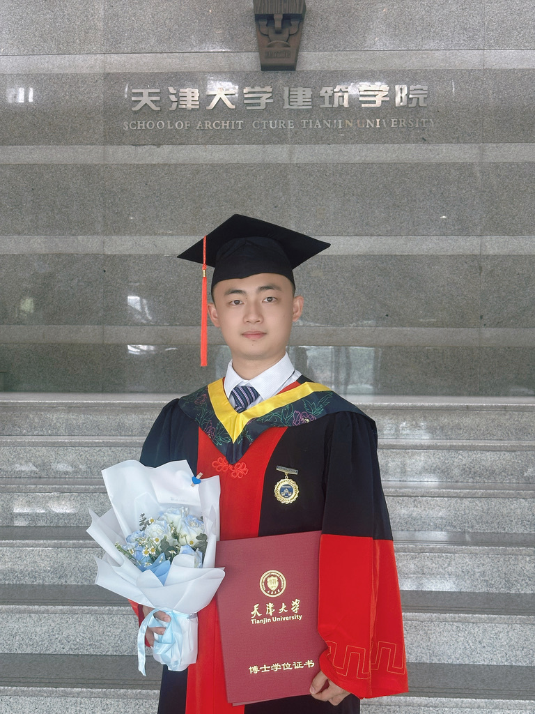
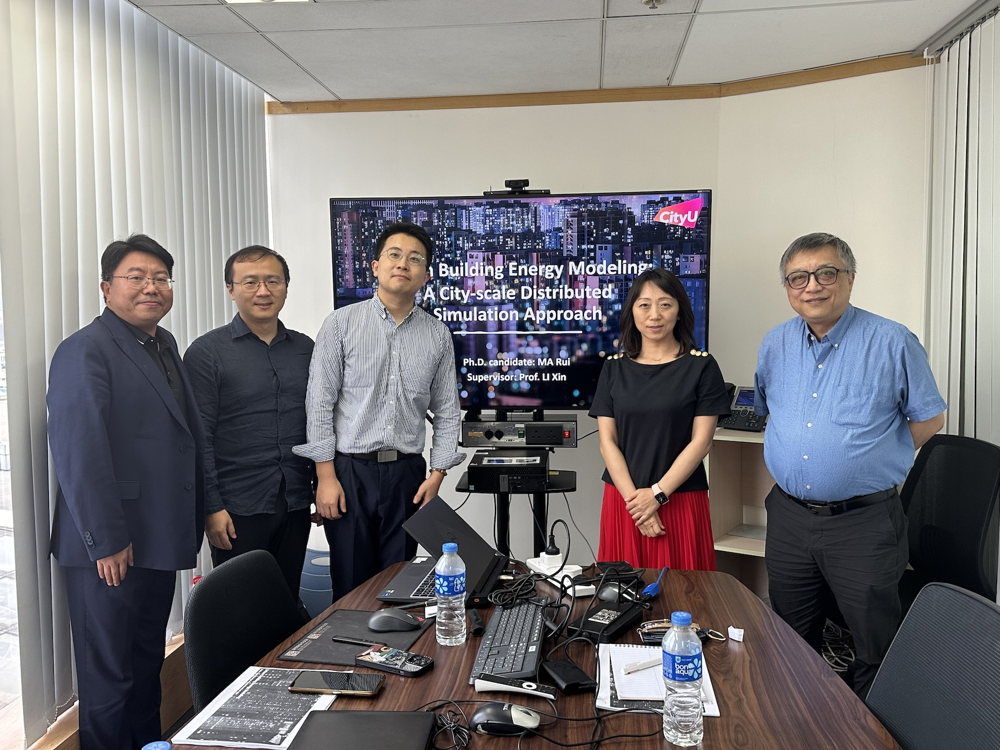
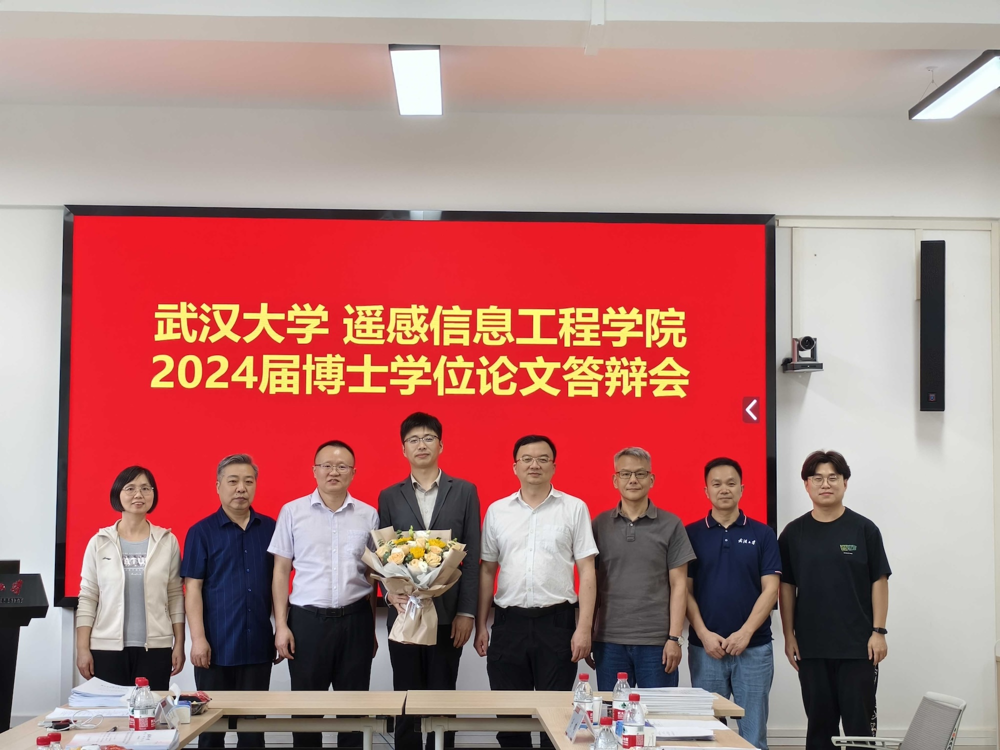
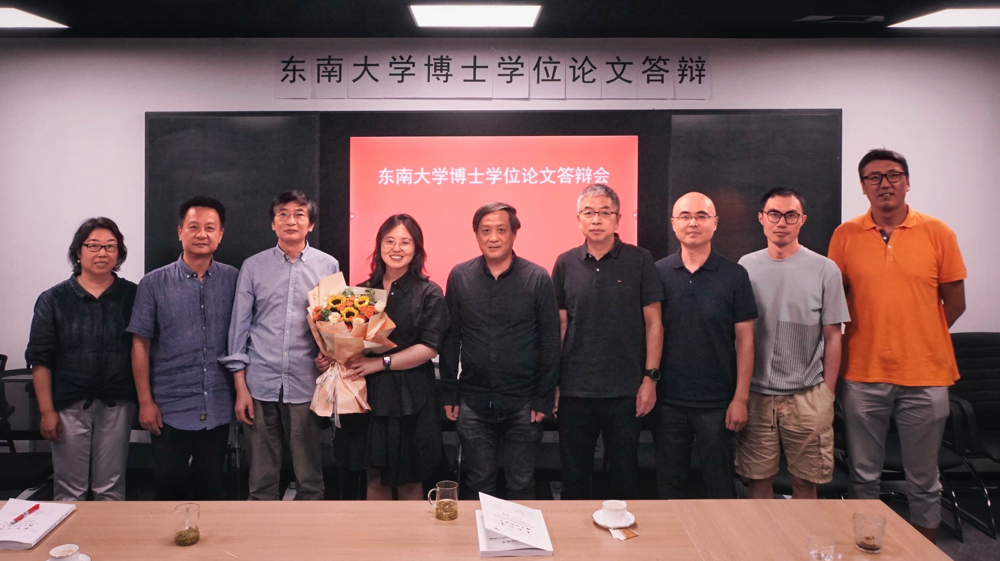

In the past few years we hosted several visiting scholars from foreign universities at our research group in Singapore, resulting in many awesome collaborations and projects.

Recently, 9 of them have finished their PhD degrees around the world, obtaining doctoral degrees from universities in mainland China, USA, Denmark, Netherlands, France, and Hong Kong. 🇨🇳🇺🇸🇩🇰🇳🇱🇫🇷🇭🇰

They are featured below.

Congratulations!
It has been a pleasure to have them in our research group and follow their successes and subsequent work.
We are very proud of their accomplishments, thank them for their collaboration (which we hope to continue), and wish them the best in the continuation of their careers.

We continuously welcome visiting scholars.
If you are looking into such a visit, please read our [Guide for prospective applicants](/opportunities/application-guide/).

---

### Tianhong Zhao, Shenzhen University

{} obtained his PhD in Urban Informatics at Shenzhen University on _Research on data-driven approaches for modeling urban public transit demand_.

During his stay in our Lab, we collaborated on a variety of topics, for example, on [Sensing urban soundscapes from street view imagery](), which got published in CEUS. Tianhong's publications are available [here](https://scholar.google.com/citations?user=zKBGvToAAAAJ&hl=zh-CN).

Tianhong is now a Lecturer at Shenzhen Technology University.

---

### Xiaofan Liang, Georgia Institute of Technology

{} defended her thesis _[Connectivity for whom and at what cost: contesting network infrastructure duality in urban planning](https://repository.gatech.edu/entities/publication/17423254-589d-4fc3-84a3-e66b05eab76e)_ and was awarded a PhD in City and Regional Planning at the Georgia Institute of Technology.
The research was conducted in our sister lab, the [Friendly Cities Lab](http://friendlycities.gatech.edu).

During her stay in our research group, we worked on [analysing the social infrastructure near subway stations](https://www.xiaofanliang.com/project/sipoi/), at the global scale and using OpenStreetMap.
Read more about Xiaofan's work on [her personal website](https://www.xiaofanliang.com), while her publications are [here](https://scholar.google.com/citations?user=fMkIGgMAAAAJ&hl=en&oi=ao).

Xiaofan is now an Assistant Professor of Urban and Regional Planning at Taubman College of Architecture & Urban Planning, University of Michigan - Ann Arbor.

---

### Benjamin Beaucamp, Centrale Nantes 

[Benjamin Beaucamp](https://fr.linkedin.com/in/benjamin-beaucamp/en) defended his PhD thesis _[Automatic assessment of the visual perception of the urban space by pedestrians](https://www.ec-nantes.fr/medias/fichier/resume_1717069935150-pdf)_ at Centrale Nantes.
He conducted this research in the [Urban Architecture Nantes Research Centre (CRENAU)](https://aau.archi.fr/crenau/), part of the [Architectural and Urban Ambiances Laboratory (AAU)](https://aau.archi.fr).

While he was in our Lab, we worked on understanding the perspective bias in street view imagery and are continuing our collaboration, which includes also the preparation of a new kind of SVI dataset.

Benjamin is now a Postdoc in the [Geoloc lab](https://geoloc.univ-gustave-eiffel.fr) at the Université Gustave Eiffel, which is known for its urban planning education and research.

---

### Cai Wu, University of Twente

{} just [received his PhD](https://www.utwente.nl/en/education/tgs/currentcandidates/phd/calendar/2024/6/1563394/phd-defence-cai-wu-a-spatial-driven-urban-pattern-language-framework-for-design-and-planning) from the University of Twente, defending his thesis _[A spatial data-driven urban pattern language framework for design and planning](https://research.utwente.nl/en/publications/a-spatial-data-driven-urban-pattern-language-framework-for-design)_.

During his stay in our research group, we worked on a variety of topics related to walkability and urban morphology.
The full list of his publications is available [here](https://scholar.google.com/citations?user=jdnF-JYAAAAJ&hl=en), while more information about his research is available on [his personal website](https://wucai.me).

Cai is soon joining The Hong Kong University of Science and Technology (Guangzhou) as Assistant Professor.

---

### Yan Zhang, Wuhan University

{} defended his PhD thesis _A multi-scale spatio-temporal sensing method for urban function zone based on street view images_ at Wuhan University.

During his stay in our group, we worked on advancing urban analytics using street view imagery. 
One of the efforts was published as a paper in the ISPRS Journal of Photogrammetry and Remote Sensing -- _[Knowledge and topology: A two layer spatially dependent graph neural networks to identify urban functions with time-series street view image]()_.
Yan's full list of publications is available [here](https://scholar.google.com.hk/citations?user=H8T2HtsAAAAJ), while more information about his research is available on [his personal website](https://sites.google.com/view/giserzhang).

Yan is now a Postdoc at The Chinese University of Hong Kong.

---

### Maxim Khomiakov, Technical University of Denmark

{} defended his PhD thesis at the Technical University of Denmark, bringing advancements in the use of deep learning in remote sensing.

While with us, Maxim was an important contributor to our [Global Streetscapes project](/project/global-streetscapes), which greatly benefited from his expertise and ideas.

His publications are available [here](https://scholar.google.com.sg/citations?user=czbfDcwAAAAJ&hl=en&oi=ao). 
He also has [a personal website](https://www.maxims.dev).

Maxim is now working as an ML Research Engineer at [pihalf](http://www.pihalf.com/) and he is also a Research Affiliate at the Technical University of Denmark.

---

### Junjie Luo, Tianjin University

{} defended his PhD thesis _Visual Perception Analysis of Urban Riverscapes Based on a Digital Twin System_ at Tianjin University.

Our research group learned a lot from Junjie's expertise during his research visit.
We worked predominanlty on human perception studies based on novel datasets.
Multiple of these efforts have been published in leading journals.
For example, Landscape and Urban Planning published his work [Semantic Riverscapes: Perception and evaluation of linear landscapes from oblique imagery using computer vision]().

The full list of his publications is available [here](https://scholar.google.com/citations?hl=en&user=9DZiTEUAAAAJ).

Junjie is now Associate Professor at Zhejiang A&F University.

---

### Rui Ma, City University of Hong Kong

{} was awarded a PhD in Architecture and Civil Engineering from the City University of Hong Kong for his thesis on urban building energy modeling.

During his stay in our Lab, we worked on multiple research efforts, including advancing 3D building reconstruction using street view imagery.
The full list of his publications is available [here](https://scholar.google.com/citations?user=V_KsQSgAAAAJ&hl=zh-CN), while more information about his research is available on [his personal website](https://ruirzma.github.io).

Rui is currently a Postdoc at the same university.

---

### Dayu Yu, Wuhan University

{} has obtained his PhD from Wuhan University, defending his thesis _Lightweight Generation and Service Methods for Photo-Realistic 3D Building Models_, which he conducted at the School of Remote Sensing Information Engineering.

We collaborated with Dayu on an effort to advance 3D spatial data infrastructures.
You can read more about his research on [his personal website](https://dayuyu-3d.github.io), while the list of his publications is available [here](https://scholar.google.com.hk/citations?hl=zh-CN&user=C3Pkj1sAAAAJ).

Dayu has transitioned to an Assistant Professor role at Nanjing Normal University.

---

In addition, it is our pleasure to use this opportunity to feature also {}, a Postdoctoral Research Fellow at Future Cities Lab Global (Singapore-ETH Centre) in our project [Semantic Urban Elements](https://fcl.ethz.ch/research/integration-and-strategies/semantic-urban-elements.html).

### Chenyi Cai, Southeast University 

[Chenyi Cai](https://ch.linkedin.com/in/chenyi-cai-680943201) has obtained her PhD at the Southeast University in Nanjing.
During her PhD she was also a visiting researcher at the Institute of Technology in Architecture, ETH Zurich.

Chenyi's publications are available [here](https://scholar.google.com/citations?hl=en&user=DV1nKooAAAAJ&view_op=list_works&sortby=pubdate), while her profile is available on the [SEC website](https://fcl.ethz.ch/people/researchers/cai-chenyi.html).

---

Congratulations to everyone, well done! 🎉👏

