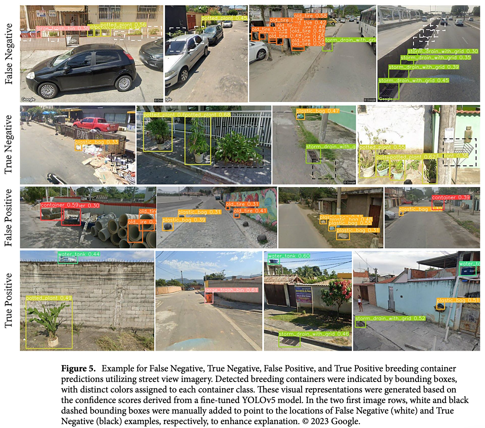
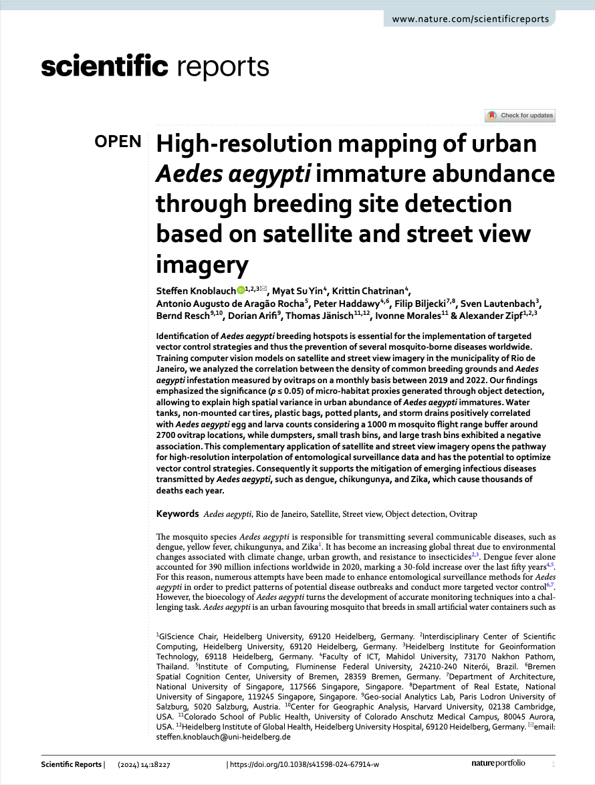

We are glad to share a new collaborative paper:

> Knoblauch S, Su Yin M, Chatrinan K, de Aragão Rocha AA, Haddawy P, Biljecki F, Lautenbach S, Resch B, Arifi D, Jänisch T, Morales I, Zipf A (2024): High-resolution mapping of urban Aedes aegypti immature abundance through breeding site detection based on satellite and street view imagery. Scientific Reports 14(1): 18227. [<i class="ai ai-doi-square ai"></i> 10.1038/s41598-024-67914-w](https://doi.org/10.1038/s41598-024-67914-w) [<i class="far fa-file-pdf"></i> PDF](/publication/2024-sr-aa-mapping/2024-sr-aa-mapping.pdf)</i> <i class="ai ai-open-access-square ai"></i>

This research was led by [Steffen Knoblauch](https://www.geog.uni-heidelberg.de/gis/knoblauch.html) from the [GIScience Research Group](https://www.geog.uni-heidelberg.de/gis/index_en.html) at Heidelberg University in Germany.
Congratulations on the publication! :raised_hands: :clap:

The paper is [available open access](https://doi.org/10.1038/s41598-024-67914-w).



### Abstract

> Identification of Aedes aegypti breeding hotspots is essential for the implementation of targeted vector control strategies and thus the prevention of several mosquito-borne diseases worldwide. Training computer vision models on satellite and street view imagery in the municipality of Rio de Janeiro, we analyzed the correlation between the density of common breeding grounds and Aedes aegypti infestation measured by ovitraps on a monthly basis between 2019 and 2022. Our findings emphasized the significance (p ≤ 0.05) of micro-habitat proxies generated through object detection, allowing to explain high spatial variance in urban abundance of Aedes aegypti immatures. Water tanks, non-mounted car tires, plastic bags, potted plants, and storm drains positively correlated with Aedes aegypti egg and larva counts considering a 1000 m mosquito flight range buffer around 2700 ovitrap locations, while dumpsters, small trash bins, and large trash bins exhibited a negative association. This complementary application of satellite and street view imagery opens the pathway for high-resolution interpolation of entomological surveillance data and has the potential to optimize vector control strategies. Consequently it supports the mitigation of emerging infectious diseases transmitted by Aedes aegypti, such as dengue, chikungunya, and Zika, which cause thousands of deaths each year.

### Paper 

For more information, please see the [paper](/publication/2024-sr-aa-mapping/) (open access <i class="ai ai-open-access-square ai"></i>).

[](/publication/2024-sr-aa-mapping/)

BibTeX citation:
```bibtex
@article{2024_sr_aa_mapping,
  author = {Knoblauch, Steffen and Su Yin, Myat and Chatrinan, Krittin and de Arag{\~a}o Rocha, Antonio Augusto and Haddawy, Peter and Biljecki, Filip and Lautenbach, Sven and Resch, Bernd and Arifi, Dorian and J{\"a}nisch, Thomas and Morales, Ivonne and Zipf, Alexander},
  doi = {10.1038/s41598-024-67914-w},
  journal = {Scientific Reports},
  number = {1},
  title = {High-resolution mapping of urban Aedes aegypti immature abundance through breeding site detection based on satellite and street view imagery},
  volume = {14},
  pages = {18227},
  year = {2024}
}
```
