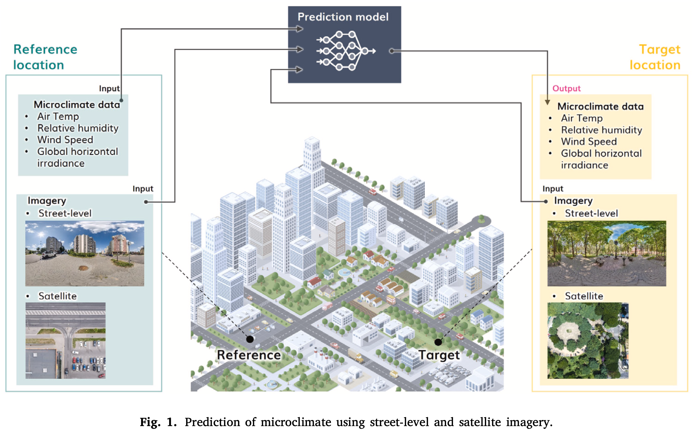
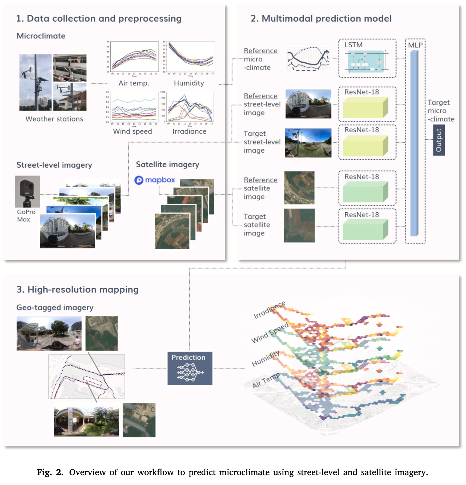
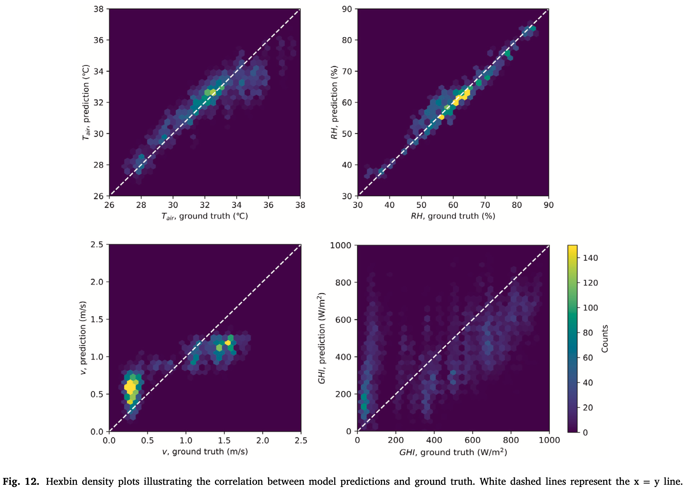
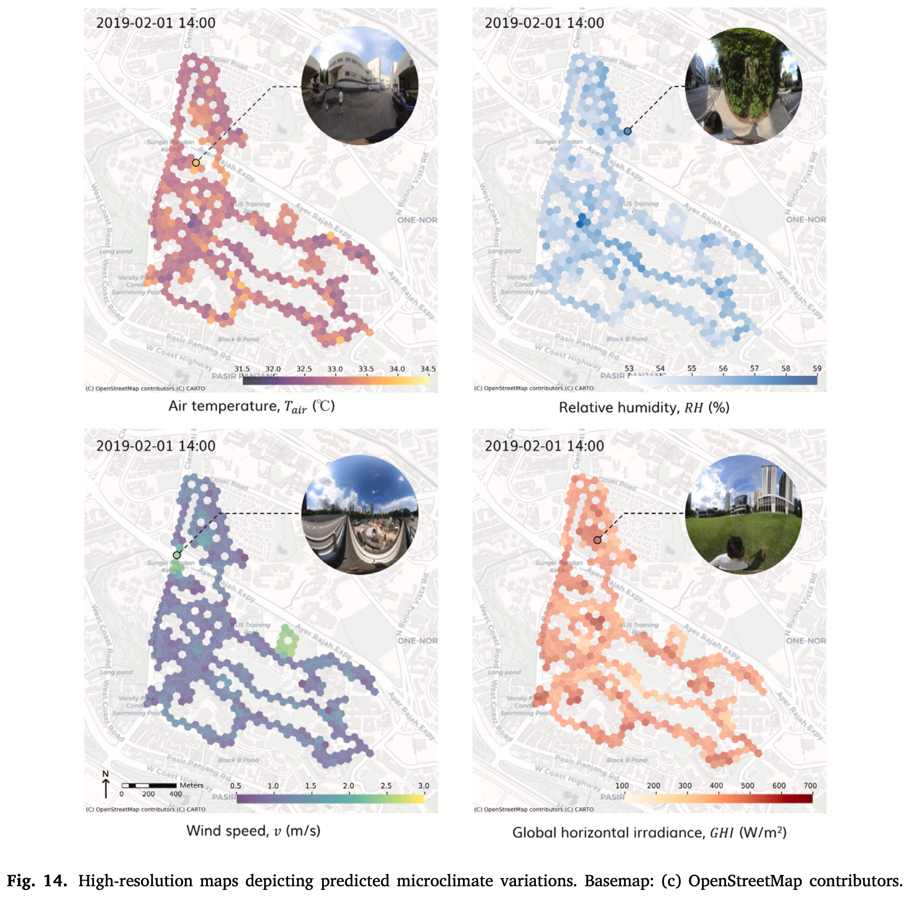
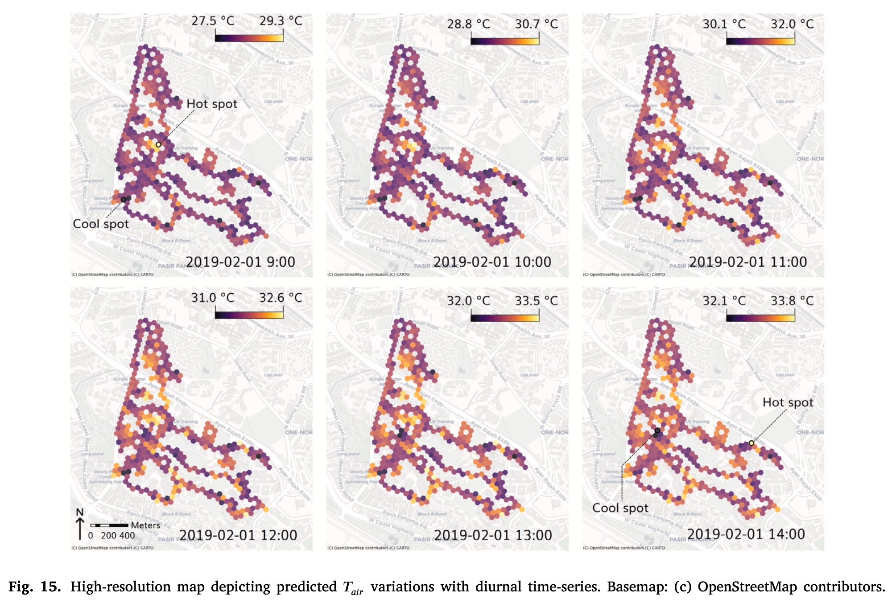
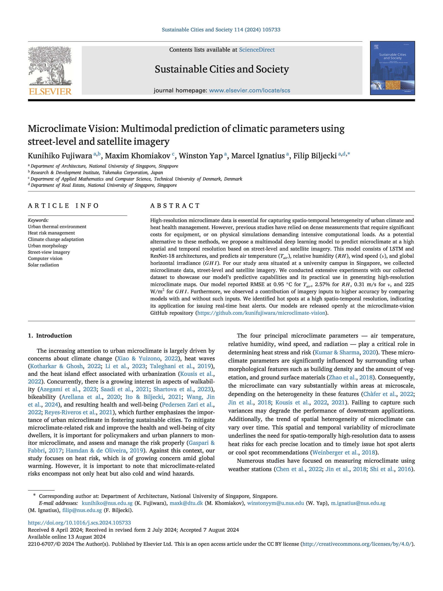

We are glad to share our new paper:

> Fujiwara K, Khomiakov M, Yap W, Ignatius M, Biljecki F (2024): Microclimate Vision: Multimodal prediction of climatic parameters using street-level and satellite imagery. Sustainable Cities and Society, 114: 105733. [<i class="ai ai-doi-square ai"></i> 10.1016/j.scs.2024.105733](https://doi.org/10.1016/j.scs.2024.105733) [<i class="far fa-file-pdf"></i> PDF](/publication/2024-scs-microclimate-vision/2024-scs-microclimate-vision.pdf)</i> <i class="ai ai-open-access-square ai"></i>

This research was led by {}.
Congratulations on this important journal publication! :raised_hands: :clap:
We are glad that this paper is one of the first outcomes of [our collaboration with Takenaka Corporation]().





### Highlights

+ Prediction of microclimate parameters using street-level and satellite imagery.
+ Multimodal prediction model combining LSTM and ResNet-18 architectures.
+ Collecting and using microclimate data, street-level imagery, and satellite imagery.
+ High accuracy: RMSE at 0.95 °C (T_air), 2.57% (RH), 0.31 m/s (v), 225 W/m2 (GHI).
+ Street-level and satellite imagery contribute to improving accuracy.






### Abstract

> High-resolution microclimate data is essential for capturing spatio-temporal heterogeneity of urban climate and heat health management. However, previous studies have relied on dense measurements that require significant costs for equipment, or on physical simulations demanding intensive computational loads. As a potential alternative to these methods, we propose a multimodal deep learning model to predict microclimate at a high spatial and temporal resolution based on street-level and satellite imagery. This model consists of LSTM and ResNet-18 architectures, and predicts air temperature (T_air), relative humidity (RH), wind speed (v), and global horizontal irradiance (GHI). For our study area situated at a university campus in Singapore, we collected microclimate data, street-level and satellite imagery. We conducted extensive experiments with our collected dataset to showcase our model’s predictive capabilities and its practical use in generating high-resolution microclimate maps. Our model reported RMSE at 0.95 °C for T_air, 2.57% for RH, 0.31 m/s for v, and 225 W/m2 for GHI. Furthermore, we observed a contribution of imagery inputs to higher accuracy by comparing models with and without such inputs. We identified hot spots at a high spatio-temporal resolution, indicating its application for issuing real-time heat alerts. Our models are released openly at the microclimate-vision GitHub repository (https://github.com/kunifujiwara/microclimate-vision).



### Paper 

For more information, please see the [paper](/publication/2024-scs-microclimate-vision/) (open access <i class="ai ai-open-access-square ai"></i>).

[](/publication/2024-scs-microclimate-vision/)

BibTeX citation:
```bibtex
@article{2024_scs_microclimate_vision,
  author = {Fujiwara, Kunihiko and Khomiakov, Maxim and Yap, Winston and Ignatius, Marcel and Biljecki, Filip},
  doi = {10.1016/j.scs.2024.105733},
  journal = {Sustainable Cities and Society},
  pages = {105733},
  title = {Microclimate Vision: Multimodal prediction of climatic parameters using street-level and satellite imagery},
  volume = {114},
  year = {2024}
}
```
