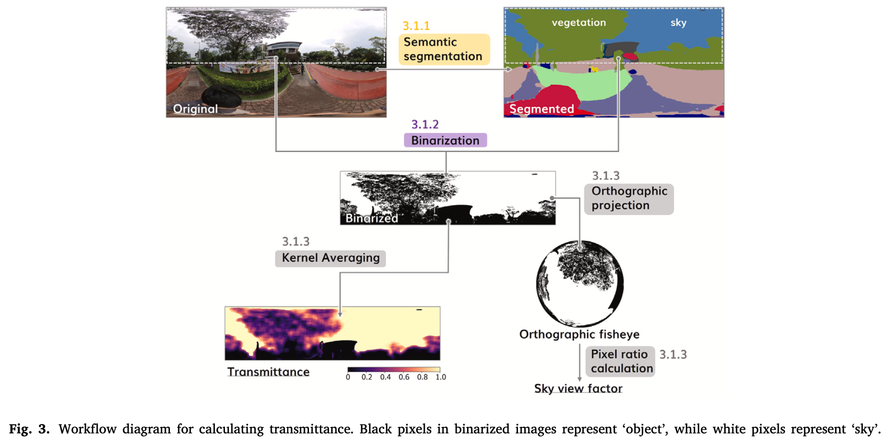
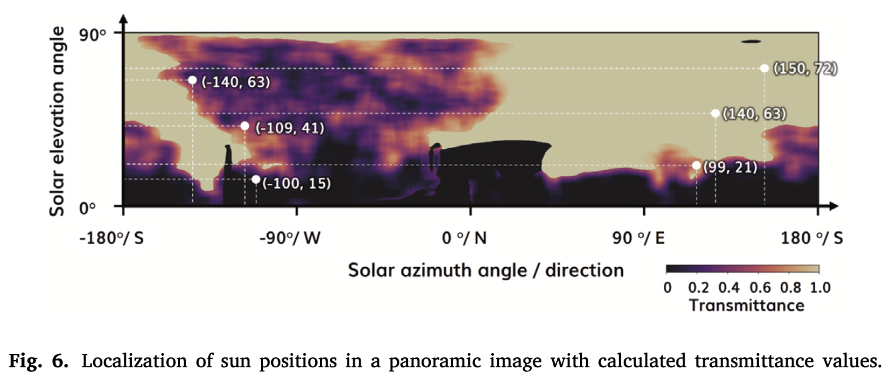
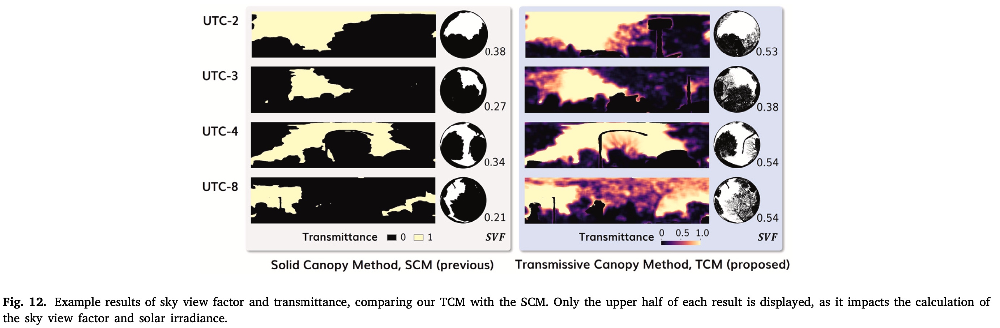
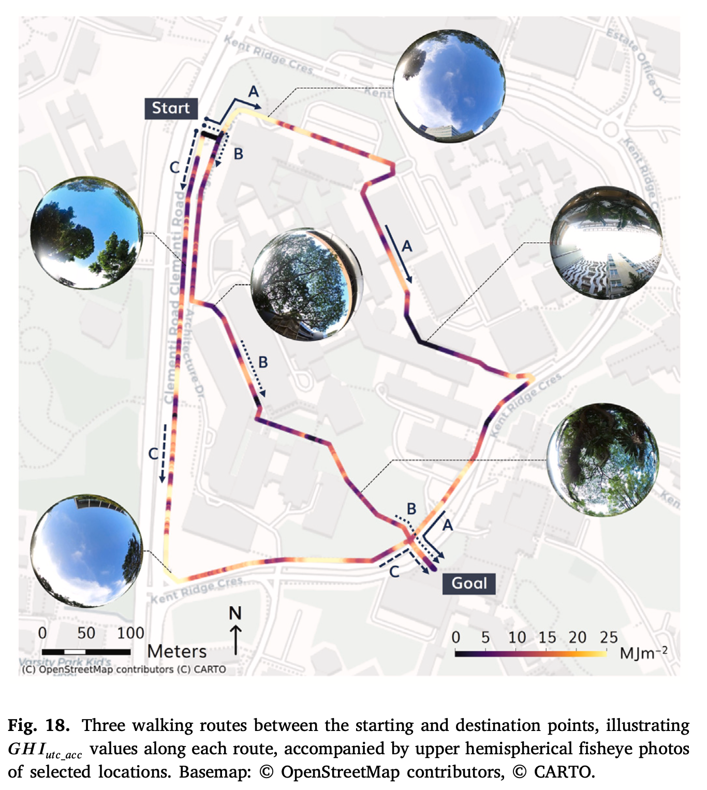
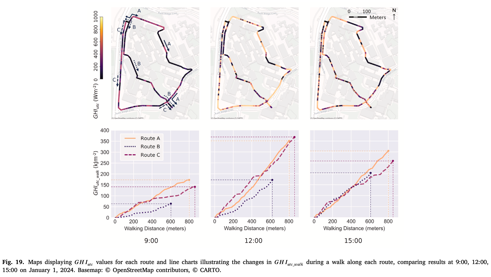
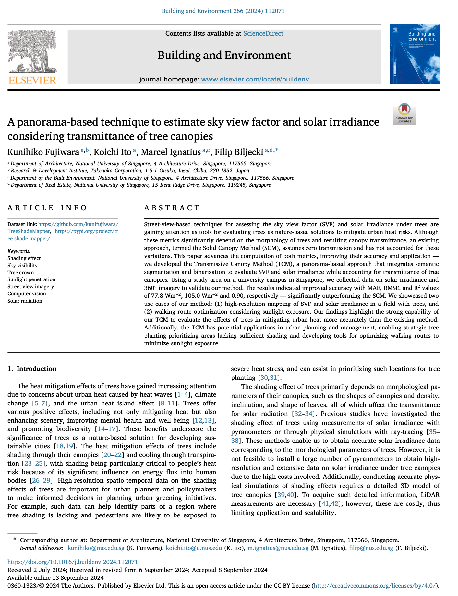

We are glad to share our new paper:

> Fujiwara K, Ito K, Ignatius M, Biljecki F (2024): A panorama-based technique to estimate sky view factor and solar irradiance considering transmittance of tree canopies. Building and Environment, 266: 112071. [<i class="ai ai-doi-square ai"></i> 10.1016/j.buildenv.2024.112071](https://doi.org/10.1016/j.buildenv.2024.112071) [<i class="far fa-file-pdf"></i> PDF](/publication/2024-bae-svf/2024-bae-svf.pdf)</i> <i class="ai ai-open-access-square ai"></i>

This research was led by {}.
Congratulations on this important journal publication! :raised_hands: :clap:

This paper is another outcome of [our collaboration with Takenaka Corporation]().

The code has been released open-source at [GitHub](https://github.com/kunifujiwara/TreeShadeMapper).





### Highlights

+ Advancing estimation of sky view factor and solar irradiance using panoramic imagery.
+ Detecting shading objects based on semantic segmentation of street-level panoramas.
+ Estimating transmittance of tree canopies using image binarization.
+ Solar irradiance estimated with MAE of 77.8 Wm−2, RMSE of 105.0 Wm−2, and R of 0.90.
+ Demonstration of high-resolution mapping and walking route optimization.






### Abstract

> Street-view-based techniques for assessing the sky view factor (SVF) and solar irradiance under trees are gaining attention as tools for evaluating trees as nature-based solutions to mitigate urban heat risks. Although these metrics significantly depend on the morphology of trees and resulting canopy transmittance, an existing approach, termed the Solid Canopy Method (SCM), assumes zero transmission and has not accounted for these variations. This paper advances the computation of both metrics, improving their accuracy and application — we developed the Transmissive Canopy Method (TCM), a panorama-based approach that integrates semantic segmentation and binarization to evaluate SVF and solar irradiance while accounting for transmittance of tree canopies. Using a study area on a university campus in Singapore, we collected data on solar irradiance and 360°imagery to validate our method. The results indicated improved accuracy with MAE, RMSE, and R values of 77.8 Wm−2, 105.0 Wm−2 and 0.90, respectively — significantly outperforming the SCM. We showcased two use cases of our method: (1) high-resolution mapping of SVF and solar irradiance in a field with trees, and (2) walking route optimization considering sunlight exposure. Our findings highlight the strong capability of our TCM to evaluate the effects of trees in mitigating urban heat more accurately than the existing method. Additionally, the TCM has potential applications in urban planning and management, enabling strategic tree planting prioritizing areas lacking sufficient shading and developing tools for optimizing walking routes to minimize sunlight exposure.



### Paper 

For more information, please see the [paper](/publication/2024-bae-svf/) (open access <i class="ai ai-open-access-square ai"></i>).

[](/publication/2024-bae-svf/)

BibTeX citation:
```bibtex
@article{2024_bae_svf,
  author = {Fujiwara, Kunihiko and Ito, Koichi and Ignatius, Marcel and Biljecki, Filip},
  doi = {10.1016/j.buildenv.2024.112071},
  journal = {Building and Environment},
  pages = {112071},
  title = {A panorama-based technique to estimate sky view factor and solar irradiance considering transmittance of tree canopies},
  volume = {266},
  year = {2024}
}
```
