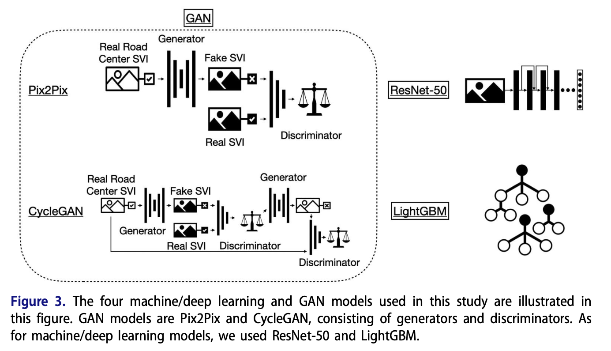

We are glad to share our new paper:

> Ito K, Quintana M, Han X, Zimmermann R, Biljecki F (2024): Translating street view imagery to correct perspectives to enhance bikeability and walkability studies. International Journal of Geographical Information Science. [<i class="ai ai-doi-square ai"></i> 10.1080/13658816.2024.2391969](https://doi.org/10.1080/13658816.2024.2391969) [<i class="far fa-file-pdf"></i> PDF](/publication/2024-ijgis-svi-gan/2024-ijgis-svi-gan.pdf)</i>

This research was led by {}.
Congratulations on this important journal publication! :raised_hands: :clap:

The work challenges studies that have used car-centric perspectives of street view imagery for understanding walkability and bikeability and offers a solution.





### Abstract

> Street view imagery (SVI), an emerging geospatial dataset, is useful for evaluating active transportation infrastructure, but it faces potential biases from its vehicle-based capture method, diverging from pedestrians’ and cyclists’ perspectives. Existing literature lacks both an examination of these biases and a solution. This study identifies and quantifies these biases by comparing conventional SVI with views from the road shoulder/sidewalk. To mitigate such perspective biases, we introduce a novel framework with generative adversarial network (GAN)-based image generation models (Pix2Pix and CycleGAN), an image regression model (ResNet-50), and a tabular model (LightGBM). Experiments assessed model effectiveness in translating car-centric views to those from pedestrian and cyclist perspectives. Results show significant differences in semantic indicators (e.g. green view index) between road center and road shoulder/sidewalk SVI, with low Pearson’s correlation coefficients r (0.35–0.55 for road shoulders and 0.45–0.47 for sidewalks) indicating bias. The framework succeeded in creating realistic images and aligning pixel ratios between perspectives, achieving strong correlation coefficients (0.81 for road shoulders and 0.83 for sidewalks), thus reducing bias. This work contributes by providing a scalable and model-agnostic approach to produce accurate SVIs for urban planning and sustainability, setting a foundation for improving bikeability and walkability assessments and promoting active transportation.


### Paper 

For more information, please see the [paper](/publication/2024-ijgis-svi-gan/).

[](/publication/2024-ijgis-svi-gan/)

BibTeX citation:
```bibtex
@article{2024_ijgis_svi_gan,
  author = {Ito, Koichi and Quintana, Matias and Han, Xianjing and Zimmermann, Roger and Biljecki, Filip},
  doi = {10.1080/13658816.2024.2391969},
  journal = {International Journal of Geographical Information Science},
  pages = {1-31},
  title = {Translating street view imagery to correct perspectives to enhance bikeability and walkability studies},
  year = {2024}
}
```
