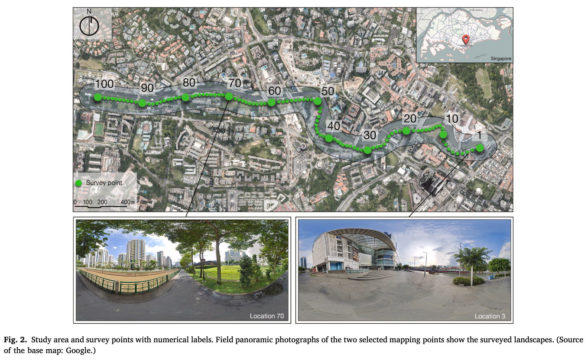
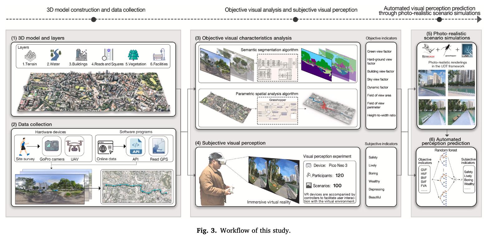
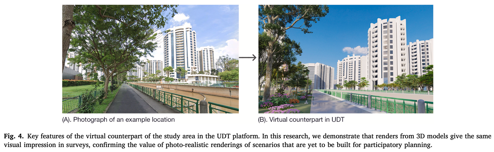
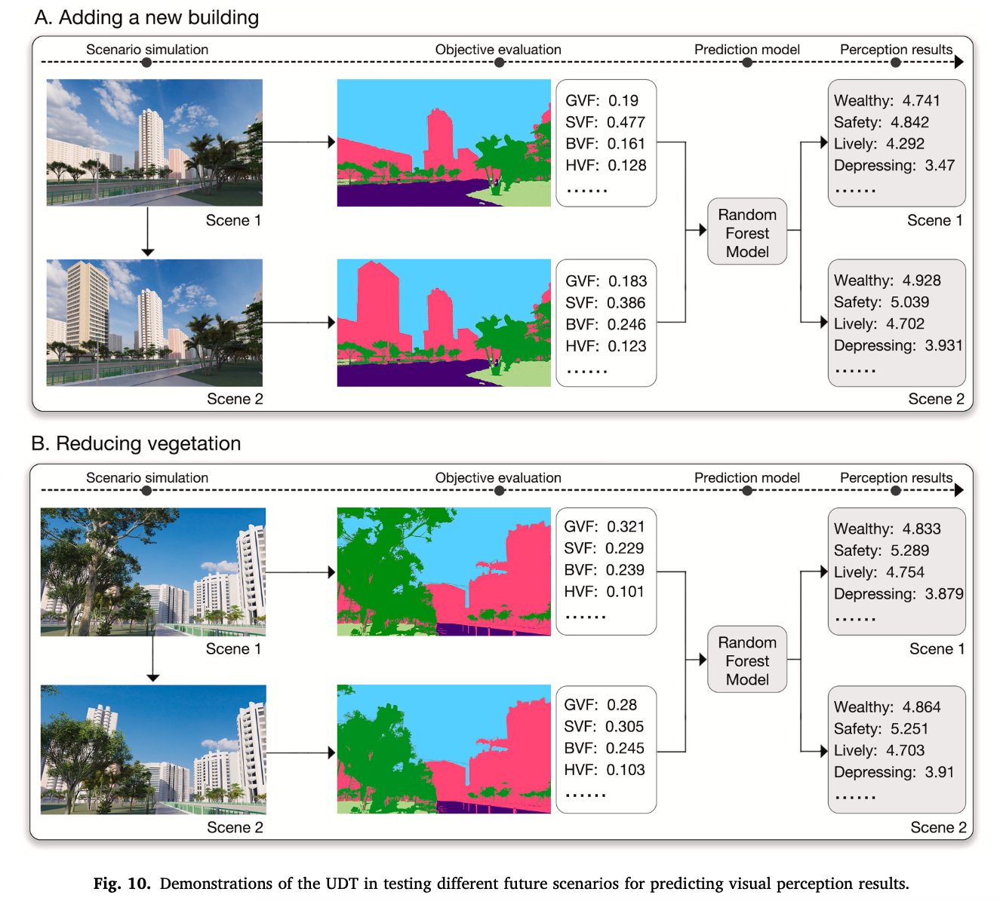
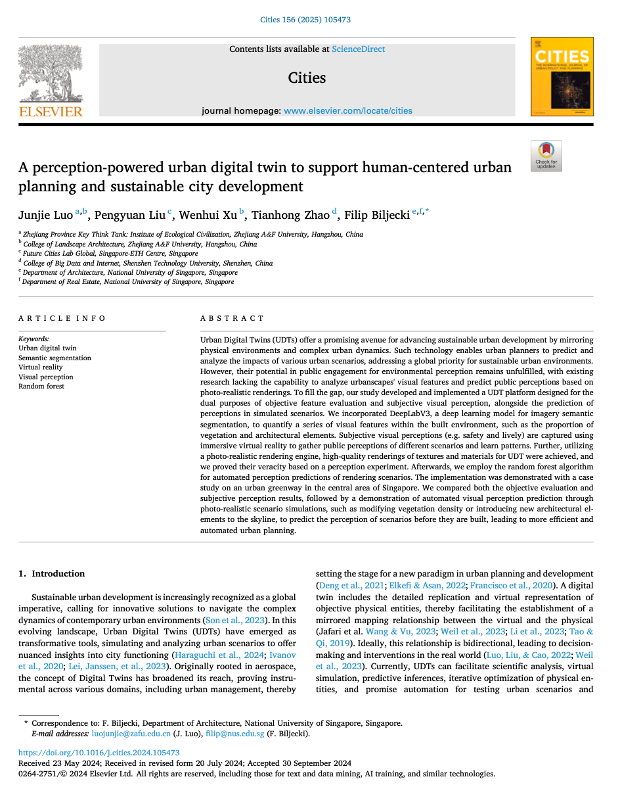

We are glad to share our new paper:

> Luo J, Liu P, Xu W, Zhao T, Biljecki F (2025): A perception-powered urban digital twin to support human-centered urban planning and sustainable city development. Cities, 156: 105473. [<i class="ai ai-doi-square ai"></i> 10.1016/j.cities.2024.105473](https://doi.org/10.1016/j.cities.2024.105473) [<i class="far fa-file-pdf"></i> PDF](/publication/2025-cities-perception-dt/2025-cities-perception-dt.pdf)</i>

This research was led by {} from Zhejiang A&F University, who was previously a researcher in our Lab.
Congratulations and thank you for the continued productive collaboration! :raised_hands: :clap:

The paper is [available freely](https://authors.elsevier.com/a/1jzIFy5jOuw-R) until 2024-12-10.





### Highlights

+ Integrating human visual perceptions into urban digital twins (UDTs).
+ Developing public-centered UDTs for automatic perception simulations.
+ Incorporating human-in-the-loop subjective perceptions via immersive virtual reality.
+ Automating perceptions through photo-realistic scenario simulations.
+ Implementing UDTs in a greenway setting to enhance citizen participation and collaboration.




### Abstract

> Urban Digital Twins (UDTs) offer a promising avenue for advancing sustainable urban development by mirroring physical environments and complex urban dynamics. Such technology enables urban planners to predict and analyze the impacts of various urban scenarios, addressing a global priority for sustainable urban environments. However, their potential in public engagement for environmental perception remains unfulfilled, with existing research lacking the capability to analyze urbanscapes' visual features and predict public perceptions based on photo-realistic renderings. To fill the gap, our study developed and implemented a UDT platform designed for the dual purposes of objective feature evaluation and subjective visual perception, alongside the prediction of perceptions in simulated scenarios. We incorporated DeepLabV3, a deep learning model for imagery semantic segmentation, to quantify a series of visual features within the built environment, such as the proportion of vegetation and architectural elements. Subjective visual perceptions (e.g. safety and lively) are captured using immersive virtual reality to gather public perceptions of different scenarios and learn patterns. Further, utilizing a photo-realistic rendering engine, high-quality renderings of textures and materials for UDT were achieved, and we proved their veracity based on a perception experiment. Afterwards, we employ the random forest algorithm for automated perception predictions of rendering scenarios. The implementation was demonstrated with a case study on an urban greenway in the central area of Singapore. We compared both the objective evaluation and subjective perception results, followed by a demonstration of automated visual perception prediction through photo-realistic scenario simulations, such as modifying vegetation density or introducing new architectural elements to the skyline, to predict the perception of scenarios before they are built, leading to more efficient and automated urban planning.



### Paper 

For more information, please see the [paper](/publication/2025-cities-perception-dt/).

[](/publication/2025-cities-perception-dt/)

BibTeX citation:
```bibtex
@article{2025_cities_perception_dt,
  author = {Luo, Junjie and Liu, Pengyuan and Xu, Wenhui and Zhao, Tianhong and Biljecki, Filip},
  doi = {10.1016/j.cities.2024.105473},
  journal = {Cities},
  pages = {105473},
  title = {A perception-powered urban digital twin to support human-centered urban planning and sustainable city development},
  volume = {156},
  year = {2025}
}
```
