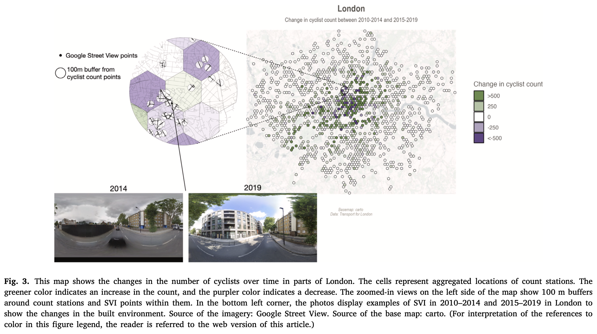
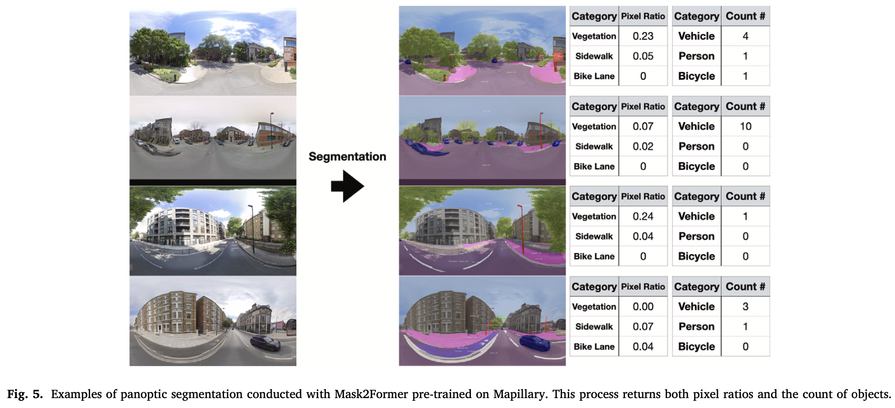
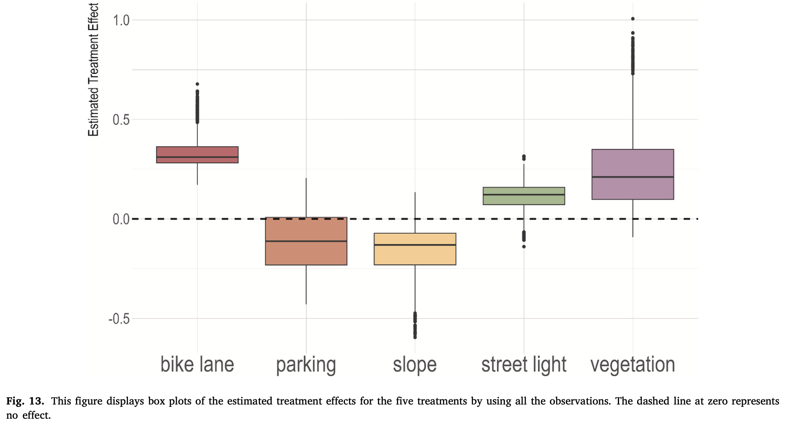
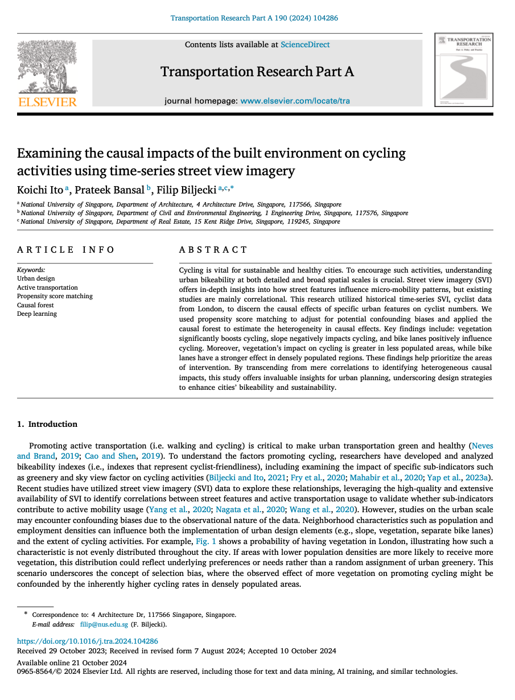

We are glad to share our new paper:

> Ito K, Bansal P, Biljecki F (2024): Examining the causal impacts of the built environment on cycling activities using time-series street view imagery. Transportation Research Part A: Policy and Practice, 190: 104286. [<i class="ai ai-doi-square ai"></i> 10.1016/j.tra.2024.104286](https://doi.org/10.1016/j.tra.2024.104286) [<i class="far fa-file-pdf"></i> PDF](/publication/2024-tra-examining/2024-tra-examining.pdf)</i>

This research was led by {}.
Congratulations on his continued successful publications during his PhD! :raised_hands: :clap:

The paper is [available freely](https://authors.elsevier.com/a/1jzWn3Rd3v3eSF) until 2024-12-10.

The code and dataset have been released [openly](https://github.com/koito19960406/bike_svi).




### Highlights

+ Examined causal relationships between street features and cycling mobility.
+ Utilized historical SVI data and cyclist count data in London.
+ Revealed the effects of urban design on cycling activities.
+ Identified heterogeneous treatment effects of urban design interventions.




### Abstract

> Cycling is vital for sustainable and healthy cities. To encourage such activities, understanding urban bikeability at both detailed and broad spatial scales is crucial. Street view imagery (SVI) offers in-depth insights into how street features influence micro-mobility patterns, but existing studies are mainly correlational. This research utilized historical time-series SVI, cyclist data from London, to discern the causal effects of specific urban features on cyclist numbers. We used propensity score matching to adjust for potential confounding biases and applied the causal forest to estimate the heterogeneity in causal effects. Key findings include: vegetation significantly boosts cycling, slope negatively impacts cycling, and bike lanes positively influence cycling. Moreover, vegetation’s impact on cycling is greater in less populated areas, while bike lanes have a stronger effect in densely populated regions. These findings help prioritize the areas of intervention. By transcending from mere correlations to identifying heterogeneous causal impacts, this study offers invaluable insights for urban planning, underscoring design strategies to enhance cities’ bikeability and sustainability.



### Paper 

For more information, please see the [paper](/publication/2024-tra-examining/).

[](/publication/2024-tra-examining/)

BibTeX citation:
```bibtex
@article{2024_tra_examining,
  author = {Ito, Koichi and Bansal, Prateek and Biljecki, Filip},
  doi = {10.1016/j.tra.2024.104286},
  journal = {Transportation Research Part A: Policy and Practice},
  pages = {104286},
  title = {Examining the causal impacts of the built environment on cycling activities using time-series street view imagery},
  volume = {190},
  year = {2024}
}
```
