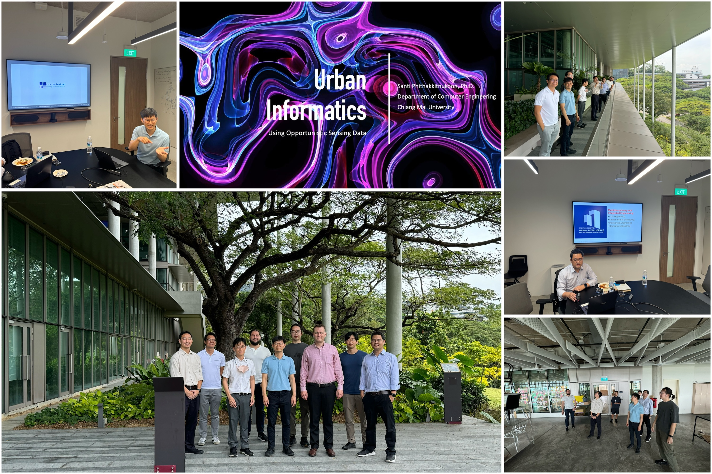
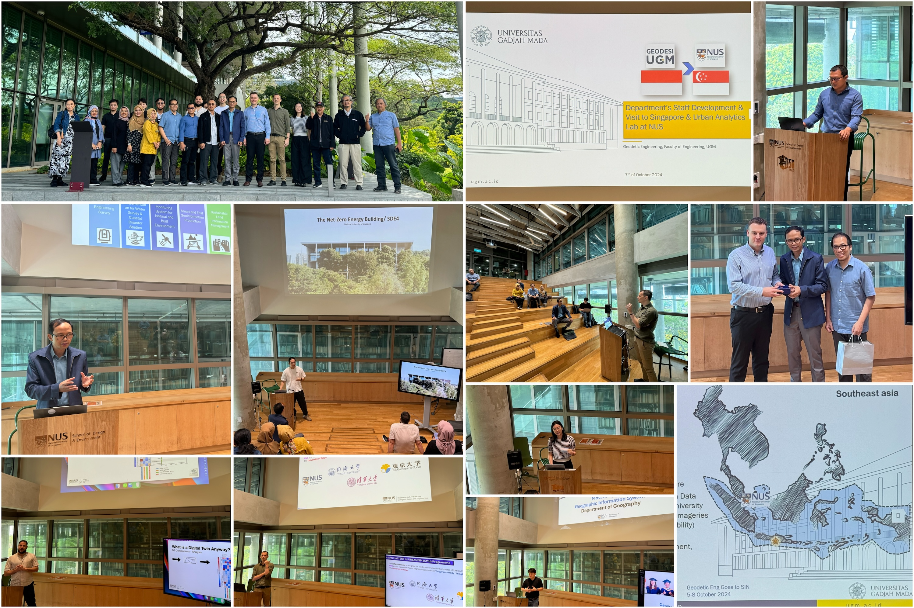
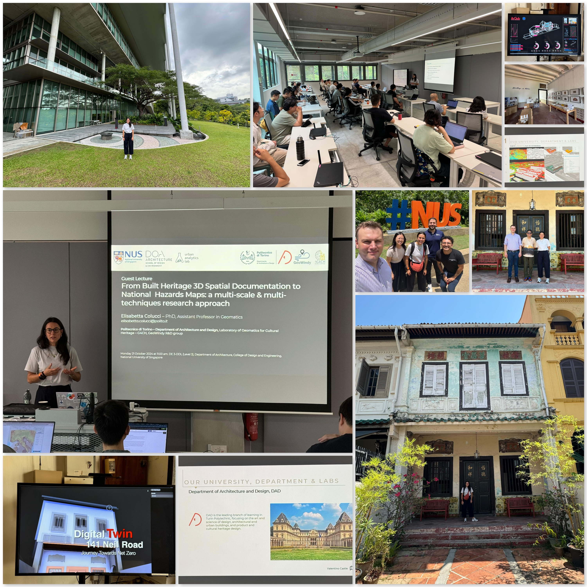
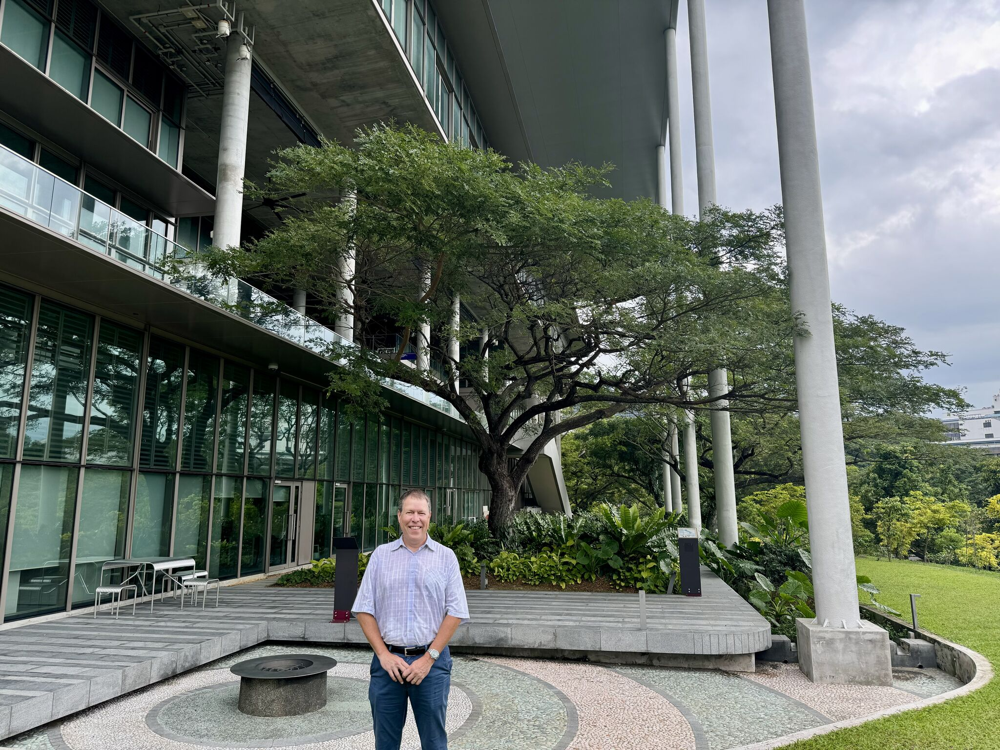

We continue hosting academic visitors from around the world for exciting lectures and productive exchanges. 

In the past month, we had the pleasure of having several visits from overseas for insightful meetings and group discussion sessions or brief exchanges:

+ [Tuuli Toivonen, University of Helsinki](https://researchportal.helsinki.fi/en/persons/tuuli-toivonen) 🇫🇮
+ A group from the [Faculty of Engineering, Chiang Mai University](https://eng.cmu.ac.th/) 🇹🇭
+ A group from the [Department of Geodetic Engineering, Universitas Gadjah Mada](https://geodesi.ugm.ac.id/en/english/) 🇮🇩
+ [Elisabetta Colucci](https://www.polito.it/en/staff?p=041312) from the [Politecnico di Torino](https://www.polito.it/en) 🇮🇹
+ [Scott Simmons](https://www.ogc.org/our-team/scott-simmons/) from [The Open Geospatial Consortium (OGC)](https://www.ogc.org/) 🇺🇸

Starting the recent series, Professor [Tuuli Toivonen](https://researchportal.helsinki.fi/en/persons/tuuli-toivonen) ([University of Helsinki](https://www.helsinki.fi/en)) gave a compelling lecture on _Greener Urban Travel Environments for Everyone: From Measured Wellbeing Impacts to Big Data Analytics_, during which she shared the impressive work of her [Digital Geography Lab](https://www.helsinki.fi/en/researchgroups/digital-geography-lab).

In early October, we hosted a productive workshop on urban informatics with a group of faculty from the [Faculty of Engineering, Chiang Mai University](https://eng.cmu.ac.th/) in Thailand.
A big thank you to the delegation led by Professor [Santi Phithakkitnukoon](https://cpemis.eng.cmu.ac.th/~santi/) (Head of the [Department of Computer Engineering](http://cpe.eng.cmu.ac.th/)) for visiting us from Thailand and sharing their work!
We have [ongoing collaborations]() with Prof Santi and his [City Context Lab](https://www.citycontext.info/).

The workshop featured presentations from both sides and a tour of our net-zero energy building.
We are always excited to learn and collaborate with fellow researchers across Southeast Asia 🌏.
Thanks also to [Bedrock Analytics](https://www.bedrockanalytics.com/) for taking part!

Next, we are glad to have hosted a large delegation from [Universitas Gadjah Mada (UGM)](https://ugm.ac.id/) in Indonesia for a workshop on urban digital twins.
We exchanged experiences in research and teaching with faculty from the [Department of Geodetic Engineering](https://geodesi.ugm.ac.id/en/english/), led by their Head, Professor [Trias Aditya](https://acadstaff.ugm.ac.id/triasaditya).

It was quite insightful to learn about the multitude of activities conducted by one of the most prominent departments in Indonesia and Southeast Asia in our domain.
In turn, they got to know more about our research group and multiple departments at NUS, and our programmes such as the [Master of Urban Planning](https://cde.nus.edu.sg/arch/programmes/master-of-urban-planning/) and [MSc in Applied GIS](https://fass.nus.edu.sg/geog/msc-in-applied-gis/).

For the first time, we had a visit from Italy -- Dr [Elisabetta Colucci](https://www.polito.it/en/staff?p=041312) from the [Department of Architecture and Design](https://www.dad.polito.it/en/) at the [Politecnico di Torino](https://www.polito.it/en).
She has delivered an insightful lecture _From Built Heritage 3D Spatial Documentation to National Hazards Maps: a multi-scale & multi-techniques research approach_.
The lecture was part of our [seminars series](/seminars) and department lectures.

The programme included also a visit to the [Architectural Conservation Laboratory (ArClab)](https://www.arclabnus.com/), which is part of our department.

Finally, it was a pleasure to have [Scott Simmons](https://www.ogc.org/our-team/scott-simmons/), Chief Standards Officer of [The Open Geospatial Consortium (OGC)](https://www.ogc.org/), visit our research group.
We have been [an active member]() of the OGC for a long time, and we are glad to continue our involvement and collaboration. 🌐

Thanks everyone!
