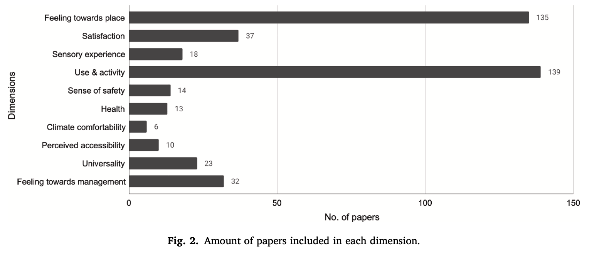
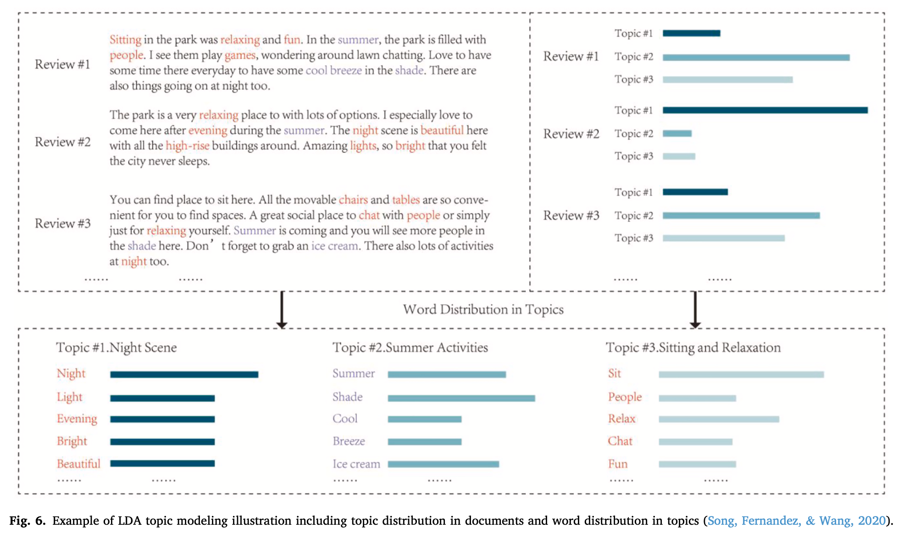
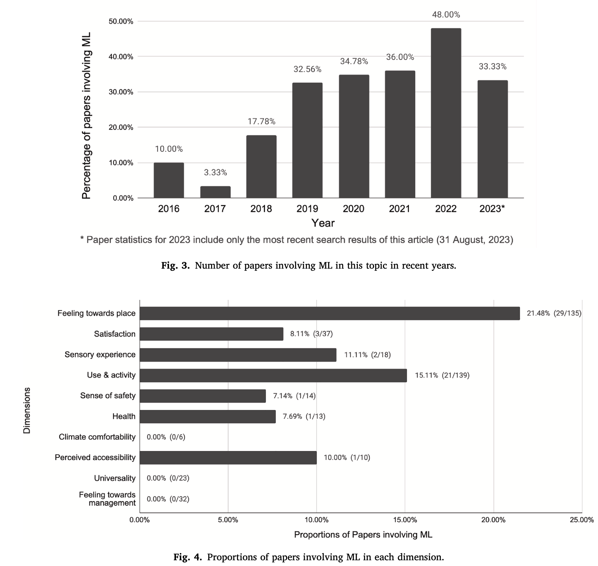
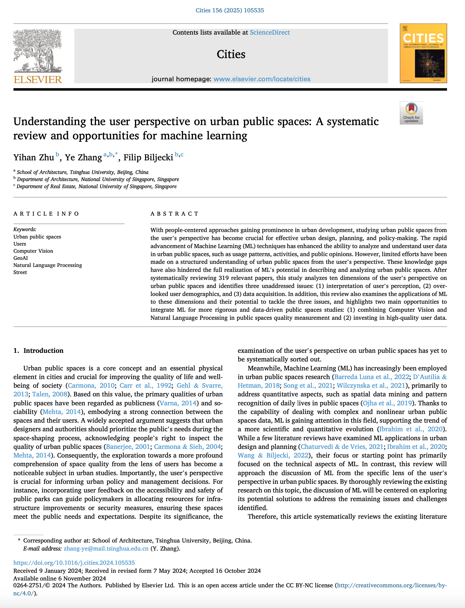

We are glad to share our new paper:

> Zhu Y, Zhang Y, Biljecki F (2025): Understanding the user perspective on urban public spaces: A systematic review and opportunities for machine learning. Cities, 156: 105535. [<i class="ai ai-doi-square ai"></i> 10.1016/j.cities.2024.105535](https://doi.org/10.1016/j.cities.2024.105535) [<i class="far fa-file-pdf"></i> PDF](/publication/2025-cities-userperspective/2025-cities-userperspective.pdf)</i> <i class="ai ai-open-access-square ai"></i>

This research was led by [Yihan Zhu](https://www.linkedin.com/in/%E7%9B%8A%E9%9F%A9-%E7%A5%9D-695319161/).
Congratulations on his new publication that is part of his PhD! :raised_hands: :clap:

The paper is available open access.




### Highlights


+ Studies on user's perspective of urban public spaces are at the infant stage.
+ Researchers study the user's perspective on urban public spaces from ten dimensions.
+ Perception interpretation, user demographics and data acquisition are key challenges.
+ Machine learning offers significant potential for addressing the above challenges.




### Abstract

> With people-centered approaches gaining prominence in urban development, studying urban public spaces from the user's perspective has become crucial for effective urban design, planning, and policy-making. The rapid advancement of Machine Learning (ML) techniques has enhanced the ability to analyze and understand user data in urban public spaces, such as usage patterns, activities, and public opinions. However, limited efforts have been made on a structured understanding of urban public spaces from the user's perspective. These knowledge gaps have also hindered the full realization of ML's potential in describing and analyzing urban public spaces. After systematically reviewing 319 relevant papers, this study analyzes ten dimensions of the user's perspective on urban public spaces and identifies three unaddressed issues: (1) interpretation of user's perception, (2) overlooked user demographics, and (3) data acquisition. In addition, this review also examines the applications of ML to these dimensions and their potential to tackle the three issues, and highlights two main opportunities to integrate ML for more rigorous and data-driven public spaces studies: (1) combining Computer Vision and Natural Language Processing in public spaces quality measurement and (2) investing in high-quality user data.



### Paper 

For more information, please see the [paper](/publication/2025-cities-userperspective/) (open access <i class="ai ai-open-access-square ai"></i>).

[](/publication/2025-cities-userperspective/)

BibTeX citation:
```bibtex
@article{2025_cities_userperspective,
  author = {Yihan Zhu and Ye Zhang and Filip Biljecki},
  doi = {10.1016/j.cities.2024.105535},
  journal = {Cities},
  pages = {105535},
  title = {Understanding the user perspective on urban public spaces: A systematic review and opportunities for machine learning},
  volume = {156},
  year = {2025}
}
```
