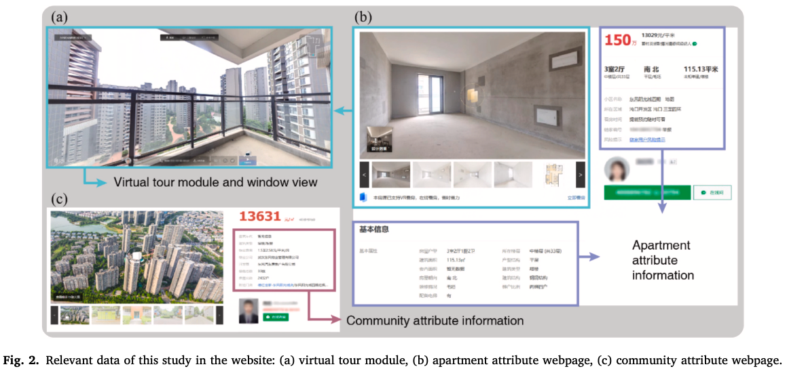
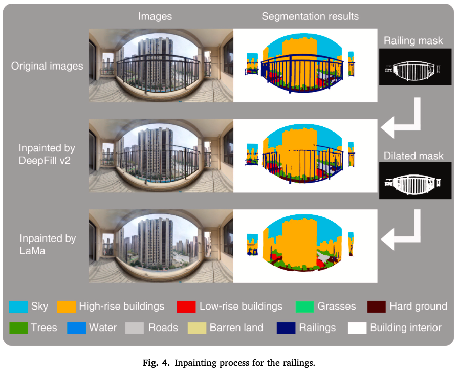
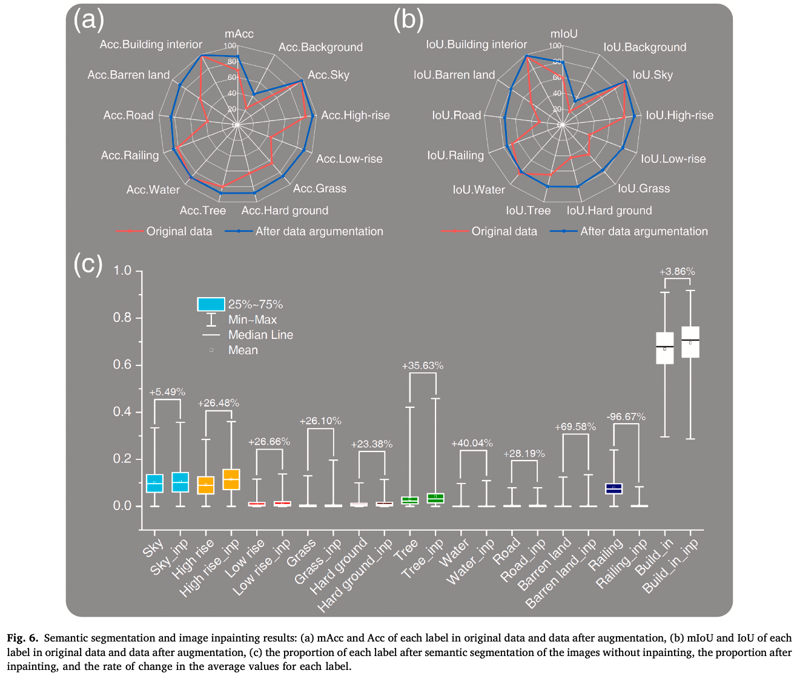
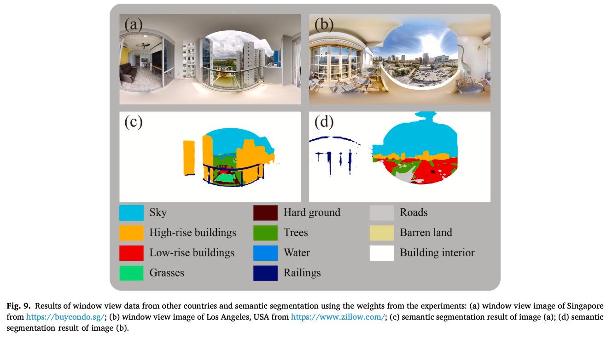
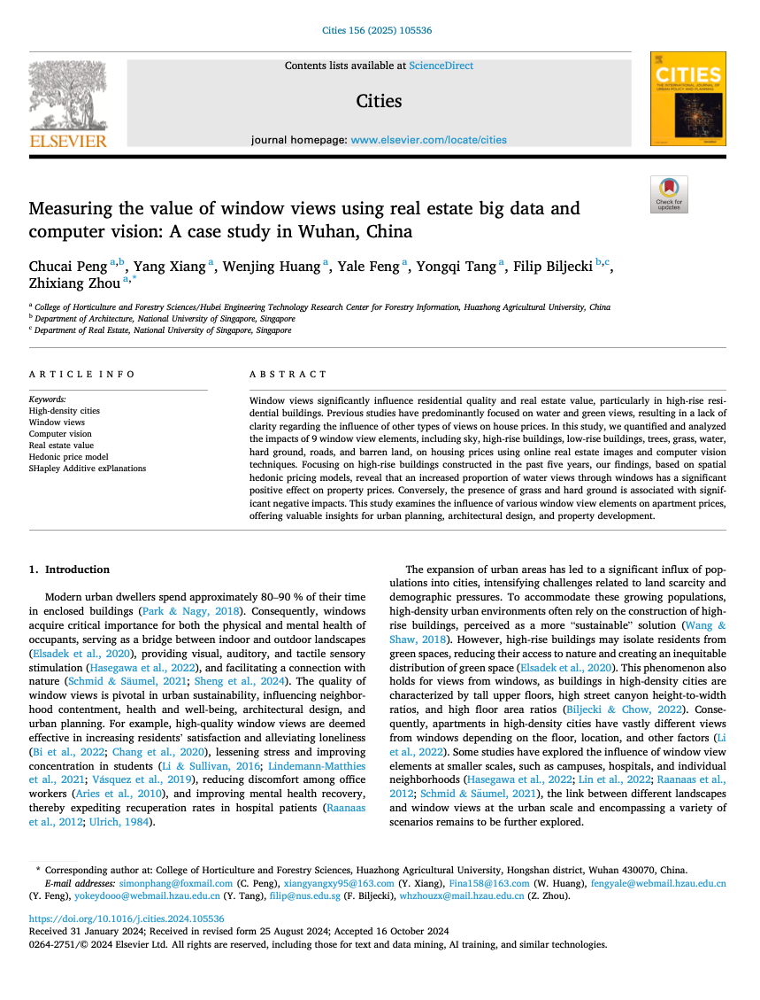

We are glad to share our new paper:

> Peng C, Xiang Y, Huang W, Feng Y, Tang Y, Biljecki F, Zhou Z (2025): Measuring the value of window views using real estate big data and computer vision: A case study in Wuhan, China. Cities, 156: 105536. [<i class="ai ai-doi-square ai"></i> 10.1016/j.cities.2024.105536](https://doi.org/10.1016/j.cities.2024.105536) [<i class="far fa-file-pdf"></i> PDF](/publication/2025-cities-windowviews/2025-cities-windowviews.pdf)</i>

This research was led by {}.
Congratulations on his new publication that is part of his PhD! :raised_hands: :clap:

The paper is [available freely](https://authors.elsevier.com/c/1k0n9y5jOux9L) until 2024-12-20.

The dataset has been released [openly](https://github.com/yahaha115/Window-view-dataset).




### Highlights

+ A pervasive, voluminous, and readily accessible semantic dataset of 3041 window views of high-rise residential building.
+ Quantifying window view elements using online real estate big images with computer vision.
+ Spatial hedonic models and interpretable machine learning methods are developed to measure the value of window view elements.
+ Water views positively affect house prices in Wuhan, while views of grass and hard ground have a negative impact.




### Abstract

> Window views significantly influence residential quality and real estate value, particularly in high-rise residential buildings. Previous studies have predominantly focused on water and green views, resulting in a lack of clarity regarding the influence of other types of views on house prices. In this study, we quantified and analyzed the impacts of 9 window view elements, including sky, high-rise buildings, low-rise buildings, trees, grass, water, hard ground, roads, and barren land, on housing prices using online real estate images and computer vision techniques. Focusing on high-rise buildings constructed in the past five years, our findings, based on spatial hedonic pricing models, reveal that an increased proportion of water views through windows has a significant positive effect on property prices. Conversely, the presence of grass and hard ground is associated with significant negative impacts. This study examines the influence of various window view elements on apartment prices, offering valuable insights for urban planning, architectural design, and property development.





### Paper 

For more information, please see the [paper](/publication/2025-cities-windowviews/).

[](/publication/2025-cities-windowviews/)

BibTeX citation:
```bibtex
@article{2025_cities_windowviews,
  author = {Peng, Chucai and Xiang, Yang and Huang, Wenjing and Feng, Yale and Tang, Yongqi and Biljecki, Filip and Zhou, Zhixiang},
  doi = {10.1016/j.cities.2024.105536},
  journal = {Cities},
  pages = {105536},
  title = {Measuring the value of window views using real estate big data and computer vision: A case study in Wuhan, China},
  volume = {156},
  year = {2025}
}
```
