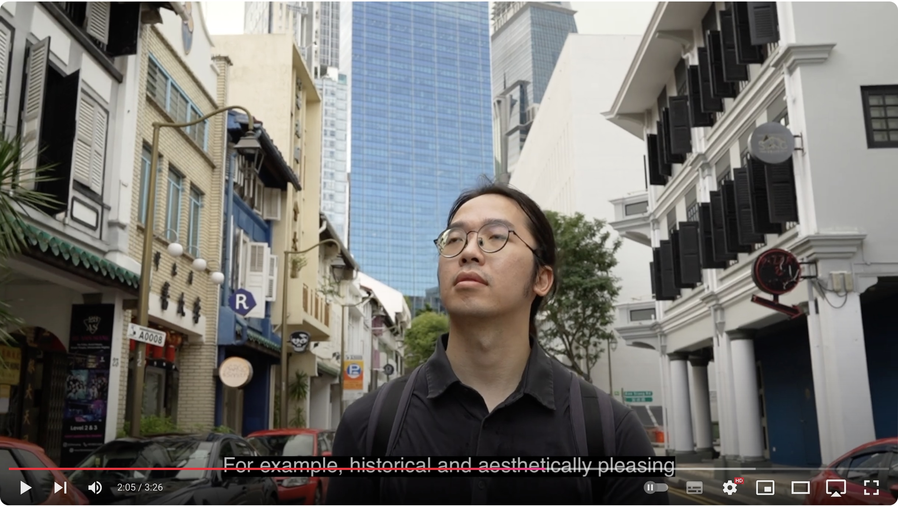
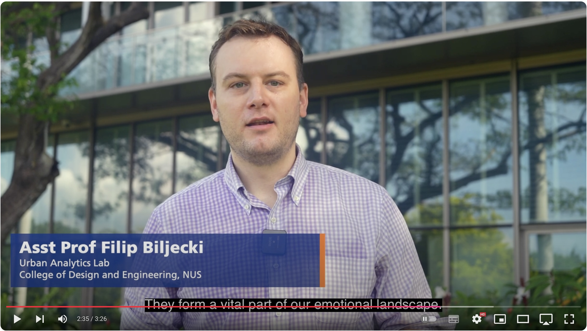

The [latest research]() of our PhD scholar {}, has been featured as a video by NUS!

Please check it below.




There is also a [blog post](https://cde.nus.edu.sg/news-detail/designing-cities-that-feel-like-home/), which we copy here:

> How do the buildings around us affect our moods and make us feel? From towering glass skyscrapers, to orderly modern residential blocks and buildings with historic facades, the architecture we encounter daily can be a powerful force in shaping our emotions and perceptions.

> “Architecture is about more than just aesthetics - it has a profound psychological impact,” says Xiucheng Liang, a PhD student at the Urban Analytics Lab (UAL) at CDE.

> In this video, Liang introduces a recent study conducted with fellow researchers at the UAL that exposes the relationship between the design of building exteriors and the psychology, emotions, and mental well-being of city residents. Through surveys of nearly 500 participants and cutting-edge AI analysis of over 250,000 building images, the research reveals the surprising ways architecture affects our moods and urban experiences.

> According to Liang, well-designed architecture can inspire emotions like safety, nostalgia, or connection, but it can also lead to feelings of discomfort, anxiety or being overwhelmed. The research provides valuable insights for urban planners and architects, suggesting ways that future cities can be not only functional but also emotionally impactful.






Many thanks to the Communications Office of our NUS College of Design and Engineering for promoting our work!

For more information, check out the [publication]():

> Liang X, Chang JH, Gao S, Zhao T, Biljecki F (2024): Evaluating human perception of building exteriors using street view imagery. Building and Environment, 263: 111875. [<i class="ai ai-doi-square ai"></i> 10.1016/j.buildenv.2024.111875](https://doi.org/10.1016/j.buildenv.2024.111875) [<i class="far fa-file-pdf"></i> PDF](/publication/2024-bae-building/2024-bae-building.pdf)</i>


BibTeX citation:
```bibtex
@article{2024_bae_building,
  author = {Liang, Xiucheng and Chang, Jiat Hwee and Gao, Song and Zhao, Tianhong and Biljecki, Filip},
  doi = {10.1016/j.buildenv.2024.111875},
  journal = {Building and Environment},
  pages = {111875},
  title = {Evaluating human perception of building exteriors using street view imagery},
  volume = {263},
  year = {2024}
}
```

