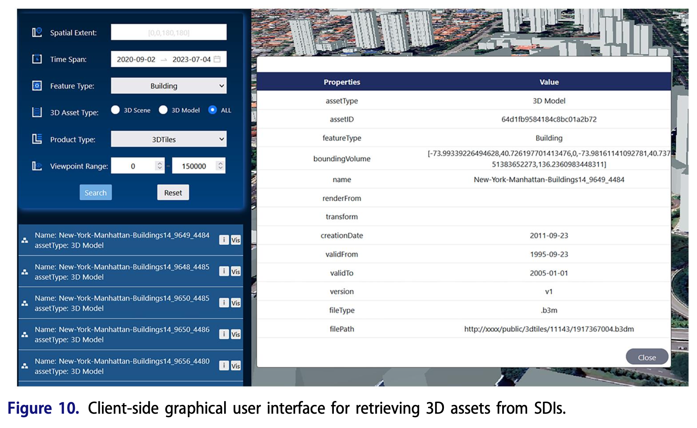
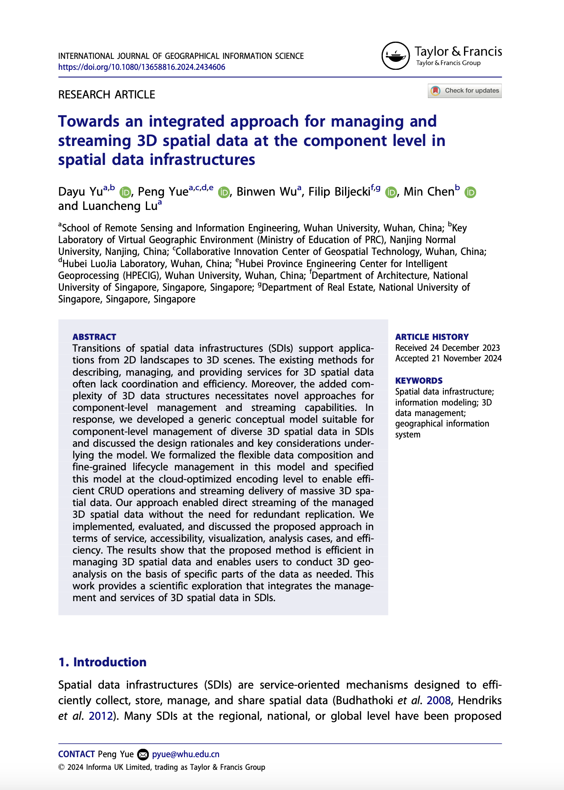

We are glad to share our new paper:

> Yu D, Yue P, Wu B, Biljecki F, Chen M, Lu L (2025): Towards an Integrated Approach for Managing and Streaming 3D Spatial Data at the Component Level in Spatial Data Infrastructures. International Journal of Geographical Information Science. [<i class="ai ai-doi-square ai"></i> 10.1080/13658816.2024.2434606](https://doi.org/10.1080/13658816.2024.2434606) [<i class="far fa-file-pdf"></i> PDF](/publication/2025-ijgis-3-dsdi/2025-ijgis-3-dsdi.pdf)</i>

This research was led by {}, who was a visiting scholar in our research group while he has been doing a PhD at Wuhan University, after which he moved to Nanjing Normal University to join as faculty.
Congratulations on his new publication that is part of his PhD! :raised_hands: :clap:

Here is [more information]() about his graduation and subsequent job.

The paper presents design rationales and a unified conceptual model suitable for component-level management of diverse 3D spatial data.
The model is subsequently mapped to a cloud-optimized encoding schema to effectively manage and deliver massive 3D spatial data within SDIs.
This work provides a scientific exploration that integrates management and services to enable direct streaming of managed 3D spatial data without the need for redundant replication and conversion.
The proposed approach is implemented and evaluated across services, accessibility, analysis cases, visualization, and efficiency.




### Abstract

> Transitions of spatial data infrastructures (SDIs) support applications from 2D landscapes to 3D scenes. The existing methods for describing, managing, and providing services for 3D spatial data often lack coordination and efficiency. Moreover, the added complexity of 3D data structures necessitates novel approaches for component-level management and streaming capabilities. In response, we developed a generic conceptual model suitable for component-level management of diverse 3D spatial data in SDIs and discussed the design rationales and key considerations underlying the model. We formalized the flexible data composition and fine-grained lifecycle management in this model and specified this model at the cloud-optimized encoding level to enable efficient CRUD operations and streaming delivery of massive 3D spatial data. Our approach enabled direct streaming of the managed 3D spatial data without the need for redundant replication. We implemented, evaluated, and discussed the proposed approach in terms of service, accessibility, visualization, analysis cases, and efficiency. The results show that the proposed method is efficient in managing 3D spatial data and enables users to conduct 3D geo-analysis on the basis of specific parts of the data as needed. This work provides a scientific exploration that integrates the management and services of 3D spatial data in SDIs.

### Paper 

For more information, please see the [paper](/publication/2025-ijgis-3-dsdi/).

[](/publication/2025-ijgis-3-dsdi/)

BibTeX citation:
```bibtex
@article{2025_ijgis_3dsdi,
  author = {Yu, Dayu and Yue, Peng and Wu, Binwen and Biljecki, Filip and Chen, Min and Lu, Luancheng},
  doi = {10.1080/13658816.2024.2434606},
  journal = {International Journal of Geographical Information Science},
  pages = {1-25},
  title = {Towards an integrated approach for managing and streaming 3D spatial data at the component level in spatial data infrastructures},
  year = {2025}
}
```
