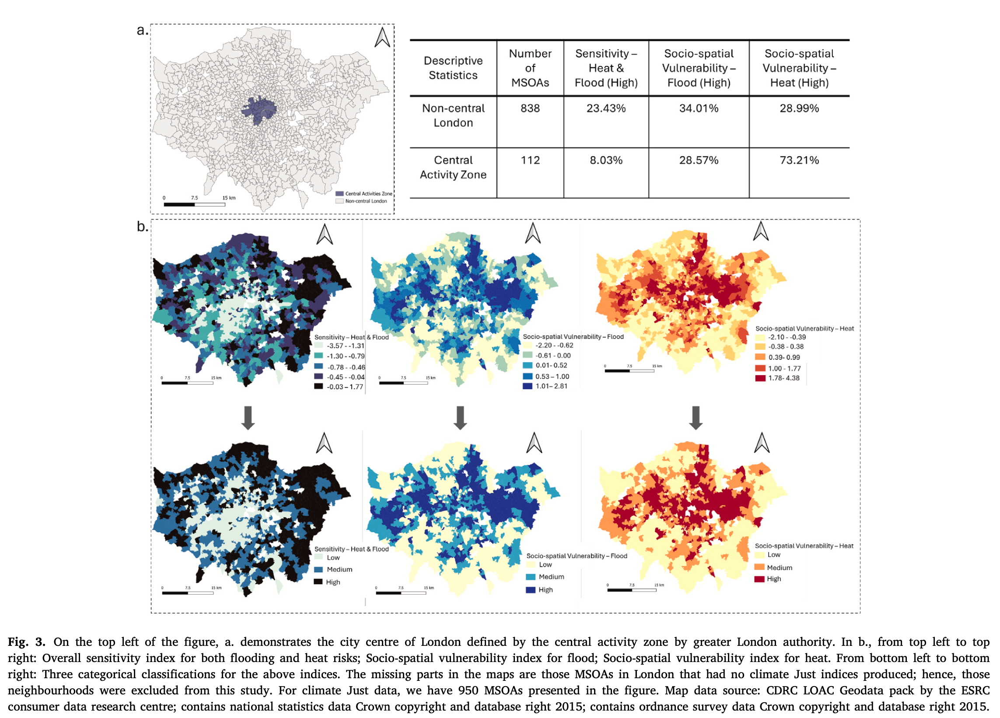
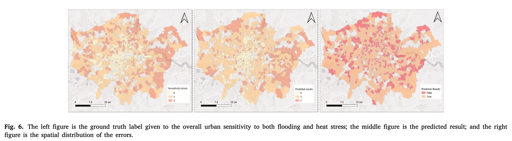
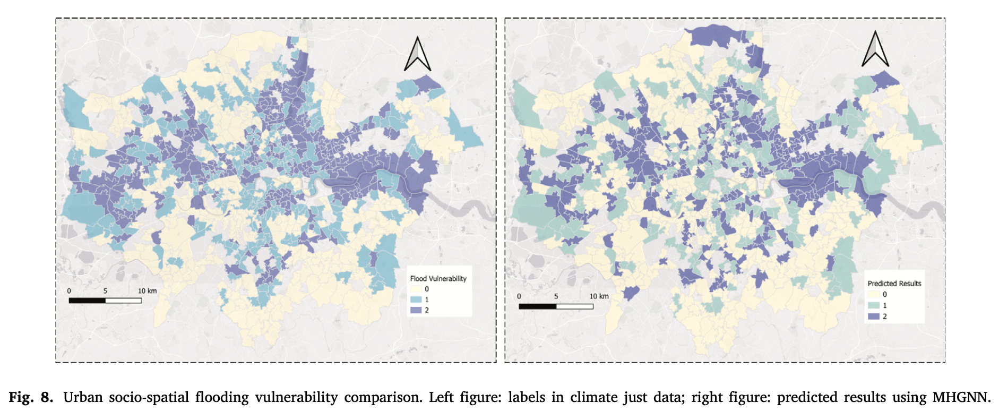
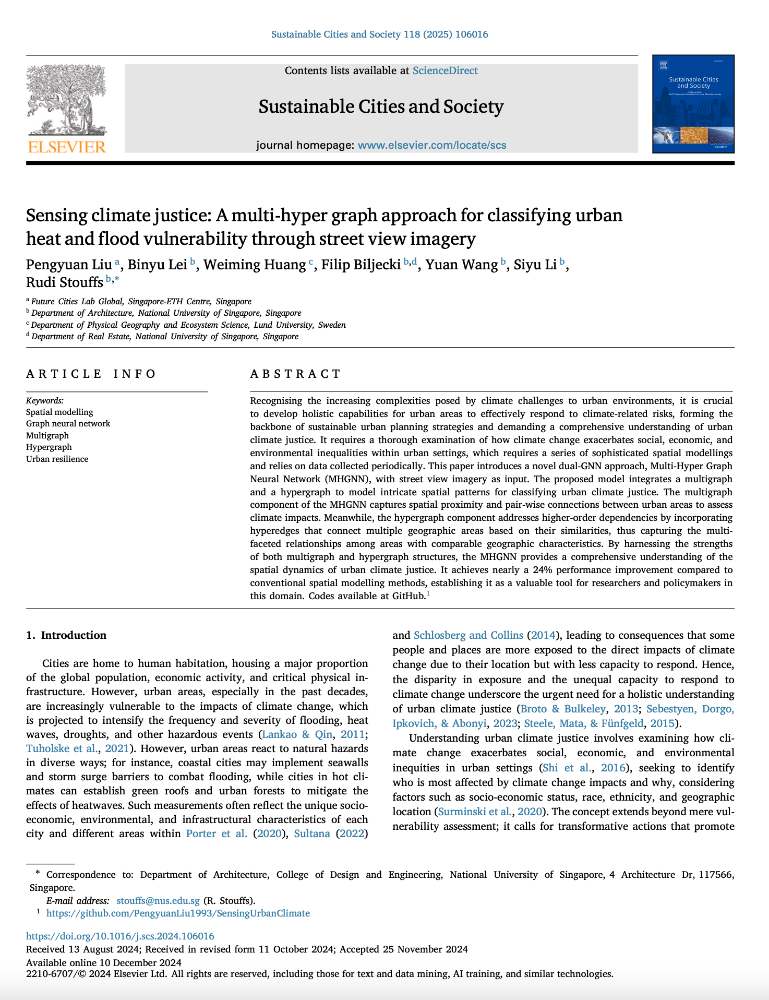

We are glad to share our new paper:

> Liu P, Lei B, Huang W, Biljecki F, Wang Y, Li S, Stouffs R (2025): Sensing climate justice: A multi-hyper graph approach for classifying urban heat and flood vulnerability through street view imagery. Sustainable Cities and Society, 118: 106016. [<i class="ai ai-doi-square ai"></i> 10.1016/j.scs.2024.106016](https://doi.org/10.1016/j.scs.2024.106016) [<i class="far fa-file-pdf"></i> PDF](/publication/2025-scs-climate/2025-scs-climate.pdf)</i>

This research was led by {}.
Congratulations on his continued successes! :raised_hands: :clap:

The paper is [available freely](https://authors.elsevier.com/c/1kFpz7sfVZE4dA) until 2025-01-31.

The code has been released [openly](https://github.com/PengyuanLiu1993/SensingUrbanClimate).


### Highlights

+ A dual-GNN to model multifaceted spatial patterns for studying urban climate justice.
+ Spatially-explicit GeoAI incorporates Laws of Geography.
+ Nearly 24% performance improvement compared to conventional spatial modelling methods.
+ Socio-economic indicators are crucial for understanding urban climate vulnerabilities.
+ Spatial structures from multiple levels contribute holistically to the urban climate justice classification.




### Abstract

> Recognising the increasing complexities posed by climate challenges to urban environments, it is crucial to develop holistic capabilities for urban areas to effectively respond to climate-related risks, forming the backbone of sustainable urban planning strategies and demanding a comprehensive understanding of urban climate justice. It requires a thorough examination of how climate change exacerbates social, economic, and environmental inequalities within urban settings, which requires a series of sophisticated spatial modellings and relies on data collected periodically. This paper introduces a novel dual-GNN approach, Multi-Hyper Graph Neural Network (MHGNN), with street view imagery as input. The proposed model integrates a multigraph and a hypergraph to model intricate spatial patterns for classifying urban climate justice. The multigraph component of the MHGNN captures spatial proximity and pair-wise connections between urban areas to assess climate impacts. Meanwhile, the hypergraph component addresses higher-order dependencies by incorporating hyperedges that connect multiple geographic areas based on their similarities, thus capturing the multi-faceted relationships among areas with comparable geographic characteristics. By harnessing the strengths of both multigraph and hypergraph structures, the MHGNN provides a comprehensive understanding of the spatial dynamics of urban climate justice. It achieves nearly a 24% performance improvement compared to conventional spatial modelling methods, establishing it as a valuable tool for researchers and policymakers in this domain. Codes available at GitHub.





### Paper 

For more information, please see the [paper](/publication/2025-scs-climate/).

[](/publication/2025-scs-climate/)

BibTeX citation:
```bibtex
@article{2025_scs_climate,
  author = {Liu, Pengyuan and Lei, Binyu and Huang, Weiming and Biljecki, Filip and Wang, Yuan and Li, Siyu and Stouffs, Rudi},
  doi = {10.1016/j.scs.2024.106016},
  journal = {Sustainable Cities and Society},
  pages = {106016},
  title = {Sensing climate justice: A multi-hyper graph approach for classifying urban heat and flood vulnerability through street view imagery},
  volume = {118},
  year = {2025}
}
```
