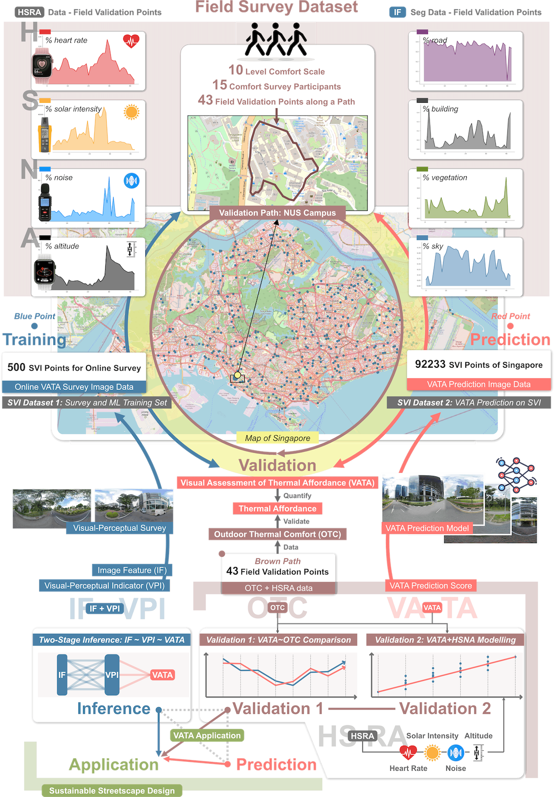
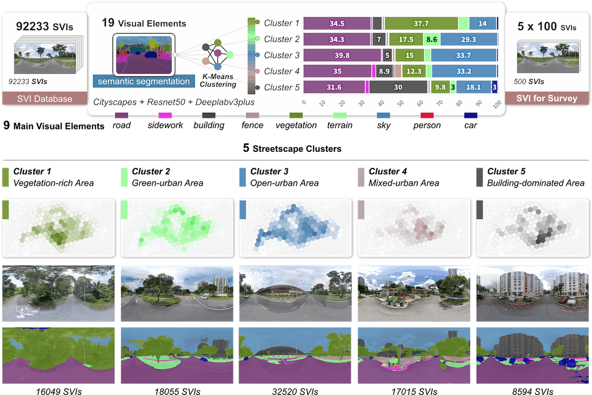
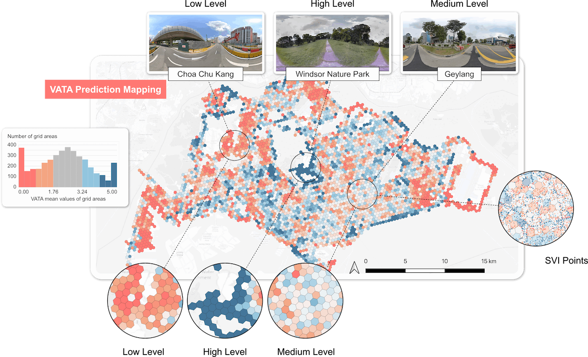
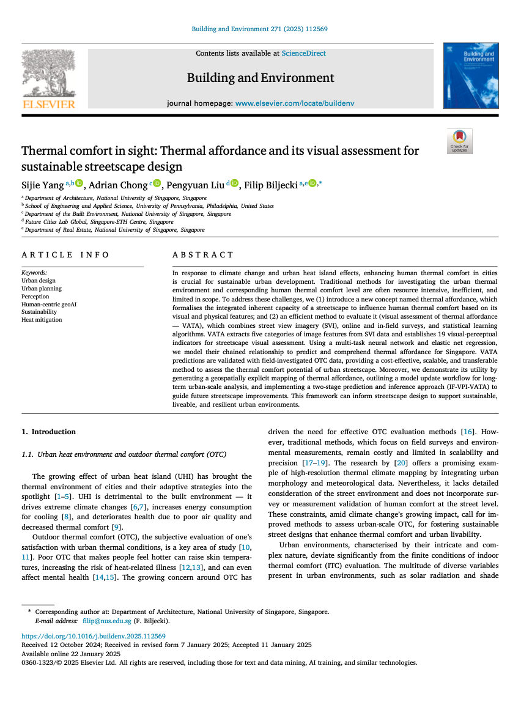

We are glad to share our new paper:

> Yang S, Chong A, Liu P, Biljecki F (2025): Thermal comfort in sight: Thermal affordance and its visual assessment for sustainable streetscape design. Building and Environment, 271: 112569. [<i class="ai ai-doi-square ai"></i> 10.1016/j.buildenv.2025.112569](https://doi.org/10.1016/j.buildenv.2025.112569) [<i class="far fa-file-pdf"></i> PDF](/publication/2025-bae-thermal/2025-bae-thermal.pdf)</i>

This research was led by {}.
Congratulations on his first PhD journal publication! :raised_hands: :clap:

The code and dataset have been released openly at [GitHub](https://github.com/Sijie-Yang/Thermal-Affordance).
The computed VATA data for thermal affordance in Singapore can be accessed [here](https://thermal-affordance.ual.sg/).

The paper is [available freely](https://authors.elsevier.com/a/1kUxQ1HudNJSL2) until 2025-03-15.






### Highlights

+ Introducing thermal affordance, linking built environments to thermal comfort.
+ Developing a framework (VATA) to assess thermal affordance using street view images.
+ Applying SVI and human visual assessment data for two-stage VATA modelling.
+ VATA modelling performance is validated by in-field thermal comfort investigation.
+ Urban-scale VATA mapping supports sustainable streetscape planning and design.




### Abstract

> In response to climate change and urban heat island effects, enhancing human thermal comfort in cities is crucial for sustainable urban development. Traditional methods for investigating the urban thermal environment and corresponding human thermal comfort level are often resource intensive, inefficient, and limited in scope. To address these challenges, we (1) introduce a new concept named thermal affordance, which formalises the integrated inherent capacity of a streetscape to influence human thermal comfort based on its visual and physical features; and (2) an efficient method to evaluate it (visual assessment of thermal affordance — VATA), which combines street view imagery (SVI), online and in-field surveys, and statistical learning algorithms. VATA extracts five categories of image features from SVI data and establishes 19 visual-perceptual indicators for streetscape visual assessment. Using a multi-task neural network and elastic net regression, we model their chained relationship to predict and comprehend thermal affordance for Singapore. VATA predictions are validated with field-investigated OTC data, providing a cost-effective, scalable, and transferable method to assess the thermal comfort potential of urban streetscape. Moreover, we demonstrate its utility by generating a geospatially explicit mapping of thermal affordance, outlining a model update workflow for long-term urban-scale analysis, and implementing a two-stage prediction and inference approach (IF-VPI-VATA) to guide future streetscape improvements. This framework can inform streetscape design to support sustainable, liveable, and resilient urban environments.


### Paper 

For more information, please see the [paper](/publication/2025-bae-thermal/).

[](/publication/2025-bae-thermal/)

BibTeX citation:
```bibtex
@article{2025_bae_thermal,
  author = {Yang, Sijie and Chong, Adrian and Liu, Pengyuan and Biljecki, Filip},
  doi = {10.1016/j.buildenv.2025.112569},
  journal = {Building and Environment},
  pages = {112569},
  title = {Thermal comfort in sight: Thermal affordance and its visual assessment for sustainable streetscape design},
  volume = {271},
  year = {2025}
}
```
