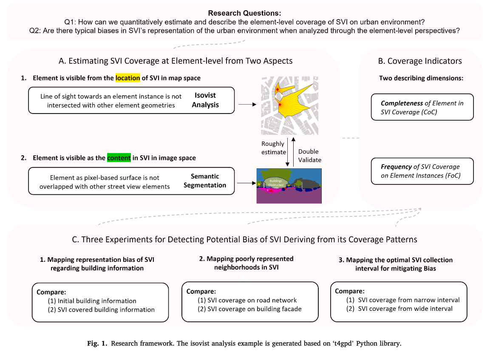
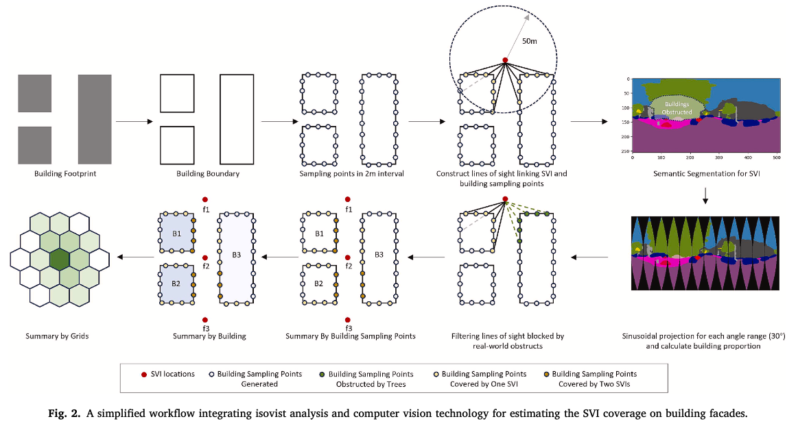
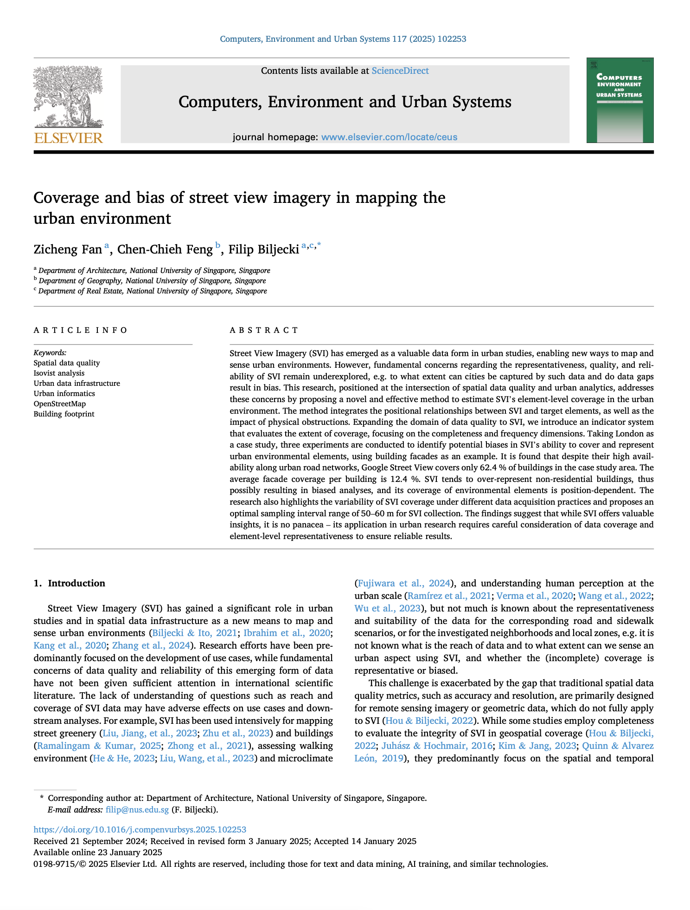

We are glad to share our new paper:

> Fan Z, Feng CC, Biljecki F (2025): Coverage and bias of street view imagery in mapping the urban environment. Computers, Environment and Urban Systems, 117: 102253. [<i class="ai ai-doi-square ai"></i> 10.1016/j.compenvurbsys.2025.102253](https://doi.org/10.1016/j.compenvurbsys.2025.102253) [<i class="far fa-file-pdf"></i> PDF](/publication/2025-ceus-svi-coverage/2025-ceus-svi-coverage.pdf)</i>

This research was led by {}.
Congratulations on his new publication that is part of his PhD, and on his continued successes! :raised_hands: :clap:

The paper is [available freely](https://authors.elsevier.com/a/1kUW1jFQh4Mk3) until 2025-03-14.




### Highlights


+ SVI is used widely but without much understanding of the coverage and bias.
+ A computational approach to estimate the coverage of urban environment elements in SVI.
+ Introducing frequency and completeness as metrics in measuring coverage.
+ SVI covers 62.4 % of buildings in London, with mean completeness on facade of 12.4 %.
+ Estimating optimal sampling interval range of 50–60 m for SVI collection.




### Abstract

> Street View Imagery (SVI) has emerged as a valuable data form in urban studies, enabling new ways to map and sense urban environments. However, fundamental concerns regarding the representativeness, quality, and reliability of SVI remain underexplored, e.g. to what extent can cities be captured by such data and do data gaps result in bias. This research, positioned at the intersection of spatial data quality and urban analytics, addresses these concerns by proposing a novel and effective method to estimate SVI's element-level coverage in the urban environment. The method integrates the positional relationships between SVI and target elements, as well as the impact of physical obstructions. Expanding the domain of data quality to SVI, we introduce an indicator system that evaluates the extent of coverage, focusing on the completeness and frequency dimensions. Taking London as a case study, three experiments are conducted to identify potential biases in SVI's ability to cover and represent urban environmental elements, using building facades as an example. It is found that despite their high availability along urban road networks, Google Street View covers only 62.4 % of buildings in the case study area. The average facade coverage per building is 12.4 %. SVI tends to over-represent non-residential buildings, thus possibly resulting in biased analyses, and its coverage of environmental elements is position-dependent. The research also highlights the variability of SVI coverage under different data acquisition practices and proposes an optimal sampling interval range of 50–60 m for SVI collection. The findings suggest that while SVI offers valuable insights, it is no panacea – its application in urban research requires careful consideration of data coverage and element-level representativeness to ensure reliable results.


### Paper 

For more information, please see the [paper](/publication/2025-ceus-svi-coverage/).

[](/publication/2025-ceus-svi-coverage/)

BibTeX citation:
```bibtex
@article{2025_ceus_svi_coverage,
  author = {Fan, Zicheng and Feng, Chen-Chieh and Biljecki, Filip},
  doi = {10.1016/j.compenvurbsys.2025.102253},
  journal = {Computers, Environment and Urban Systems},
  pages = {102253},
  title = {Coverage and bias of street view imagery in mapping the urban environment},
  volume = {117},
  year = {2025}
}
```
