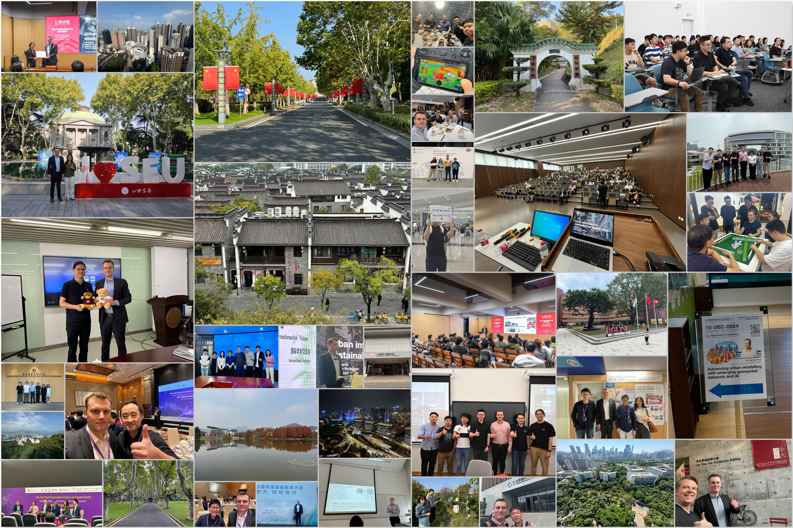
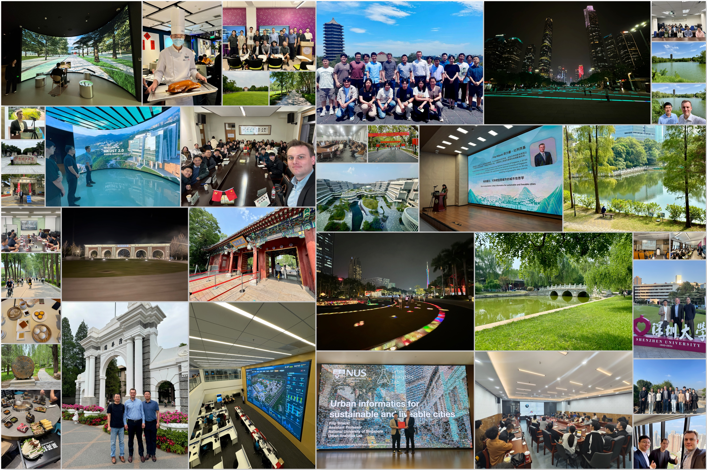
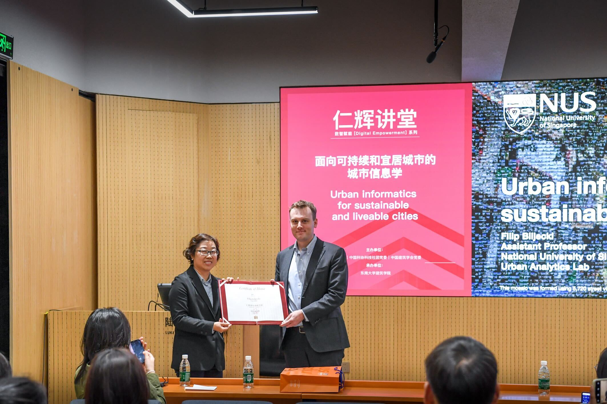

Over the last half year, the PI of the Urban Analytics Lab, {}, has been invited to visit 15 universities across China to give guest lectures and presentations, showcase the work of our research groups, and establish collaborations.

It has been an enriching experience and impressive in many ways -- from the quality of research and the beautiful campuses to very driven and talented researchers.

A big thank you to all the hosts for their wonderful hospitality at (in chronological order): Peking University, Tsinghua University, Hong Kong University of Science and Technology (Guangzhou), South China University of Technology, Nanjing University, Nanjing Normal University, Southeast University, Shenzhen University, Shenzhen Technology University, The Chinese University of Hong Kong, The University of Hong Kong, City University of Hong Kong, The Hong Kong Polytechnic University, Zhejiang A&F University, and Zhejiang University.

")

")

It was a pleasure to be in the company of exceptional scholars and learn more about their work.
We look forward to continue collaborating with these wonderful research groups.
