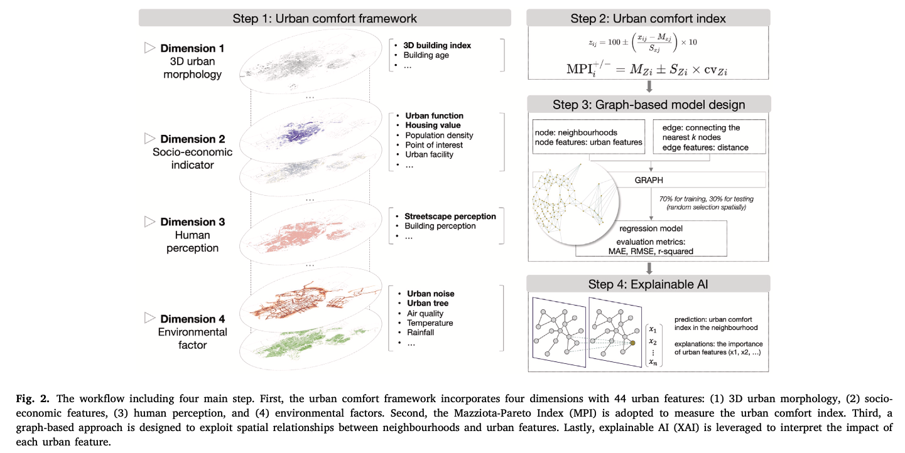
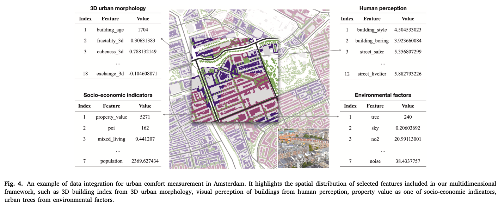
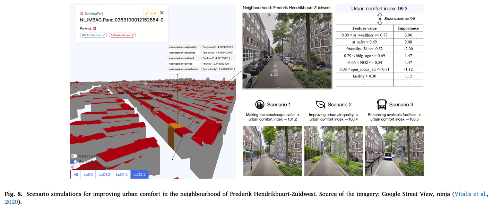
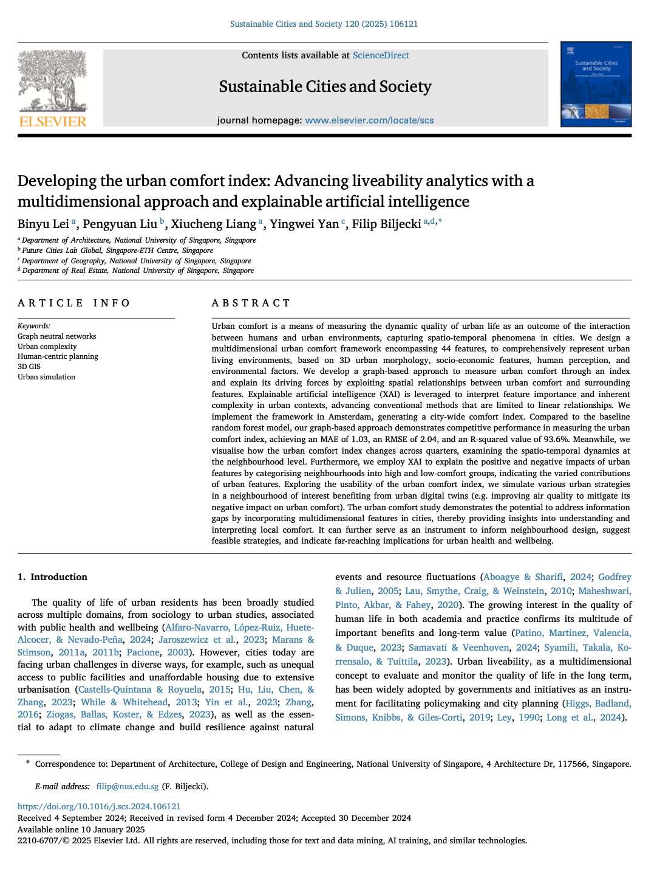

We are glad to share our new paper:

> Lei B, Liu P, Liang X, Yan Y, Biljecki F (2025): Developing the urban comfort index: Advancing liveability analytics with a multidimensional approach and explainable artificial intelligence. Sustainable Cities and Society, 120: 106121. [<i class="ai ai-doi-square ai"></i> 10.1016/j.scs.2024.106121](https://doi.org/10.1016/j.scs.2024.106121) [<i class="far fa-file-pdf"></i> PDF](/publication/2025-scs-urban-comfort/2025-scs-urban-comfort.pdf)</i>

This research was led by {}.
Congratulations on her new publication that is part of her PhD, and on her continued successes! :raised_hands: :clap:

The paper is [available freely](https://authors.elsevier.com/a/1kRMe7sfVZE4tM) until 2025-03-10.




### Highlights


+ A multidimensional framework for measuring urban comfort.
+ An innovative graph structure of neighbourhoods to represent spatial contexts.
+ Explainable AI to interpret the non-linear and intricate impacts of urban features.
+ Urban comfort demonstrates spatial variation and temporal dynamics.
+ A practical use case for simulating scenarios to enhance local comfort.




### Abstract

> Urban comfort is a means of measuring the dynamic quality of urban life as an outcome of the interaction between humans and urban environments, capturing spatio-temporal phenomena in cities. We design a multidimensional urban comfort framework encompassing 44 features, to comprehensively represent urban living environments, based on 3D urban morphology, socio-economic features, human perception, and environmental factors. We develop a graph-based approach to measure urban comfort through an index and explain its driving forces by exploiting spatial relationships between urban comfort and surrounding features. Explainable artificial intelligence (XAI) is leveraged to interpret feature importance and inherent complexity in urban contexts, advancing conventional methods that are limited to linear relationships. We implement the framework in Amsterdam, generating a city-wide comfort index. Compared to the baseline random forest model, our graph-based approach demonstrates competitive performance in measuring the urban comfort index, achieving an MAE of 1.03, an RMSE of 2.04, and an R-squared value of 93.6%. Meanwhile, we visualise how the urban comfort index changes across quarters, examining the spatio-temporal dynamics at the neighbourhood level. Furthermore, we employ XAI to explain the positive and negative impacts of urban features by categorising neighbourhoods into high and low-comfort groups, indicating the varied contributions of urban features. Exploring the usability of the urban comfort index, we simulate various urban strategies in a neighbourhood of interest benefiting from urban digital twins (e.g. improving air quality to mitigate its negative impact on urban comfort). The urban comfort study demonstrates the potential to address information gaps by incorporating multidimensional features in cities, thereby providing insights into understanding and interpreting local comfort. It can further serve as an instrument to inform neighbourhood design, suggest feasible strategies, and indicate far-reaching implications for urban health and wellbeing.



### Paper 

For more information, please see the [paper](/publication/2025-scs-urban-comfort/).

[](/publication/2025-scs-urban-comfort/)

BibTeX citation:
```bibtex
@article{2025_scs_urban_comfort,
  author = {Lei, Binyu and Liu, Pengyuan and Liang, Xiucheng and Yan, Yingwei and Biljecki, Filip},
  doi = {10.1016/j.scs.2024.106121},
  journal = {Sustainable Cities and Society},
  pages = {106121},
  title = {Developing the urban comfort index: Advancing liveability analytics with a multidimensional approach and explainable artificial intelligence},
  volume = {120},
  year = {2025}
}
```
