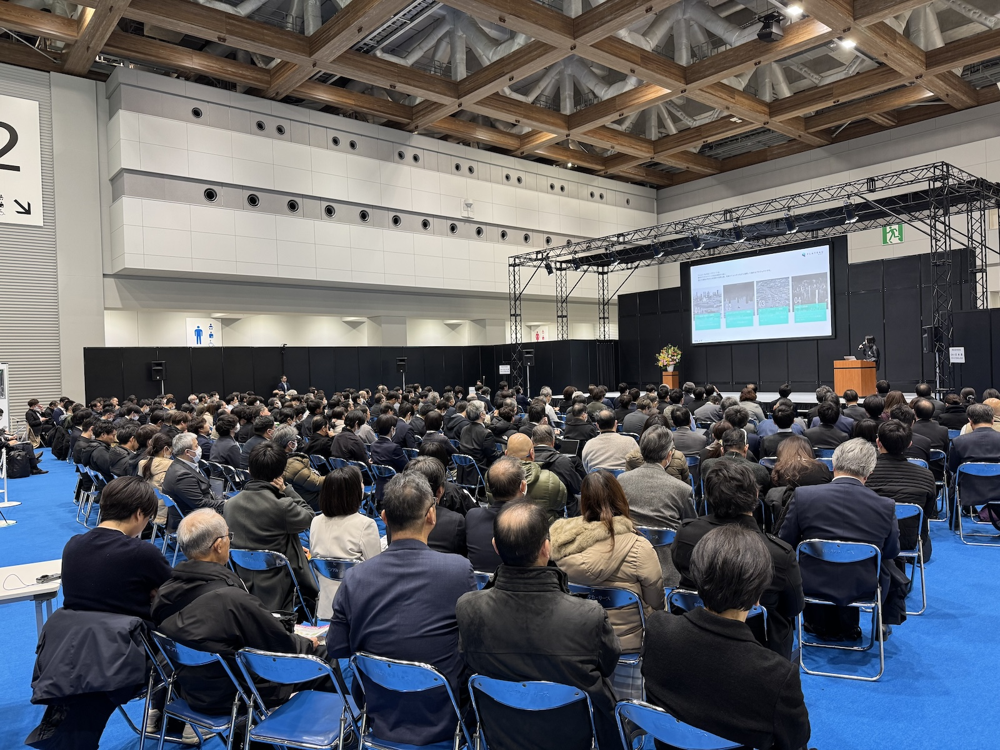

The PI of the Urban Analytics Lab, {}, has been invited to be the keynote speaker at the PLATEAU Symposium of Japan's [Ministry of Land, Infrastructure, Transport and Tourism](https://www.mlit.go.jp/en/), presenting to 300 digital twin enthusiasts in the Japanese geospatial community.
This invitation is very much appreciated.
Big thanks also to AIGID (Association for Promotion of Infrastructure Geospatial Information Distribution). 🇯🇵

The presentation included sharing some views and challenges on urban digital twins against the backdrop of their promise and momentum, and gave a sneak peek into some developments from our [Urban Analytics Lab](/) and other groups at the National University of Singapore.
This invitation affirms the relevance of our research and developments in the domain of urban digital twins.

Japan's advancements in urban digital twins are truly becoming a global benchmark. 🌏

[PLATEAU](https://www.mlit.go.jp/en/toshi/daisei/plateau_en_2.html) is a 3D urban model development, utilisation, and open data project led by MLIT - among the best urban digital twin efforts globally, with quite positive points of nurturing the triangle of government-industry-academia and the impressive involvement of hundreds of cities. The Japanese authorities have recognised the importance of open developments, achieving a unique and comprehensive ecosystem that does not include only data & systems but it also encompasses a vibrant community that comes together through a series of events and initiatives.

It was great to exchange ideas with experts from MLIT, including Ms Yuka Sogawa, Dr Muto Sachio and others, as well as panelists Ms Chikako Kurokawa (Asia Air Survey), Mr Michio Oda (Kukusai Kogyo), Mr Kenya Tamura (Eukarya), Mr Yukihiro Nakajima (Asia Air Survey), Mr Shigeru Chiba (NTT InfraNet), and other Japanese digital twin champions.

Thanks to MLIT, AIGID, & PLATEAU team (and many others involved including Ms Yu Nagura and Prof Yoshihide Sekimoto) for the inspiring leadership and activities.

