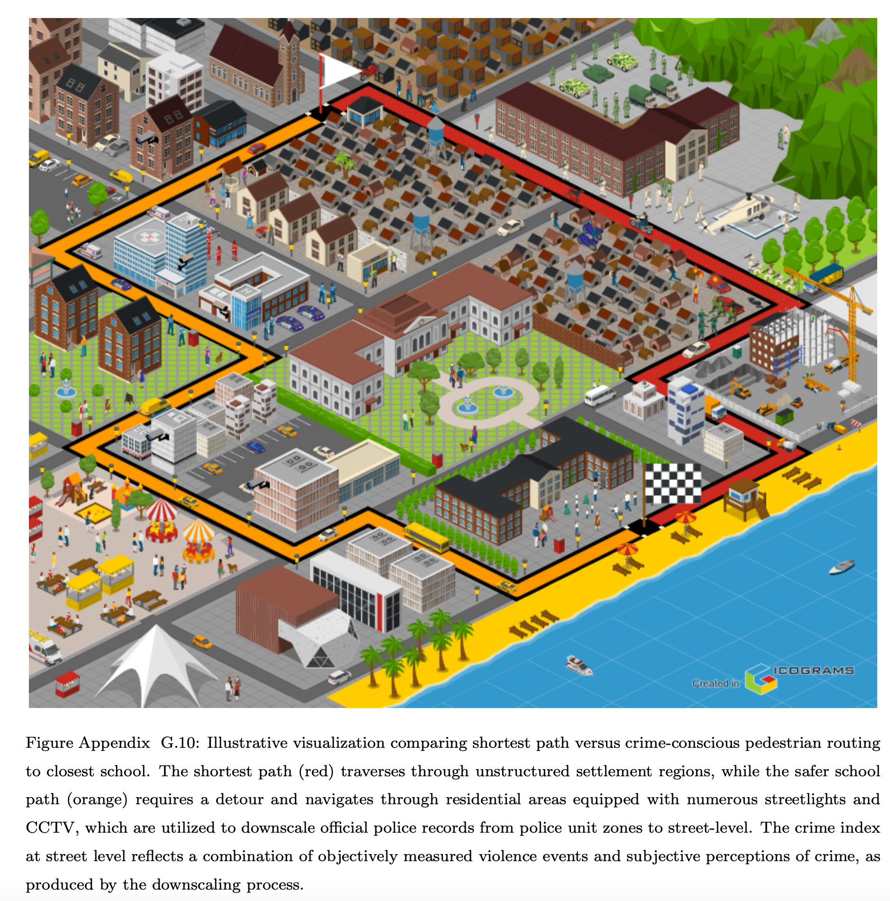
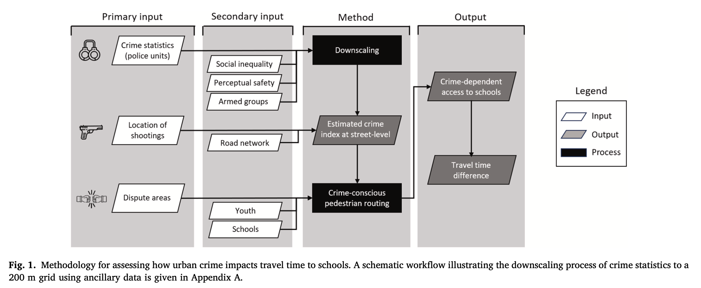
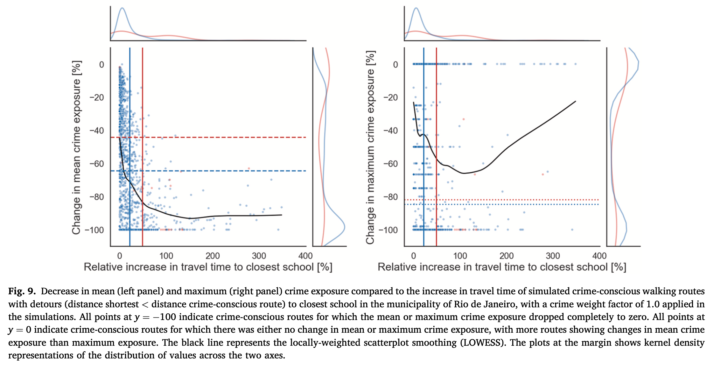
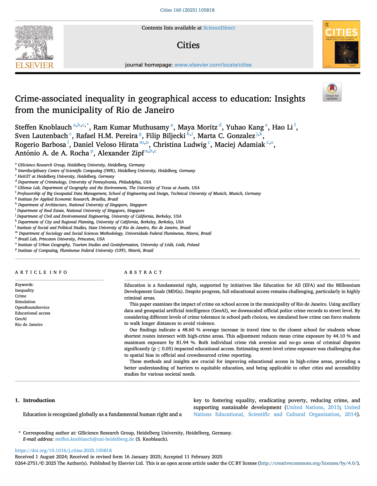

We are glad to share a new collaborative paper:

> Knoblauch S, Muthusamy RK, Moritz M, Kang Y, Li H, Lautenbach S, Pereira RHM, Biljecki F, Gonzalez MC, Barbosa R, Hirata DV, Ludwig C, Adamiak M, de A Rocha AA, Zipf A (2024): Crime-associated inequality in geographical access to education: Insights from the municipality of Rio de Janeiro. Cities 160: 105818. [<i class="ai ai-doi-square ai"></i> 10.1016/j.cities.2025.105818](https://doi.org/10.1016/j.cities.2025.105818) [<i class="far fa-file-pdf"></i> PDF](/publication/2025-cities-crime-education/2025-cities-crime-education.pdf)</i> <i class="ai ai-open-access-square ai"></i>

This research was led by [Steffen Knoblauch](https://www.geog.uni-heidelberg.de/gis/knoblauch.html) from the [GIScience Research Group](https://www.geog.uni-heidelberg.de/gis/index_en.html) at Heidelberg University in Germany.
Congratulations on the publication! :raised_hands: :clap:

The paper is [available open access](https://doi.org/10.1016/j.cities.2025.105818).



## Highlights

+ Crime-conscious routing can reveal inequality in geographic access to education.
+ GeoAI can support downscaling of crime records to street level.
+ In Rio de Janeiro, dispute areas increase travel time to the nearest school by 48.6 %.
+ Findings support targeted interventions to improve school access in high-crime areas.
+ Method adaptable to a broad range of urban access studies across diverse cities.



### Abstract

> Education is a fundamental right, supported by initiatives like Education for All (EFA) and the Millennium Development Goals (MDGs). Despite progress, full educational access remains challenging, particularly in highly criminal areas. This paper examines the impact of crime on school access in the municipality of Rio de Janeiro. Using ancillary data and geospatial artificial intelligence (GeoAI), we downscaled official police crime records to street level. By considering different levels of crime tolerance in school path choices, we simulated how crime can force students to walk longer distances to avoid violence. Our findings indicate a 48.60 % average increase in travel time to the closest school for students whose shortest routes intersect with high-crime areas. This adjustment reduces mean crime exposure by 44.10 % and maximum exposure by 81.94 %. Both individual crime risk aversion and no-go areas of criminal disputes significantly (p  0.05) impacted educational access. Estimating street-level crime exposure was challenging due to spatial bias in official and crowdsourced crime reporting. These methods and insights are crucial for improving educational access in high-crime areas, providing a better understanding of barriers to equitable education, and being applicable to other cities and accessibility studies for various societal needs.



### Paper 

For more information, please see the [paper](/publication/2025-cities-crime-education/) (open access <i class="ai ai-open-access-square ai"></i>).

[](/publication/2025-cities-crime-education/)

BibTeX citation:
```bibtex
@article{2025_cities_crime_education,
 author = {Knoblauch, Steffen and Muthusamy, Ram Kumar and Moritz, Maya and Kang, Yuhao and Li, Hao and Lautenbach, Sven and Pereira, Rafael H.M. and Biljecki, Filip and Gonzalez, Marta C. and Barbosa, Rogerio and Hirata, Daniel Veloso and Ludwig, Christina and Adamiak, Maciej and de A. Rocha, Antônio A. and Zipf, Alexander},
 doi = {10.1016/j.cities.2025.105818},
 journal = {Cities},
 pages = {105818},
 title = {Crime-associated inequality in geographical access to education: Insights from the municipality of Rio de Janeiro},
 volume = {160},
 year = {2025}
}
```
