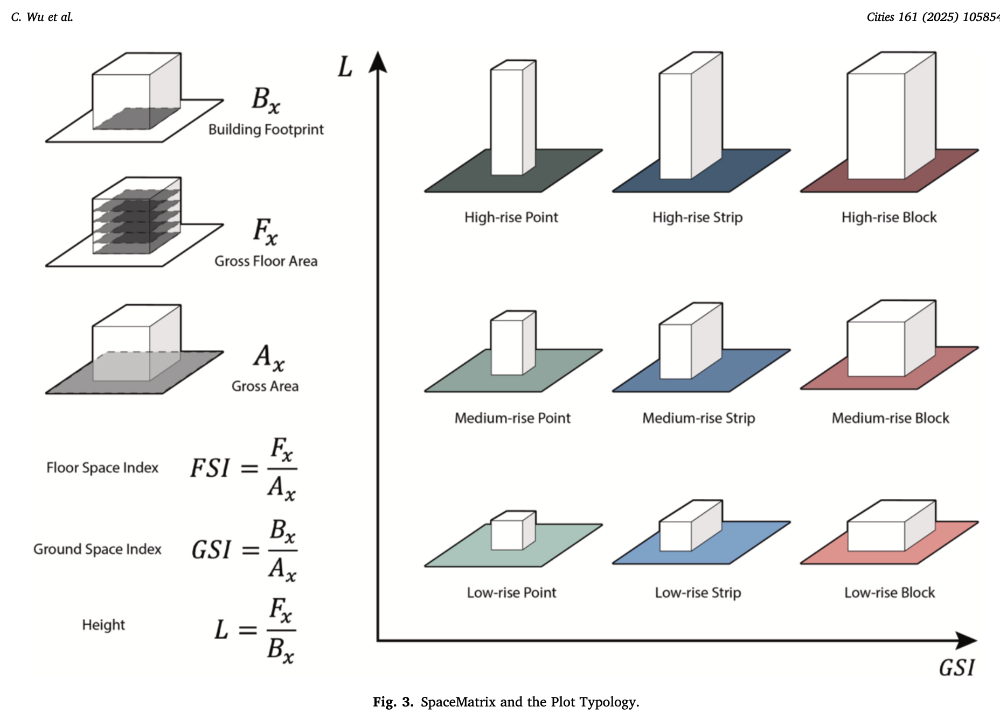
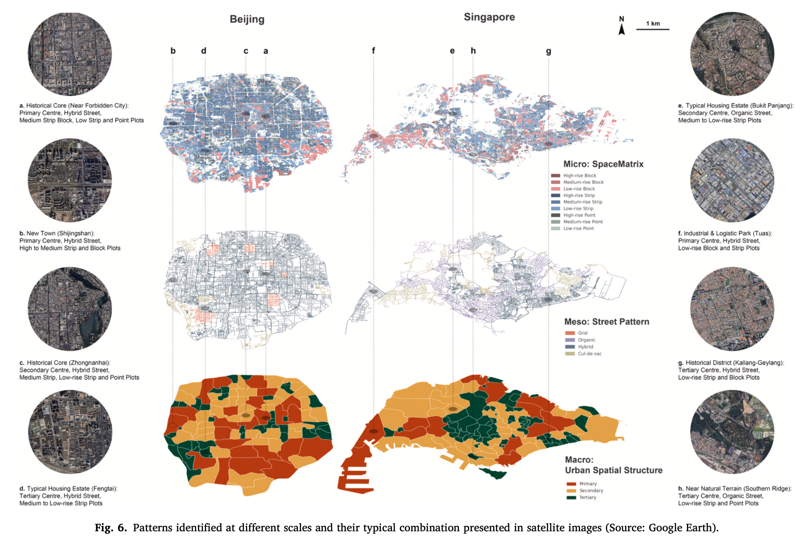
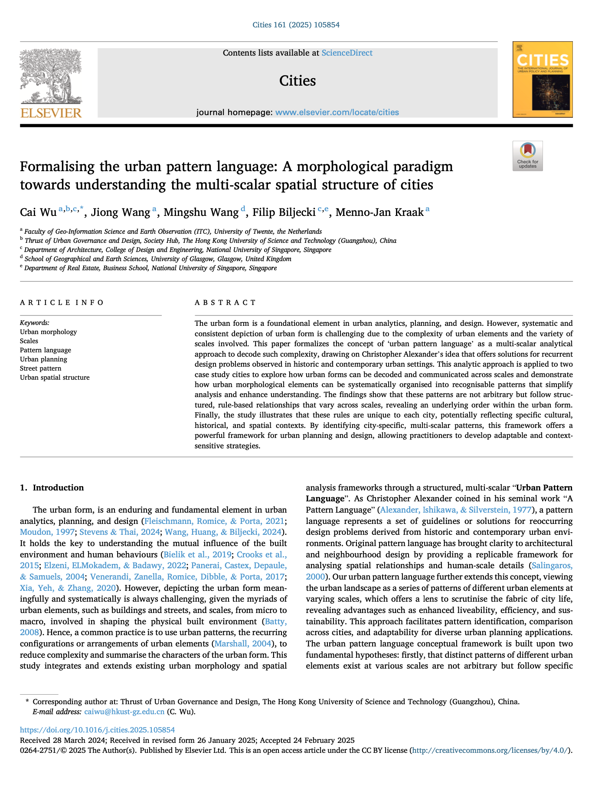

We are glad to share our new paper:

> Wu C, Wang J, Wang M, Biljecki F, Kraak MJ (2025): Formalising the urban pattern language: A morphological paradigm towards understanding the multi-scalar spatial structure of cities. Cities, 161: 105854. [<i class="ai ai-doi-square ai"></i> 10.1016/j.cities.2025.105854](https://doi.org/10.1016/j.cities.2025.105854) [<i class="far fa-file-pdf"></i> PDF](/publication/2025-cities-pattern-language/2025-cities-pattern-language.pdf)</i> <i class="ai ai-open-access-square ai"></i>

This research was led by {}.
Congratulations on his new publication that is part of his PhD! :raised_hands: :clap:




### Highlights

+ Develop a quantitative method for multi-scale urban morphology analysis using urban pattern language.
+ Quantify selected urban patterns at various scales, demonstrating their structured, non-arbitrary relationships.
+ Show how urban pattern language reflects distinct urban contexts and characteristics through case studies.
+ Highlight practical applications in planning and design, aiding contextual, sustainable, and informed decision-making.
+ Identify future research opportunities by showcasing adaptability to diverse urban contexts and data availability.




### Abstract

> The urban form is a foundational element in urban analytics, planning, and design. However, systematic and consistent depiction of urban form is challenging due to the complexity of urban elements and the variety of scales involved. This paper formalizes the concept of ‘urban pattern language’ as a multi-scalar analytical approach to decode such complexity, drawing on Christopher Alexander's idea that offers solutions for recurrent design problems observed in historic and contemporary urban settings. This analytic approach is applied to two case study cities to explore how urban forms can be decoded and communicated across scales and demonstrate how urban morphological elements can be systematically organised into recognisable patterns that simplify analysis and enhance understanding. The findings show that these patterns are not arbitrary but follow structured, rule-based relationships that vary across scales, revealing an underlying order within the urban form. Finally, the study illustrates that these rules are unique to each city, potentially reflecting specific cultural, historical, and spatial contexts. By identifying city-specific, multi-scalar patterns, this framework offers a powerful framework for urban planning and design, allowing practitioners to develop adaptable and context-sensitive strategies.

### Paper 

For more information, please see the [paper](/publication/2025-cities-pattern-language/). <i class="ai ai-open-access-square ai"></i>

[](/publication/2025-cities-pattern-language/)

BibTeX citation:
```bibtex
@article{2025_cities_pattern_language,
  author = {Wu, Cai and Wang, Jiong and Wang, Mingshu and Biljecki, Filip and Kraak, Menno-Jan},
  doi = {10.1016/j.cities.2025.105854},
  journal = {Cities},
  pages = {105854},
  title = {Formalising the urban pattern language: A morphological paradigm towards understanding the multi-scalar spatial structure of cities},
  volume = {161},
  year = {2025}
}
```
