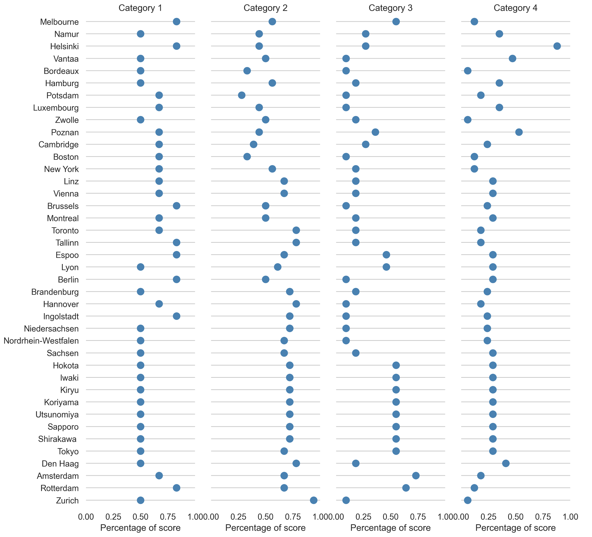

## 3D City Index -- Assessing and benchmarking 3D City Models

### About the project

3D city models are omnipresent in urban management and simulations.
We establish a holistic and comprehensive 4-category framework -- '3D City Index', encompassing 47 criteria to identify key properties of 3D city models, enabling their assessment and benchmarking, and suggesting usability.
The framework implementation enables a comprehensive and structured understanding of the landscape of semantic 3D geospatial data, as well as doubles as an evaluated collection of open 3D city models.

There are further applications of this first endeavour to standardise the characterisation of 3D data: monitoring developments and trends in 3D city modelling, and enabling researchers and practitioners to find the most appropriate datasets for their needs.
The work is designed to measure datasets continuously and can also be applied to other instances in spatial data infrastructures.

### Framework 

The developed framework contains four categories, which are: Data portal, Basic information, Thematic content, and Attribute content. Each category includes a set of criteria to comprehensively emphasise different points of views.

| **Category**             | **Criteria**                                                                    |
| ------------------------ | ------------------------------------------------------------------------------- |
| (1) Data Portal          | 1C1 -- Does the dataset have a dedicated website?                               |
|                          | 1C2 -- Is there a web viewer in 3D?                                             |
|                          | 1C3 -- Is there near real-time information in the viewer?                       |
|                          | 1C4 -- Is it available in local language?                                       |
|                          | 1C5 -- Is it available in English?                                              |
|                          | 1C6 -- Is there a way to leave feedback?                                        |
| ------------------------ | ------------------------------------------------------------------------------- |
| (2) Basic Information    | 2C1 -- Is it a structured 3D city (information) model?                          |
|                          | 2C2 -- Is it a 3D mesh model?                                                   |
|                          | 2C3 -- Is it downloadable?                                                      |
|                          | 2C4 -- Is it free of charge?                                                    |
|                          | 2C5 -- Is it available to download without registration?                        |
|                          | 2C6 -- Is it available to download in more than one format?                     |
|                          | 2C7 -- Is it generated using open data standard?                                |
|                          | 2C8 -- Is it openly licensed?                                                   |
|                          | 2C9 -- Does it provide metadata?                                                |
|                          | 2C10 -- Is it recently published (within latest 5 years)?                       |
|                          | 2C11 -- Has it been updated?                                                    |
|                          | 2C12 -- Does it have a plan to update?                                          |
|                          | 2C13 -- Does it keep historical datasets?                                       |
|                          | 2C14 -- Does it include more than one level of detail (LoD)?                    |
|                          | 2C15 -- Does it cover the entire jurisdiction?                                  |
| ------------------------ | ------------------------------------------------------------------------------- |
| (3) Thematic Content     | 3C1 -- Are buildings modelled with semantically differentiated surfaces?        |
|                          | 3C2 -- Does it contain bridges?                                                 |
|                          | 3C3 -- Does it contain land use?                                                |
|                          | 3C4 -- Does it contain terrain?                                                 |
|                          | 3C5 -- Does it contain roads?                                                   |
|                          | 3C6 -- Does it contain tunnels?                                                 |
|                          | 3C7 -- Does it contain tracks?                                                  |
|                          | 3C8 -- Does it contain city furniture?                                          |
|                          | 3C9 -- Does it contain vegetation?                                              |
|                          | 3C10 -- Does it contain individual trees?                                       |
|                          | 3C11 -- Does it contain water bodies?                                           |
| ------------------------ | ------------------------------------------------------------------------------- |
| (4) Attribute Content    | 4C1 -- Does it contain the postal code?                                         |
|                          | 4C2 -- Are buildings with texture?                                              |
|                          | 4C3 -- Does it contain the ID of buildings?                                     |
|                          | 4C4 -- Does it contain the year of construction?                                |
|                          | 4C5 -- Does it contain the address of buildings?                                |
|                          | 4C6 -- Does it contain the function of buildings?                               |
|                          | 4C7 -- Does it contain the height of buildings?                                 |
|                          | 4C8 -- Does it contain the volume of buildings?                                 |
|                          | 4C9 -- Does it contain the number of storeys?                                   |
|                          | 4C10 -- Does it contain the area of walls?                                      |
|                          | 4C11 -- Does it contain the area of roofs?                                      |
|                          | 4C12 -- Does it contain the type of roofs?                                      |
|                          | 4C13 -- Does it contain the area of grounds?                                    |
|                          | 4C14 -- Does it contain gross floor areas?                                      |
|                          | 4C15 -- Does it contain materials of buildings?                                 |


### Assessment

A demonstration that doubles as an analysis of the worldwide state of open 3D geoinformation and as a catalogue of open 3D data, a set of 40 authoritative open datasets has been assessed using the framework.
Overall, our implementation contains about 2000 manually collected properties.
The assessed 40 datasets present significant differences in each category.
Such performances suggest heterogeneous approaches and different focuses of local governments.

The results are given in the table below.
You may click on cities to visit their 3D models.

| **City**                                             | **Score**       |
| ---------------------------------------------------- | --------------- |
| [Helsinki][Helsinki]                                 | 32              |
| [Amsterdam][Amsterdam]                               | 27              |
| [Espoo][Espoo]                                       | 27              |
| [Poznan][Poznan]                                     | 26              |
| [Iwaki][Iwaki]                                       | 25              |
| [Tokyo][Tokyo]                                       | 25              |
| [Shirakawa][Shirakawa]                               | 25              |
| [Sapporo][Sapporo]                                   | 25              |
| [Utsunomiya][Utsunomiya]                             | 25              |
| [Koriyama][Koriyama]                                 | 25              |
| [Kiryu][Kiryu]                                       | 25              |
| [Rotterdam][Rotterdam]                               | 24              |
| [Den Haag][Den Haag]                                 | 24              |
| [Vienna][Vienna]                                     | 24              |
| [Hokota][Hokota]                                     | 24              |
| [Lyon][Lyon]                                         | 23              |
| [Melbourne][Melbourne]                               | 23              |
| [Vantaa][Vantaa]                                     | 22              |
| [Sachsen][Sachsen]                                   | 22              |
| [Linz][Linz]                                         | 22              |
| [Berlin][Berlin]                                     | 21              |
| [Hamburg][Hamburg]                                   | 21              |
| [Brandenburg][Brandenburg]                           | 21              |
| [Tallinn][Tallinn]                                   | 21              |
| [Niedersachsen][Niedersachsen]                       | 20              |
| [Hannover][Hannover]                                 | 20              |
| [Toronto][Toronto]                                   | 20              |
| [Namur][Namur]                                       | 20              |
| [Luxembourg][Luxembourg]                             | 19              |
| [Montreal][Montreal]                                 | 19              |
| [Zurich][Zurich]                                     | 19              |
| [Cambridge][Cambridge]                               | 18              |
| [Nordrhein-Westfalen][Nordrhein-Westfalen]           | 18              |
| [Brussels][Brussels]                                 | 18              |
| [New York][New York]                                 | 16              |
| [Zwolle][Zwolle]                                     | 15              |
| [Potsdam][Potsdam]                                   | 15              |
| [Wellington][Wellington]                             | 15              |
| [Boston][Boston]                                     | 13              |
| [Bordeaux][Bordeaux]                                 | 13              |


[Helsinki]:https://www.hel.fi/helsinki/en/administration/information/general/3d/view/view-the-models
[Amsterdam]:https://3d.amsterdam.nl/web/index.html
[Espoo]:https://kartat.espoo.fi/3d/index_en.html
[Poznan]:https://www.poznan.pl/mim/main/object.html?id_klasy=5763&id_obiektu=71448&lang=pl
[Tokyo]:https://www.geospatial.jp/ckan/dataset/plateau-tokyo23ku-citygml-2020
[Shirakawa]:https://www.geospatial.jp/ckan/dataset/plateau-07205-shirakawa-shi-2020
[Sapporo]:https://www.geospatial.jp/ckan/dataset/plateau-01100-sapporo-shi-2020
[Utsunomiya]:https://www.geospatial.jp/ckan/dataset/plateau-09201-utsunomiya-shi-2020
[Koriyama]:https://www.geospatial.jp/ckan/dataset/plateau-07203-koriyama-city-2020
[Kiryu]:https://www.geospatial.jp/ckan/dataset/plateau-10203-kiryu-shi-2020
[Iwaki]:https://www.geospatial.jp/ckan/dataset/plateau-07204-iwaki-shi-2020
[Hokota]:https://www.geospatial.jp/ckan/dataset/plateau-08234-hokota-shi-2020
[Rotterdam]:https://www.rotterdam.nl/werken-leren/3d/
[Den Haag]:https://denhaag.dataplatform.nl/#/data?search_input=3D
[Vienna]:https://www.wien.gv.at/stadtentwicklung/stadtvermessung/geodaten/stadtmodell/
[Lyon]:https://data.grandlyon.com/jeux-de-donnees/maquettes-3d-texturees-2018-communes-metropole-lyon/donnees
[Melbourne]:https://data.melbourne.vic.gov.au/Property/City-of-Melbourne-3D-Textured-Mesh-Photomesh-2018/d5tb-r7a6
[Vantaa]:https://www.betaavoindata.fi/data/fi/dataset/vantaan-3d-rakennukset
[Linz]:https://www.linz.at/stadtentwicklung/linz3d.php
[Sachsen]:http://www.landesvermessung.sachsen.de/3d-stadtmodell-4090.html
[Berlin]:https://www.businesslocationcenter.de/en/economic-atlas/download-portal/
[Hamburg]:https://suche.transparenz.hamburg.de/dataset/3d-stadtmodell-lod2-de-hamburg2#
[Brandenburg]:https://geobasis-bb.de/lgb/de/geodaten/3d-produkte/3d-gebaeudemodelle/#
[Tallinn]:https://geoportaal.maaamet.ee/eng/Spatial-Data/Geo3D/3D-Data-p836.html
[Toronto]:https://open.toronto.ca/dataset/3d-massing/
[Niedersachsen]:https://opengeodata.lgln.niedersachsen.de/#lod1
[Namur]:https://data.namur.be/explore/dataset/namur-3d-batiments-textures-par-dalle-de-200m/information/
[Hannover]:https://www.hannover.de/Leben-in-der-Region-Hannover/Verwaltungen-Kommunen/Die-Verwaltung-der-Landeshauptstadt-Hannover/Dezernate-und-Fachbereiche-der-LHH/Stadtentwicklung-und-Bauen/Fachbereich-Planen-und-Stadtentwicklung/Geoinformation/Open-GeoData/3D-Stadtmodell-und-Gel%C3%A4ndemodell/Digitales-3D-Stadtmodell
[Luxembourg]:https://data.public.lu/en/datasets/5cecd25a4384b06ad27e5c58/
[Montreal]:https://open.canada.ca/data/en/dataset/58dd9b17-8242-4013-bf9d-0c8d3d93f081
[Zurich]:https://data.stadt-zuerich.ch/dataset?q=&tags=3d-stadtmodell
[Cambridge]:https://www.cambridgema.gov/GIS/3D/3ddata/3ddatadownloadmap
[Nordrhein-Westfalen]:https://www.bezreg-koeln.nrw.de/brk_internet/geobasis/3d_gebaeudemodelle/index.html
[Brussels]:https://datastore.brussels/web/data/dataset/93b1bcb1-2adb-4cf8-9e5d-381e9904536c
[New York]:https://www1.nyc.gov/site/doitt/initiatives/3d-building.page
[Zwolle]:https://zwolle.maps.arcgis.com/apps/webappviewer/index.html?id=f178225fb81e462f956404cdb54500e8&webmap=03d590b1de534bd193ba83cf815b4584
[Potsdam]:https://potsdam.opendatasoft.com/explore/dataset/3d-gebaudemodell-lod2-citygml/information/
[Boston]:http://www.bostonplans.org/3d-data-maps/3d-smart-model/3d-data-download
[Bordeaux]:https://opendata.bordeaux-metropole.fr/explore/dataset/bati3d/information/
[Wellington]:https://catalogue.data.govt.nz/dataset/3d-wellington



## Documentation, paper, and attribution

A [paper](https://doi.org/10.1080/13658816.2022.2140808) describing the project was published in _International Journal of Geographical Information Science_.

If you use this work in a scientific context, please cite the paper:

> Lei B, Stouffs R, Biljecki F (2023): Assessing and benchmarking 3D city models. International Journal of Geographical Information Science, 37(4): 788-809. doi:10.1080/13658816.2022.2140808

```bibtex
@article{2023_ijgis_3d_city_index,
  author = {Lei, Binyu and Stouffs, Rudi and Biljecki, Filip},
  doi = {10.1080/13658816.2022.2140808},
  journal = {International Journal of Geographical Information Science},
  title = {{Assessing and benchmarking 3D city models}},
  year = {2023},
  pages = {788-809},
  volume = {37},
  issue = {4}
}
```

## Lead research and development
{}

### Research group
[Urban Analytics Lab, National University of Singapore (NUS)](/)

## Disclaimer

We remain neutral with respect to jurisdictional claims in the datasets.

## Acknowledgements

We gratefully acknowledge the sources of the used input data.

This research is part of the projects (i) Large-scale 3D Geospatial Data for Urban Analytics, which is supported by the National University of Singapore under the Start Up Grant R-295-000-171-133; and (ii) Multi-scale Digital Twins for the Urban Environment: From Heartbeats to Cities, which is supported by the Singapore Ministry of Education Academic Research Fund Tier 1.
