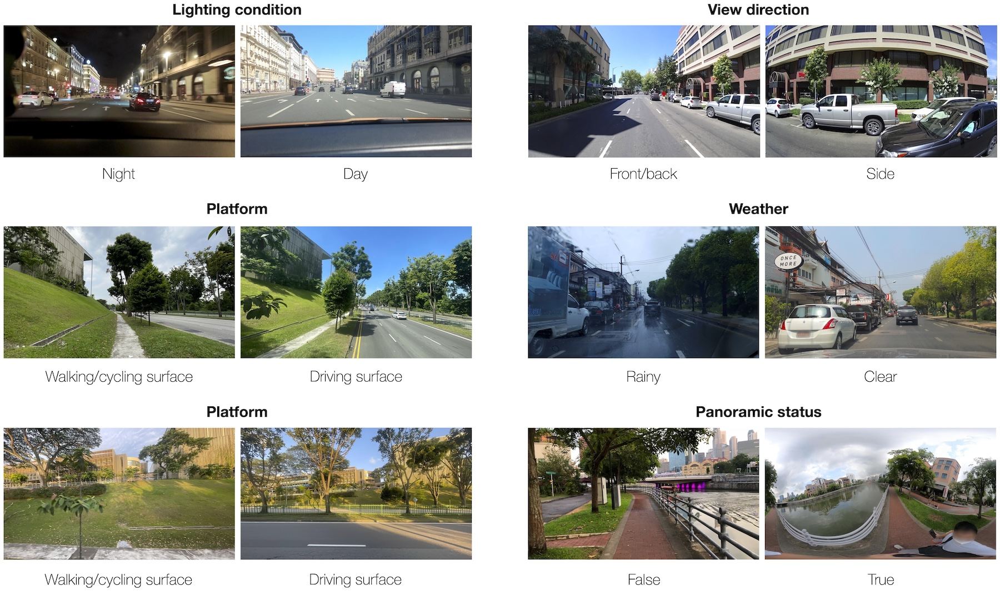

# A comprehensive dataset of 10 million street-level images across 688 cities for urban science and analytics

{}
The dataset and models are [here](https://huggingface.co/datasets/NUS-UAL/global-streetscapes), while the code and online documentation are [here](https://github.com/ualsg/global-streetscapes). There is also a [journal paper](https://doi.org/10.1016/j.isprsjprs.2024.06.023).
{}

## Summary / TL;DR

Street-level imagery[^1] is a popular data source in urban informatics, GIScience, urban studies, and computer vision, but datasets usually come without much context and metadata.
We devised a set of hundreds of attributes that indicate a variety of characteristics of photos (e.g. type of road and weather) and may be useful for downstream analyses.
Then, we labelled manually a number of images according to them and developed models and a workflow to do so automatically.
We obtained millions of crowdsourced images from [Mapillary](https://www.mapillary.com) and [KartaView](https://kartaview.org) from hundreds of geographically balanced cities from around the world, and enriched them with these attributes and provided the enhanced dataset for everyone to use for any purpose.
Further, we pre-computed myriads of those that researchers commonly use, such as green view index, to save time and lower the technical barriers.
The code is also shared to enable extensions and updates to the dataset, and we wrote a [comprehensive journal paper](https://doi.org/10.1016/j.isprsjprs.2024.06.023).
All that is released openly.
Enjoy!

The project was carried out by the [Urban Analytics Lab](/) at the [National University of Singapore](https://nus.edu.sg).

While both the [paper](https://doi.org/10.1016/j.isprsjprs.2024.06.023) and [repository](https://github.com/ualsg/global-streetscapes) are rich in details, on this website you can find a description of what we do in a nutshell.
For more information, please refer to the [paper](https://doi.org/10.1016/j.isprsjprs.2024.06.023) and the wiki on the [repository](https://github.com/ualsg/global-streetscapes).

## Introduction and Motivation

In the last decade, street view imagery (SVI)[^1] has been [used widely by researchers globally in a variety of domains](), e.g.
[for assessing walkability](),
[mapping the amount of greenery at a very high resolution](),
[understanding human perception of cities](),
[tracking changes in urban environments](), and
[assessing parks and other open spaces]().


[]()
This emerging form of geographic information, which is rivalling satellite imagery and other traditionally used data, owes its popularity in urban science to a new perspective it brings but also the wide availability and increasing data sources.
SVI is usually obtained from commercial services like [Google Street View](https://www.google.com/streetview/) and [Baidu Maps](http://map.baidu.com/), which have been accompanied by crowdsourced platforms such as [Mapillary](https://www.mapillary.com) and [KartaView](https://kartaview.org/) (open to anyone from anywhere to contribute with imagery).

Here is an example of an image obtained from Mapillary in Singapore, from a contributor walking on a pedestrian path.

.")

Here is another example, this time from Zagreb in Croatia, from a contributor in a car.

.")

And one more -- from Delft in the Netherlands -- collected by a cyclist on a designated bike path.

.")

There are billions of such images available from thousands of cities around the world, powering a lot of cool research in urban studies, geoinformatics, computer vision, etc.

However, there are some issues that the community faces:
+ There is lack of information (metadata) to describe the contextual characteristics of SVIs. As you can tell from the examples above, the images can be vastly different, influencing the fit for purpose. The three images above are taken on different roads, different weather conditions, and via different transportation modes. But such information is not known. Images that are available in datasets usually contain only the coordinates and year when it was taken. Not all the images are equally appropriate for the same purpose, thus, having more information about them might be useful. For example, to comprehensively assess walkability, images taken from cars on motorised roads may not be as good as those taken from pedestrians, but we have no means to filter & select data by transportation mode and use only those that are most useful.
+ Computer vision and SVI are nowadays used routinely, using well established methods. But that can be challenging to many peers in the field who are less experienced with computational methods and might not have access to powerful workstations with GPU capabilities. Thus, there is a high entry barrier to this emerging form of geospatial data, affecting accessibility and participation around the world. Further, even seasoned researchers with nice machines and expertise may find processing data a hassle.
+ Studies often tend to focus on one or a few cities, and they tend to include only large cities. Smaller cities and some entire countries are often ignored in studies relying on street view imagery.
+ Researchers tend to overlook crowdsourced street view imagery, which provides great potential, and some benefits[^2] over commercial data such as an open licence, heterogeneous views, and coverage.
+ The computer vision community has a limited set of benchmark SVI datasets.

.")


## Goal, contributions, and benefits of our project

Welcome to Global Streetscapes -- our multi-pronged contribution addressing the above shortcomings with the following:

+ A worldwide dataset of 10 million crowdsourced SVIs sampled from [Mapillary](https://www.mapillary.com) and [KartaView](https://kartaview.org), covering 688 cities around the world, which account for about 10\% of the world's population, enriched with more than 300 attributes and has wide geographical, environmental, and temporal diversity.
+ A comprehensive list of hundreds of SVI-relevant attributes that indicate camera, geographical, temporal, contextual, perceptual, and semantic nature that have been derived from a literature review, [our experience in the field](/publication/), and many hours of team discussions.
+ Pre-computed information that many researchers find valuable but spend time on computing, such as the amount of sky or greenery in an image, saving them time, effort, and resources.
+ A reproducible framework to sample and synthesise crowdsourced SVIs from two different sources ([Mapillary](https://www.mapillary.com) and [KartaView](https://kartaview.org)), and enrich them with the information above.
+ The first dataset with curated manual labels and baseline CV models for benchmarking models for SVIs and urban data science.
+ Released CV models to classify images.
+ Reduced the entry barrier to research utilising street view imagery by providing a diverse, vast, off-the-shelf solution, increasing equity and participation from researchers who are less experienced with computational methods.
+ Promoting the use of street view imagery, especially crowdsourced instances, in urban studies and beyond.

Further, the [paper](https://doi.org/10.1016/j.isprsjprs.2024.06.023) provides a fundamental discourse on street view imagery, which beginners may find of relevance.

## Deliverables

On a broader scope, NUS Global Streetscapes is composed of the following outputs:

+ [Dataset and models](https://huggingface.co/datasets/NUS-UAL/global-streetscapes). For users who have no access to Hugging Face, the dataset is [available also on Baidu Cloud Disk](https://pan.baidu.com/s/1wsbqfbA56sXjIdb0KoSBbQ?pwd=98tr).
+ [Code and online documentation](https://github.com/ualsg/global-streetscapes), including tutorials/wiki.
+ [Peer-reviewed paper](https://doi.org/10.1016/j.isprsjprs.2024.06.023) published in an academic journal.

## Paper and attribution

A [paper](https://doi.org/10.1016/j.isprsjprs.2024.06.023) describing the project was published in _ISPRS Journal of Photogrammetry and Remote Sensing_.
Please refer to it for detailed information, while this website summarises the project and provides the links to the datasets, models, and code.

If you use Global Streetscapes in a scientific context, please cite the paper:

> Hou Y, Quintana M, Khomiakov M, Yap W, Ouyang J, Ito K, Wang Z, Zhao T, Biljecki F (2024): Global Streetscapes -- A comprehensive dataset of 10 million street-level images across 688 cities for urban science and analytics. ISPRS Journal of Photogrammetry and Remote Sensing 215: 216-238. doi: [10.1016/j.isprsjprs.2024.06.023](https://doi.org/10.1016/j.isprsjprs.2024.06.023)

```bibtex
@article{2024_global_streetscapes,
 author = {Hou, Yujun and Quintana, Matias and Khomiakov, Maxim and Yap, Winston and Ouyang, Jiani and Ito, Koichi and Wang, Zeyu and Zhao, Tianhong and Biljecki, Filip},
 doi = {10.1016/j.isprsjprs.2024.06.023},
 journal = {ISPRS Journal of Photogrammetry and Remote Sensing},
 pages = {216-238},
 title = {Global Streetscapes -- A comprehensive dataset of 10 million street-level images across 688 cities for urban science and analytics},
 volume = {215},
 year = {2024}
}
```

## Method in a nutshell

We sample hundreds of cities around the world while ensuring a good balance (e.g. geographically, by population), and covering most countries and territories around the world. 
After that, we enrich them with a set of attributes with computer vision and geospatial operations.
The resulting dataset is released openly, together with the open-source code.
More information about some aspects, such as coverage and licence, are below.

 to data enrichment (B), to produce the Global Streetscapes dataset (C).")

## Coverage

Global Streetscapes covers a diversity of cities that have 50k or more residents.
Depending on the data availability, in each country, we looked into sampling at least a few cities (always including the capital), with some (larger) countries having more than a few cities.
In total, we have covered the city centres (2 x 2 km) of 688 cities.


## Attributes

The SVIs are enriched with a comprehensive range of spatial, temporal, semantic, perceptual, and contextual attributes that we believe will be relevant for a variety of downstream analyses and computer vision modelling benchmarking efforts.


## Demo/use cases/examples

Thanks to the vast volume of imagery, users have a diversity of settings at their disposal.
The next image shows the distribution of the values of various attributes (e.g. perception score of _lively_ according to Place Pulse) and examples at different values.

 to data enrichment (B), to produce the Global Streetscapes dataset (C).")

Given the heterogeneous nature of crowdsourced imagery (typical for user-generated content / volunteered geographic information), there may be multiple imagery of diverse characteristics at the same location, which can be distinguished thanks to our attributes.



Ultimately, one of the aspirations of the dataset is to enable querying for imagery that is fit for purpose, e.g. if you are analysing walkability, then the enriched dataset enables you to retrieve only those images that are relevant for this use case.


## Extensibility 

The design is modular, enabling the addition of new cities and indicators.
Further, the dataset can be updated with new imagery in the same area.
Our dataset covers data that was uploaded to Mapillary and KartaView in the 688 cities until early 2024.

## Licence

The project is licenced according to [CC BY 4.0](https://creativecommons.org/licenses/by/4.0/).
That means that you can use our work for pretty much anything as long as you attribute it properly depending on the context (cite our [paper](https://doi.org/10.1016/j.isprsjprs.2024.06.023), mention the name of the project, source & author of the data, link to this website, etc.).
Preferably, please also mention [Mapillary](https://www.mapillary.com) and [KartaView](https://kartaview.org), as this project wouldn't be possible without their awesome contributors and companies managing these platforms.

## Limitations, issues, and future work

Like any other academic output such as code and data, Global Streetscapes is an experimental research prototype and largely a proof of concept, which leaves room for improvement and future work.
For example, the dataset surely has errors, as the labelling and classification models are not perfect.
The developed code may also have some bugs.
The deliverables (e.g. software) are provided as is.

## Authors / Research group

The project was led by {} and conducted in the [Urban Analytics Lab](/) at the National University of Singapore (NUS).
The full list of people involved is below this post.

## Funding and Acknowledgements

Global Streetscapes is made possible by the efforts of many others, primarily contributors and maintainers of Mapillary, KartaView, and OpenStreetMap.

This research is part of the projects (i) Large-scale 3D Geospatial Data for Urban Analytics, which is supported by the National University of Singapore under the Start Up Grant R-295-000-171-133 and (ii) Multi-scale Digital Twins for the Urban Environment: From Heartbeats to Cities, which is supported by the Singapore Ministry of Education Academic Research Fund Tier 1.
The research was partially conducted at the Future Cities Lab Global at the Singapore-ETH Centre, which was established collaboratively between ETH Zürich and the National Research Foundation Singapore (NRF) under its Campus for Research Excellence and Technological Enterprise (CREATE) programme.

## Further reading

Besides the [paper about the project](https://doi.org/10.1016/j.isprsjprs.2024.06.023) and the references it contains, here are some reading recommendations, especially in relation to some aspects you may want to learn more about:

- How can street view imagery be used? Read our [2021 review paper in Landscape and Urban Planning]().
- Perception evaluation is commonly mentioned as one of the key applications of SVI, but how does it work exactly? Read our [2024 review paper in Cities](). Recently, we also introduced a new use case related to perception -- [our 2024 paper in Building and Environment]() demonstrates how SVI can be used to understand the impression of building exterior and architecture at a large scale.
- How does SVI compare to traditionally used satellite imagery? [Our 2022 conference paper]() provides a systematic comparison between the two.
- Crowdsourced data does not tend to have many panoramic images, is that a problem? [Our 2023 JAG study]() demonstrates that perspective (non-panoramic) imagery may be quite useful for typical studies such as mapping the urban form.
- Crowdsourced imagery, akin to other forms of user-generated / volunteered geographic information may have quality issues, what are these? We identified dozens of quality elements and issues, and provided the first SVI quality framework in [a 2022 JAG paper]().
- Street view imagery can be used on its own to power lots of new use cases but can we incorporate it to enhance existing analyses? Yes. For example, [Urbanity, published in 2023 in npj Urban Sustainability](), enhanced street network analyses by incorporating insights obtained from street view imagery. There is also a dataset, see [the 2023 Scientific Data paper]().
- The dataset provides images from the past several years, is there any chance to use it for some historical/longitudinal studies? Yes, see [our 2023 paper in Landscape and Urban Planning]() as an example.
- The dataset has quite heterogeneous imagery, even images collected from boats, is there any use of it? Yes, see [our 2023 paper in Ecological Indicators](), which looks into the usability of 'street view' imagery collected on water.


## FAQ

This website provides only a summary.
For more information about the work, please see the aforementioned [paper](https://doi.org/10.1016/j.isprsjprs.2024.06.023).

### What if I want to use it?

You are welcome to use, we will be glad if you will find it useful. You do not need to ask us for permission, just head to the [dataset](https://huggingface.co/datasets/NUS-UAL/global-streetscapes) and [paper](https://doi.org/10.1016/j.isprsjprs.2024.06.023).
Commercial use is also fine as long as your licence is compatible with [ours](#licence).
However, when using the dataset in any way please attribute this project by citing the [paper](https://doi.org/10.1016/j.isprsjprs.2024.06.023) and mentioning [our research group & university](/about).

Optionally, feel free to reach out to tell us a bit more how are you using this work and taking it forward.

### I want to read more but I do not have access to the paper. Is there any other way to download the paper?

We prepared a green open access version (postprint) [here]().

### I don't have access to the dataset deposited on Hugging Face. Is there any other way to download the dataset and models?

For users who have no access to Hugging Face (e.g. those based in China), the dataset is [available also on Baidu Cloud Disk](https://pan.baidu.com/s/1wsbqfbA56sXjIdb0KoSBbQ?pwd=98tr).

### What if I find an error?

We are pretty sure that the code and the dataset, like others, is not perfect.
Labels are not 100% correct, and the accuracy of some of them is around 70%.
We talked about some limitations and issues in the [paper](https://doi.org/10.1016/j.isprsjprs.2024.06.023).
If you find a major issue that we have not documented, please contact us.

### What if I have an idea and want to collaborate with you?

In principle, we welcome collaborations if we will have bandwidth for them and if there is a match.
Please [get in touch](/#contact).
Further, [we welcome visiting scholars to our group](/opportunities/vacancies).

### Do you have a plan for future updates? Is there going to be a v2?

Like all academic projects, it much depends on the funding, bandwidth, and ideas.
We will also monitor its uses and value it provides to the community before we make decisions about the next steps.

In the meantime, if you want to include your city or refresh the dataset for new imagery taken after this dataset has been released, the [openly released code](https://github.com/ualsg/global-streetscapes) provides a workflow how to do that.

### I want to add a new attribute that does not exist yet, how do I do that?

You will need to develop your own approach.
Perhaps [the code we released openly](https://github.com/ualsg/global-streetscapes) could help as a start.

### What is the image (mosaic) in the header of this website?

It is a composite of 5,720 SVIs in our dataset sourced from various places around the world (0.057% of the dataset). The mosaic forms a [single SVI](https://www.mapillary.com/app/?pKey=922234401680671&focus=photo) (from Mapillary) featuring the unique streetscape at the Circular Road in Singapore, with lines of iconic shophouses against a backdrop of modern development.
The idea was to demonstrate the diverse scenes, viewpoints, ambient conditions, and camera settings included in this dataset developed in Singapore not very far from the street shown in the main image.

### Why 688 cities? It sounds random but nice at the same time.

We have been finalising the project around the [Lunar New Year](https://en.wikipedia.org/wiki/Lunar_New_Year), which is an important holiday here in Singapore, so we decided to aim for an auspicious number according to [Chinese numerology](https://en.wikipedia.org/wiki/Chinese_numerology) to bring luck and prosperity to our users and peers when they use our research. 😉


[^1]: If you are interested more in street view imagery, have a look at our [comprehensive review paper]() that introduces this data and use cases.
[^2]: This will depend on the geographic location, but there are many where crowdsourced platforms often have data but commercial ones do not, and places where crowdsourced imagery is newer than those found in commercial counterparts.

