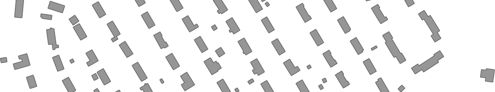



{}
This is an ongoing project: the inventory is currently in beta, as we are working on cleaning it and adding new datasets.
A preliminary snapshot is provided here to raise awareness of the project, [solicit more datasets](#adding-a-new-dataset), and help us detect errors.
{}

## Mapping and analysing the availability of authoritative datasets on buildings worldwide

### About the project

Open government data on buildings is becoming increasingly available and accessible globally, being useful for a variety of use cases, e.g. in urban morphology and energy simulations.
While [OpenStreetMap](https://www.openstreetmap.org/) (OSM) [covers a large number of buildings and has made impressive progress in the past few years](/publication/2020-3-dgeoinfo-3-d-asean/), datasets released by governments often have authoritative status thanks to their full completeness in their jurisdictions, homogeneous data collection, and sometimes an extended set of attributes not available elsewhere.
However, these datasets have limited availability.

We have created a global inventory of open government data on buildings.
The principal results are available as a map (above) and as a list (below), with an ongoing [analysis](#analysis).
The index spans datasets containing more than 100 million building footprints from dozens of locations around the world.

The results of this project have several purposes, e.g. draw attention to these datasets to practitioners and scientists, and aid governments in understanding how their data fares in comparison to others, or for governments that have not released their data yet, to provide insights about common practices of their counterparts around the world.
Further, we seek to understand the intertwined relationships with other sources of data such as volunteered geoinformation and commercial entities, and the role authoritative data has amid the increasing role of other actors in the same geographies.

This research is funded by the [National University of Singapore (NUS)](https://nus.edu.sg) and it is carried out by the [NUS Urban Analytics Lab](https://ual.sg) in collaboration with [others](#people).

Please note that this is an ongoing work, and we will be adding new datasets as we check their content.

### Inclusion criteria

The criteria for inclusion in the list are as follows.
The dataset should:
- [x] be released as [open data](https://opendefinition.org), i.e. it can be freely used, modified, and shared by anyone for any purpose. For example, a viewer that enables viewing the data, but one that does not allow downloading it, is not considered to be a case of open data. In addition, the dataset should be relatively easy to download, not requiring expert knowledge or esoteric workflows.
- [x] be created and released by a governmental authority, such as national mapping/cadastral agency, regional government, or city administration.
- [x] contain 2D spatial data on buildings (i.e. footprints). For example, non-spatial datasets (e.g. spreadsheets or aggregated statistics) and point-based datasets (e.g. geocoded addresses) are not considered for this project due to their limited usefulness in geospatial workflows and urban studies.

While we regard also the semantic content of data (i.e. attributes) such as type of building, number of storeys, and its year of construction, they are not a requirement for the inclusion, thus, purely spatial datasets with no attributes are included in this study. In fact, about 47% of the datasets we have identified contain no semantic content whatsoever. Where attributes are available, we have [analysed them](#analysis).

The datasets have been identified through an exploration of data portals, crowdsourcing (through social media), and examining research papers.

Do note that we are not covering datasets that are not of official nature.
For example, commercial releases and volunteered geoinformation are not in the focus of this research (however, they are subject of [our other research activities](/)).

### List of datasets

The key result of the project is an inventory, which is given in the tables below, by level of jurisdiction.
You may click on the links to visit the website linking to the data and often describing it with metadata.

#### Country-wide datasets

| **Country** | | **Website** | 
| --- | --- | --- |
| Belgium || [Link](https://inspire-geoportal.ec.europa.eu/download_details.html?view=downloadDetails&resourceId=%2FINSPIRE-f5201eb0-2404-11e5-8130-52540004b857_20210429-085202%2Fservices%2F1%2FPullResults%2F161-180%2Fseries%2F7&expandedSection=metadata) |
| Denmark || [Link](https://inspire-geoportal.ec.europa.eu/download_details.html?view=downloadDetails&resourceId=%2FINSPIRE-6e8353b4-de80-11e7-a188-52540023a883_20210604-072602%2Fservices%2F1%2FPullResults%2F221-240%2Fdatasets%2F17&expandedSection=metadata) |
| Estonia || [Link](https://geoportaal.maaamet.ee/eng/Maps-and-Data/Estonian-Topographic-Database/Download-Topographic-Data-p618.html) |
| France || [Link](https://geoservices.ign.fr/documentation/diffusion/telechargement-donnees-libres.html#bd-topo) |
| Japan || [Link](https://fgd.gsi.go.jp/download/mapGis.php) |
| Lithuania || [Link](https://inspire-geoportal.ec.europa.eu/download_details.html?view=downloadDetails&resourceId=%2FINSPIRE-106902a4-2bd0-11e9-a83c-52540023a883_20210526-134902%2Fservices%2F1%2FPullResults%2F1-50%2Fdatasets%2F45&expandedSection=metadata) |
| Luxembourg || [Link](https://inspire-geoportal.ec.europa.eu/download_details.html?view=downloadDetails&resourceId=%2FINSPIRE-93ee1068-1dc3-11e7-a02d-52540023a883_20201215-103902%2Fservices%2F1%2FPullResults%2F1-20%2Fdatasets%2F18&expandedSection=metadata) |
| Malta || [Link](https://inspire-geoportal.ec.europa.eu/download_details.html?view=downloadDetails&resourceId=%2FINSPIRE-80e86358-9378-11e5-a300-a0369f4c5bc0_20210322-151802%2Fservices%2F1%2FPullResults%2F281-299%2Fdatasets%2F5&expandedSection=metadata) |
| Netherlands || [Link](https://nationaalgeoregister.nl/geonetwork/srv/dut/catalog.search;jsessionid=00BBD805A35CB4968F9CC7E1A94316FD#/metadata/aa3b5e6e-7baa-40c0-8972-3353e927ec2f) |
| New Zealand || [Link](https://data.linz.govt.nz/layer/101292-nz-building-outlines-all-sources/) |
| Norway || [Link](https://inspire-geoportal.ec.europa.eu/results.html?country=no&view=details&theme=bu) |

#### City and regional datasets

|**Coverage** | | **Country** | | **Website** | 
| --- | --- | --- | --- | --- |
| Christmas Island || Australia || [Link](https://data.gov.au/dataset/ds-wa-460b724b-0ed2-4348-8866-78feefc8cb21/details?q=buildings) |
| Cocos Island || Australia || [Link](https://data.gov.au/dataset/ds-wa-9159fce6-4328-4cb9-bdd7-ad7778ce8818/details?q=buildings) |
| Geelong || Australia || [Link](https://data.gov.au/dataset/ds-dga-41527e85-0907-4faf-b5f4-e9655b23d128/details) |
| Greater Sheppparton || Australia || [Link](https://data.gov.au/dataset/ds-dga-f1b95fd3-57b6-4a66-9af9-80b364bdd832/details?q=BUILDING%20FOOTPRINT) |
| Launceston || Australia || [Link](https://data.gov.au/dataset/ds-launceston-https%3A%2F%2Fopendata.launceston.tas.gov.au%2Fdatasets%2F6e55c56aeb244d0eb0b57e0271cccf7e_6/details?q=building%20footprints) |
| Manningham || Australia || [Link](https://data.gov.au/dataset/ds-dga-4622bbd1-82d6-4f05-ae70-4ec317ccac75/details?q=BUILDING%20FOOTPRINT) |
| Tirol || Austria || [Link](https://inspire-geoportal.ec.europa.eu/download_details.html?view=downloadDetails&resourceId=%2FINSPIRE-61494ff5-6fad-11e8-b649-52540023a883_20210527-095402%2Fservices%2F1%2FPullResults%2F351-400%2Fdatasets%2F1&expandedSection=metadata) |
| Blaineville || Canada  || [Link](https://www.donneesquebec.ca/recherche/fr/dataset/batiments-municipaux-hackqc2018) |
| Caledon || Canada || [Link](https://data.peelregion.ca/datasets/building-footprints-caledon) |
| Fleuve St Laurent || Canada || [Link](https://open.canada.ca/data/en/dataset/7a5cda52-c7df-427f-9ced-26f19a8a64d6#wb-auto-14) |
| Grande Prairie County || Canada || [Link](https://open.canada.ca/data/en/dataset/7a5cda52-c7df-427f-9ced-26f19a8a64d6#wb-auto-7) |
| Grasslands || Canada || [Link](https://open.canada.ca/data/en/dataset/7a5cda52-c7df-427f-9ced-26f19a8a64d6#wb-auto-17) |
| Jackhead || Canada || [Link](https://open.canada.ca/data/en/dataset/7a5cda52-c7df-427f-9ced-26f19a8a64d6#wb-auto-9) |
| Lake Manitoba || Canada || [Link](https://open.canada.ca/data/en/dataset/7a5cda52-c7df-427f-9ced-26f19a8a64d6#wb-auto-10) |
| Lower Mainland || Canada || [Link](https://open.canada.ca/data/en/dataset/7a5cda52-c7df-427f-9ced-26f19a8a64d6#wb-auto-8) |
| Mauricie Sud || Canada || [Link](https://open.canada.ca/data/en/dataset/7a5cda52-c7df-427f-9ced-26f19a8a64d6#wb-auto-15) |
| Montreal || Canada || [Link](https://donnees.montreal.ca/ville-de-montreal/batiment-2d) |
| Niagara Falls || Canada || [Link](https://niagaraopendata.ca/dataset/building-footprints) |
| Prince George || Canada || [Link](https://data-cityofpg.opendata.arcgis.com/datasets/building-outlines) |
| Quebec || Canada || [Link](https://open.canada.ca/data/en/dataset/fab160ae-c81d-46f8-8f92-4a01c10d4390#wb-auto-6) |
| Regina || Canada || [Link](http://open.regina.ca/dataset/building-outline) |
| Repentigny || Canada || [Link](https://www.donneesquebec.ca/recherche/fr/dataset/batiment) |
| Rimouski  || Canada || [Link](https://open.canada.ca/data/en/dataset/71372ca5-0989-43ba-bc5f-c8bfa83fa3a1) |
| Riviere Outaouais || Canada || [Link](https://open.canada.ca/data/en/dataset/7a5cda52-c7df-427f-9ced-26f19a8a64d6#wb-auto-16) |
| Roseau River Watershed || Canada || [Link](https://open.canada.ca/data/en/dataset/7a5cda52-c7df-427f-9ced-26f19a8a64d6#wb-auto-11) |
| Rouyn-Noranda || Canada || [Link](https://open.canada.ca/data/en/dataset/44ef1c79-af8b-45b8-8824-4829aa657dea) |
| Sannich || Canada || [Link](https://www.saanich.ca/EN/main/local-government/data-catalogue-1.html) |
| Shawinigan || Canada || [Link](https://www.donneesquebec.ca/recherche/fr/dataset/3c14053fd3f84c74be077cc890a8d434_0) |
| Sherbrooke || Canada || [Link](https://www.donneesquebec.ca/recherche/fr/dataset/c4710ec54f0e455fb8884940e5b7012c_1) |
| St Catharines || Canada || [Link](https://niagaraopendata.ca/dataset/st-catharines-building-polygons) |
| The Pas || Canada || [Link](https://open.canada.ca/data/en/dataset/7a5cda52-c7df-427f-9ced-26f19a8a64d6#wb-auto-12) |
| Ville De Quebec || Canada || [Link](https://www.donneesquebec.ca/recherche/fr/dataset/empreintes-des-batiments) |
| Welland || Canada || [Link](https://niagaraopendata.ca/dataset/city-of-welland-building-footprints) |
| Windsor || Canada || [Link](https://opendata.citywindsor.ca/opendata/details/234) |
| Winnipeg || Canada || [Link](https://open.canada.ca/data/en/dataset/7a5cda52-c7df-427f-9ced-26f19a8a64d6#wb-auto-13) |
| Bogota || Colombia || [Link](https://www.ideca.gov.co/recursos/mapas/construccion-bogota-dc) |
| Medellin City || Colombia || [Link](https://geomedellin-m-medellin.opendata.arcgis.com/datasets/M-Medellin::construcciones-y-mejoras-del-predio/about) |
| Tampere || Finland || [Link](https://data.tampere.fi/data/fi/dataset/tampereen-rakennukset) |
| Finistere || France  || [Link](https://www.data.gouv.fr/fr/datasets/liste-des-batiments-du-departement-du-finistere/) |
| Garges-les-Gonesse || France  || [Link](https://www.data.gouv.fr/fr/datasets/cadastre-garges-les-gonesse/) |
| Blagnac || France || [Link](https://www.data.gouv.fr/fr/datasets/batiments-communaux-blagnac/) |
| Grand Poitiers || France || [Link](https://www.data.gouv.fr/fr/datasets/referentiel-geographique-cadastre-donnees-batiments-grand-poitiers-donnees-de-reference/) |
| Isere  || France || [Link](https://www.data.gouv.fr/fr/datasets/bati-agrege-de-2016-isere/) |
| La Rochelle || France || [Link](https://www.data.gouv.fr/en/datasets/cadastre-bati-dur-1/) |
| Le Havre Sine || France || [Link](https://www.data.gouv.fr/fr/datasets/batiment/) |
| Nice  || France || [Link](https://www.data.gouv.fr/fr/datasets/batiments-cadastraux-de-la-metropole-nice-cote-d-azur/) |
| Rennes || France || [Link](https://www.data.gouv.fr/fr/datasets/referentiel-batiment-sur-rennes-metropole/) |
| Val d'llle-Aubigne || France || [Link](https://www.data.gouv.fr/fr/datasets/equipements-du-val-dille-aubigne-1/) |
| Brandenburg || Germany  || [Link](https://hub.arcgis.com/datasets/esri-de-content::geb%C3%A4ude-brandenburg?geometry=11.403%2C52.178%2C14.633%2C52.763&selectedAttribute=zustand) |
| Berlin  || Germany || [Link](https://hub.arcgis.com/datasets/esri-de-content::geb%C3%A4ude-berlin?geometry=11.811%2C52.207%2C15.041%2C52.792) |
| Wuppertal || Germany || [Link](https://www.govdata.de/web/guest/suchen/-/details/alkis-gebaude-wuppertal) |
| Reggio Emilia || Italy || [Link](https://www.dati.gov.it/view-dataset/dataset?id=332648eb-09a3-4307-ad38-409b1955ba32) |
| Rovereto || Italy || [Link](https://dati.trentino.it/dataset/comune-di-rovereto-edifici) |
| Umbria || Italy || [Link](http://www.umbriageo.regione.umbria.it/pagina/distribuzione-carta-tecnica-regionale-vettoriale-1) |
| Gisborne || New Zealand || [Link](https://hub.arcgis.com/datasets/gizzy::building-footprints?geometry=177.826%2C-38.712%2C178.230%2C-38.619) |
| Seoul || South Korea || [Link](http://data.seoul.go.kr/dataList/OA-13227/S/1/datasetView.do) |
| Navarre || Spain || [Link](https://gobiernoabierto.navarra.es/es/open-data/datos/cartografia-11000-recinto-edificio) |
| Halifax || UK || [Link](https://catalogue-hrm.opendata.arcgis.com/datasets/625d718e3dd04dc4ac69ae2861f6df36_0) |
| Alabama || US  || [Link](https://hub.arcgis.com/datasets/geoplatform::alabama-building-footprints) |
| Ann Arbor || US  || [Link](https://www.a2gov.org/services/data/Pages/default.aspx) |
| Atlanta  || US  || [Link](https://dpcd-coaplangis.opendata.arcgis.com/datasets/building-footprints) |
| Champaign || US  || [Link](https://gis-cityofchampaign.opendata.arcgis.com/datasets/building-footprints) |
| Allegheny || US || [Link](https://openac-alcogis.opendata.arcgis.com/datasets/allegheny-county-building-footprint-locations) |
| Austin || US || [Link](https://data.austintexas.gov/Locations-and-Maps/Building-Footprints-Year-2013/7bns-7teg) |
| Baltimore  || US || [Link](https://data.baltimorecity.gov/browse?q=building+footprint) |
| Bay field || US || [Link](https://www.bayfieldcounty.org/892/GIS-Data-Download) |
| Bend || US || [Link](https://github.com/MaptimeBend/bend_buildings/tree/master/data) |
| Bloomington || US || [Link](https://data.bloomington.in.gov/dataset/building-footprint-gis-data) |
| Boston  || US || [Link](https://data.boston.gov/dataset/boston-buildings) |
| Brown || US || [Link](https://geodata.wisc.edu/catalog/0BA56134-0F03-4DCD-A5EC-585360A1F623) |
| Buffalo || US || [Link](https://geodata.wisc.edu/catalog/39359B3B-6F07-4A35-ABE6-EA96D81FDE80) |
| Buncombe || US || [Link](https://data-avl.opendata.arcgis.com/datasets/bunco::buncombe-county-building-footprints?geometry=-82.565%2C35.595%2C-82.540%2C35.601) |
| Burlington || US || [Link](https://navburl-burlington.opendata.arcgis.com/datasets/buildings) |
| Calumet || US || [Link](http://www.calumetmaps.com/data.html) |
| Centre || US || [Link](https://gisdata-centrecountygov.opendata.arcgis.com/datasets/CentreCountyGov::buildings?geometry=-79.486%2C40.603%2C-76.017%2C41.329) |
| Chicago || US || [Link](https://data.cityofchicago.org/Buildings/Building-Footprints-current-/hz9b-7nh8) |
| Cibolo || US || [Link](https://hub.arcgis.com/datasets/cibolotx::cibolo-building-footprints?geometry=-98.581%2C29.454%2C-97.774%2C29.664) |
| Cincinnati || US || [Link](https://data-cagisportal.opendata.arcgis.com/datasets/building-footprints/explore) |
| Clark || US || [Link](https://geodata.wisc.edu/catalog/67315C46-0A56-459A-B100-04832CD90826) |
| Cook || US || [Link](https://datacatalog.cookcountyil.gov/GIS-Maps/Historical-ccgisdata-ESRI-Suburban-Cook-Building-F/dh3h-25vu) |
| Dakota || US || [Link](https://gisdata.mn.gov/dataset/us-mn-co-dakota-struc-propertyinfo-buildingp) |
| Dane || US || [Link](https://geodata.wisc.edu/catalog/DaneCounty_53390cd1213b48e19a565b644695a8ea_3) |
| Dauphin || US || [Link](https://data-dauphinco.opendata.arcgis.com/datasets/building-outlines) |
| Denver || US || [Link](https://hub.arcgis.com/datasets/0d43652d038a4a0dbca68f0501151bb0_0?geometry=-108.219%2C38.963%2C-101.759%2C40.442) |
| Douglas || US || [Link](https://geodata.wisc.edu/catalog/5DEB9585-F7F6-4082-9370-7F66715E164F) |
| Edmonton || US || [Link](https://data.edmonton.ca/Geospatial-Boundaries/City-of-Edmonton-Rooflines-as-of-2019-/jpxi-a9a5) |
| FlagStaff || US || [Link](https://gis.flagstaffaz.gov/portal/apps/sites/#/opendata/datasets/c7eab6bfb9b14a408379ffd63fa063af) |
| Fond du Lac || US || [Link](https://geodata.wisc.edu/catalog/6023030B-F7F6-4D0A-9D70-90A1615E4948) |
| Fort Collins || US || [Link](https://opendata.fcgov.com/High-Performing-Government/Building-Footprints-Map/2wan-k89y) |
| Hamilton || US || [Link](https://open.hamilton.ca/datasets/9b0ccd920ab34810a155b9f21ed1b075_8) |
| Hobart || US || [Link](https://hub.arcgis.com/datasets/hobartcc::building-footprints?geometry=146.909%2C-42.980%2C147.717%2C-42.804) |
| Indianapolis || US || [Link](https://data.indy.gov/datasets/building-footprints) |
| Jefferson || US || [Link](https://geodata.wisc.edu/catalog/DD659D58-2C37-40BC-94C2-FF529EA7BBEE) |
| John Creeks || US || [Link](https://datahub.johnscreekga.gov/datasets/structure-footprints-1?geometry=-84.478%2C33.988%2C-83.913%2C34.088) |
| Kentucky || US || [Link](https://data.louisvilleky.gov/dataset/neural-network-generated-building-footprints) |
| Kerville || US || [Link](https://hub.arcgis.com/datasets/kerrvilletx::kerrville-building-footprints?geometry=-99.549%2C29.928%2C-98.741%2C30.136) |
| Kodiak Island || US || [Link](https://data-kiborough.opendata.arcgis.com/datasets/kib-buildingfootprints?geometry=-153.277%2C57.636%2C-151.662%2C57.892) |
| Los Angeles || US || [Link](https://hub.arcgis.com/datasets/lacounty::countywide-building-outlines-2014?layer=1) |
| Manitowoc || US || [Link](https://geodata.wisc.edu/catalog/66DF3C65-80D3-4233-B936-2E3D6DBE0B87) |
| New Orleans || US || [Link](https://data.nola.gov/dataset/Building-Footprint/m3gg-u447) |
| New York City || US || [Link](https://data.cityofnewyork.us/Housing-Development/Building-Footprints/nqwf-w8eh) |
| Newport News || US || [Link](https://hub.arcgis.com/datasets/nngov::building-footprints?geometry=-77.313%2C36.899%2C-75.698%2C37.282) |
| Orange || US || [Link](https://data-ocpw.opendata.arcgis.com/datasets/8db4b58e6bbf4f6cac676f477348be48_0/explore) |
| Ottawa || US || [Link](https://open.ottawa.ca/datasets/building-footprints?geometry=-76.344%2C45.154%2C-75.052%2C45.492) |
| Philadephia || US || [Link](https://www.opendataphilly.org/dataset/buildings) |
| Pierece || US || [Link](https://geodata.wisc.edu/catalog/46C0CB62-6B9D-41CB-BBD2-4FADC8468157) |
| Portage || US || [Link](https://geodata.wisc.edu/catalog/E7A7D524-5BA7-44F8-B72E-639CFE4624F6) |
| Ramsey || US || [Link](https://gisdata.mn.gov/dataset/us-mn-co-ramsey-struc-structure-data) |
| Redlands || US || [Link](https://opendata-coredlands.opendata.arcgis.com/datasets/1a39f698339144b4a97a868ee683b69d_0) |
| Rhode Island || US || [Link](https://wiki.openstreetmap.org/wiki/Esri/ArcGIS_Datasets) |
| San Francisco || US || [Link](https://data.sfgov.org/Geographic-Locations-and-Boundaries/Building-Footprints/ynuv-fyni) |
| Sarpy || US || [Link](https://gis.sarpy.gov/datasets/1109224811aa404383c44cd84bf62a84_42/explore) |
| Sauk || US || [Link](https://data-saukgis.opendata.arcgis.com/datasets/dbe64a71897e4982934dbd7637d576d5_0/explore) |
| Somerville || US || [Link](https://data.somervillema.gov/GIS-data/Buildings/uzdd-gyjv) |
| St Augustine || US || [Link](https://hub.arcgis.com/datasets/STAUG::buildingfootprints?geometry=-81.508%2C29.849%2C-81.104%2C29.953) |
| Summit  || US || [Link](https://data-summitgis.opendata.arcgis.com/datasets/6fed86513a004125a3333a7e6a34f49e) |
| Tempe || US || [Link](https://data.tempe.gov/datasets/2c749ab250aa4a72985332b0cd019a51_0) |
| Vilas  || US || [Link](https://hub.arcgis.com/datasets/vilas::buildings?geometry=-91.105%2C45.743%2C-87.875%2C46.410) |
| Washburn || US || [Link](https://geodata.wisc.edu/catalog/B0069926-5DAA-4FC1-B33F-D2ED0310C8D2) |
| Washington DC || US || [Link](https://opendata.dc.gov/datasets/building-footprints) |
| Waukesha || US || [Link](https://data-waukeshacounty.opendata.arcgis.com/datasets/bdf2fcbffaee40f0879f0471dd648822_0/explore) |
| Yavapai || US || [Link](https://hub.arcgis.com/datasets/YavGIS::building-2014-footprints-1/about) |
| Pulyny || Ukraine || [Link](https://data.gov.ua/dataset/24eac8c9-71f0-4504-bceb-3ebfe6b196c2) |

#### Datasets with partial coverage

During our exploration, we have identified several datasets that do not include all the buildings in their administrative extent.
For example, there are datasets that have only commercial buildings mapped, or buildings with a footprint larger than a threshold of considerable size, not being representative of buildings in the area.
Further, some datasets have partial coverage as they have an indicative purpose, e.g. serving as a sample dataset.
These datasets may still be found useful for some spatial analyses.
We list such datasets in this table.

| **Coverage** | | **Website** | 
| --- | --- | --- |
|Canada (Canada)|| [Link](https://open.canada.ca/data/en/dataset/7a5cda52-c7df-427f-9ced-26f19a8a64d6) |
|Cape Town (South Africa)|| [Link](https://web1.capetown.gov.za/web1/opendataportal/DatasetDetail?DatasetName=Building%20footprints) |
|Gold Coast (Australia)|| [Link](https://data.gov.au/dataset/ds-dga-da4f31ac-2716-4eca-b067-359f0b868d3c/details?q=buildings) |
|Greene (US)|| [Link](https://hub.arcgis.com/datasets/GIMSOH29::buildings?geometry=-84.689%2C39.515%2C-83.074%2C39.885) |
|Jasper Park (Canada)|| [Link](https://open.canada.ca/data/en/dataset/7a5cda52-c7df-427f-9ced-26f19a8a64d6#wb-auto-6) |
|Park Canada (Canada)|| [Link](https://open.canada.ca/data/en/dataset/aff6b442-1b27-4f24-8546-6b38f96bba1d) |
|Queensland (Australia)||[Link](https://data.gov.au/dataset/ds-qld-00bb290d-a45e-4a80-acd6-84ea2c394d0f/details?q=BUILDING%20FOOTPRINT) |
|Singapore (Singapore)|| [Link](https://data.gov.sg/dataset/master-plan-2019-building-layer) |
|Surprise (US)|| [Link](https://hub.arcgis.com/datasets/Surprise::commercial-footprints?geometry=-112.812%2C33.545%2C-112.004%2C33.745) |
|Wyndham (Australia)|| [Link](https://data.gov.au/dataset/ds-dga-1ac84b6c-aef0-445f-a8da-0f19d0796181/details?q=BUILDING%20FOOTPRINT) |

### Analysis

Putting up the inventory of publicly available building datasets by governments is just the first part of this project.
For each dataset, we have analysed the metadata and checked it to understand their content, geometric validity, etc.
The full results will be published in a paper.
In the meantime, we include two figures as a sneak peek into the ongoing work.

{{< figure src="attribute_content.png" caption="Frequency of most common attributes pertaining to buildings, which we identified in 100+ datasets we analysed. The information that is most commonly available is on the type of the building. The level of semantic richness has a wide range. On the one hand, a fifth of the datasets has 4 or more attributes stored for each building. On the other hand, nearly half of the datasets do not contain a single attribute, describing only the geometry of the building footprint." numbered="true" >}}



### Webmap

The map at the top of this page is intended to show the locations of the datasets and the global distribution of the availability of authoritative open data on buildings.
The locations of the datasets are represented in two ways: by approximate centroids of the entire dataset and by their approximate coverage (this is visible when zooming in).
The latter has been generated in two different ways: for some datasets, we have (i) computed the [convex hulls](https://en.wikipedia.org/wiki/Convex_hull); while for others, we have (ii) used the polygon of the administrative unit the dataset states to represent.
The administrative polygons have been sourced from [GADM](https://gadm.org/), the
Database of Global Administrative Areas.

### Adding a New Dataset

More open government building data are getting added to this index as we expand our search.
If you'd like to contribute with new entries to enlarge our inventory, you are welcome to do so by filling the following [form](https://forms.gle/GVMUBgf3ntSViHK1A).
Before doing so, please read the [inclusion criteria](#inclusion-criteria) above.

### Errors

The registry is not free of errors, especially in jurisdictions we are less familiar with.
The links have been checked during Q2 2021.
However, it is possible that some of them are broken, with some datasets moved to another link and some removed.
If you spot an error, please report it through this [form](https://forms.gle/JnhuGobgaJQiwMop8).

## Paper

A paper is coming out soon. Stay tuned!

## People

### Research Assistant
{}

### Collaborators

[Nikola Milojević-Dupont](https://www.mcc-berlin.net/en/about/team/milojevic-dupont-nikola.html) and [Felix Creutzig](https://www.mcc-berlin.net/en/about/team/creutzig-felix.html) (Mercator Research Institute on Global Commons and Climate Change and Technical University of Berlin)

### Principal Investigator
{}

### Research group
Urban Analytics Lab, National University of Singapore (NUS)

## Acknowledgements

We thank all contributors who have pointed out authoritative building datasets, which we included in our list.

This research is part of the project Large-scale 3D Geospatial Data for Urban Analytics, which is supported by the National University of Singapore under the Start-Up Grant R-295-000-171-133.

The location and the source of the illustration of the building footprints at the top of this webpage: [Middlesex County](https://www.openstreetmap.org/#map=17/42.54988/-71.56806), Massachusetts, United States (Bureau of Geographic Information -- MassGIS, Commonwealth of Massachusetts, Executive Office of Technology and Security Services, 2021.)
